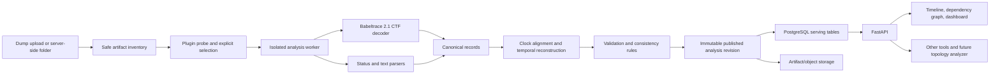

# Architecture and library decisions

Status: proposed baseline, researched 2026-07-19
Runtime: Python 3.12 on Linux for the server and analysis workers

## 1. Executive decision

Start as a modular monolith with isolated workers, not as microservices and not
as a graph-database product.



The default serving store is PostgreSQL because this is a concurrent server,
the data volume in the brief is moderate, and temporal interval queries fit its
`int8range`, GiST, JSONB, and `inet` support. Keep original and large extracted
artifacts in content-addressed filesystem or S3-compatible storage.

If a revision grows from hundreds of thousands into tens or hundreds of
millions of records, add immutable Parquet fact datasets, publish them through a
revision manifest, and use DuckDB for offline/worker analytics. Do not make one
mutable DuckDB file a multi-process server database.

## 2. Correctness constraints that shape the product

### 2.1 Exact reverse history is not guaranteed

A latest snapshot and a sequence of received updates do not uniquely determine
past state unless every change is invertible.

- `property = 5` does not reveal the prior property value.
- A delete may omit the deleted object.
- A callback returning success does not prove all derived hardware writes completed.
- Internal mutations may have no corresponding gRPC message.
- A relationship may change without the old target appearing in the log.
- Status files from different layers may have been collected at different times.

Every plugin declares a reconstruction **default** of `exact`, `best_effort`, or
`unsupported`, but that is never promoted to a blanket guarantee. Every semantic
output carries orthogonal provenance (`observed`, `event_derived`,
`reconstructed`, `correlated`, or `plugin_default`) and quality (`exact`,
`best_effort`, `ambiguous`, or `unknown`). Field-level quality and explicit
unknown reasons override the record-level summary. Absence from a partial update
is not interpreted as deletion.

Prefer forward replay from the earliest coherent checkpoint or applicable
earlier observation anchors. Reverse replay from later observations is permitted
only through a plugin-supplied `revert()` reducer.
Here, "snapshot" means a collection of individual observation constraints, not
one simultaneous world: every resource, field group, and observed relationship
retains its own capture interval. A dump-wide timestamp is merely a collection
hint unless the capture mechanism proves simultaneity.

### 2.2 Preserve four different facts

Do not collapse these into one generic event table or one graph edge:

| Concept | Meaning |
|---|---|
| Observation | A value read from a status snapshot, with its capture-time range. |
| Event | Something recorded in a trace or debug log. |
| Mutation | A state/relationship change inferred from an event by a plugin. |
| Causal link | Evidence that events in different layers correspond or caused one another. |

Structural ownership, runtime dependency, reference, cross-layer correspondence,
and event causality are separate relation types with separate semantics.

### 2.3 Time is evidence, not just a timestamp

Keep all of the following:

- Raw timestamp and its clock domain.
- Stream and source sequence/ordinal.
- Normalized nanoseconds, when a transform is known.
- Uncertainty interval and clock-transform evidence.
- Deterministic ingestion order for reproducibility.

When uncertainty windows overlap, a strict cross-container order is not proven.
The system may use a deterministic linearization for stable output, but affected
states and causal links must be marked ambiguous. Use signed 64-bit nanoseconds;
serialize them as decimal strings in JSON because JavaScript numbers cannot
represent them exactly.

Events without a usable timestamp remain in an **unplaced events** collection
with their source ordinal. They can be reached from resource history and source
context, but must not be assigned a fabricated point on the global timeline.

## 3. Analysis revisions and ingestion lifecycle

Every import produces an immutable `analysis_revision` identified by:

- Input content hash and node/case identity.
- Core schema/API version.
- Plugin IDs, versions, package hashes, and configuration hash.
- Babeltrace decoder version and supported CTF/MIP version.
- Clock alignment configuration.

Reprocessing after a plugin upgrade creates a new revision. Published rows are
never reinterpreted in place. A small transaction changes the case's published
revision pointer only after validation succeeds.

Recommended job state machine (an exact configured match may pass directly from
`PROBED` to `SELECTED`):

```text
RECEIVED -> INVENTORIED -> PROBED
PROBED -> AWAITING_SELECTION -> SELECTED
PROBED -----------------------> SELECTED  (exact configured match)
SELECTED -> PARSING -> NORMALIZING -> ALIGNING -> RECONSTRUCTING
         -> VALIDATING -> PUBLISHED
```

Failures stay attached to an unpublished revision with structured diagnostics.
Send only job IDs and artifact references through the queue, never dump bytes.

### Stage details

1. **Receive**: spool the upload to quota-controlled storage and compute SHA-256.
2. **Inventory**: walk archives without blindly extracting them; record logical
   path, parent archive, type, sizes, and content hash where practical.
   Detect each compression/archive layer from content plus plugin hints, not the
   suffix alone. A name such as `.zst.gz` may require gzip followed by Zstandard;
   record the actual codec chain and cap its depth.
3. **Probe/select**: run allowlisted plugin probes. If two plugins are plausible,
   persist candidates and pause for an explicit choice; never silently select the
   nearest software version. Record the chosen plugin ID/version/package hash and
   probe-set hash before an idempotent resume.
4. **Materialize selected inputs**: extract only plugin-selected artifacts into a
   private worker directory. CTF filesystem traces need a real directory containing
   `metadata` and stream files.
5. **Parse**: stream snapshot observations and trace events in bounded batches.
6. **Normalize/correlate**: assign typed resource identities, mutations,
   relationships, causal links, and clock anchors.
7. **Reconstruct**: create state and relationship validity intervals.
8. **Validate**: replay in the opposite direction where possible, compare terminal
   reconstructed state to observations, execute tri-state consistency rules, and
   record coverage.
9. **Publish**: bulk-load/index serving tables and atomically expose the revision.

## 4. Plugin architecture

Discover plugin bundles through Python entry points under
`router_dump_analyzer.plugins`. The reference protocol is in
`src/router_dump_analyzer/plugin_api.py`; operational rules are in
`docs/plugin-contract.md`.

A plugin bundle supplies:

- Platform/version probe and input locators.
- Status parsers, text-log parsers, and domain mappers for core-decoded CTF records.
- Typed resource keys and display metadata.
- Forward and reverse reducers.
- Dynamic relationship and cross-layer correlation rules.
- Clock anchors/alignment rules.
- Consistency checks.
- Projection into a canonical forwarding model.
- Sensitive-field redaction and source-context policy.

Plugins emit iterators/batches; they do not write the database. For production,
use Arrow `RecordBatch` messages between the plugin worker and coordinator so
100K+ records do not become millions of Python ORM objects. Validate every batch
against the core schema at the process boundary.

A Python import is not a sandbox. Execute plugins and the native Babeltrace
decoder in disposable, resource-limited Linux processes/containers without
network access or application database credentials.

The worker/core owns `bt2` iterator lifecycle and converts every native message
into a dependency-free record: event; stream, packet, or activity boundary; or
discarded-event/packet notice, with trace/stream identity, stable message
ordinal, raw/default-clock time, payload/context, and source evidence. Native
`bt2` objects never cross the plugin call boundary. The core-assigned source
identity remains a typed field on the mapped domain event. The plugin only maps
those normalized records to domain events; this keeps decoder upgrades and
native failures inside one controlled boundary.

All input-dependent plugin methods can emit structured diagnostics; the static
`describe()` schema hook is validated or fails plugin loading. Correlation receives a
bounded, indexed `CorrelationReader` rather than the whole event list; it streams
candidates by time window, layer, event type, and subject, and can request a
read-only world at a time. World scans and relationship scans are iterators with
coordinator-enforced budgets, so checks and projections do not require a 100K+
object list in memory.

## 5. Canonical domain model

### 5.1 Resource identity

Each resource has:

- A stable opaque external ID derived from a canonical typed key.
- A dense internal `BIGINT` for joins and in-memory traversal.
- Node, layer, namespace, kind, and ordered typed key parts.
- An incarnation number so delete/recreate lifetimes are not merged.
- Optional unresolved-placeholder status for references seen before definitions.

Never hash a display name such as `vrf:id:uuid` without type information.
Integer `1`, string `"1"`, a UUID, and raw bytes are different key values.

### 5.2 State representation

Use a small stable envelope rather than a universal EAV table:

- Promoted columns: existence, admin state, operational state, severity,
  provenance, and quality where they apply.
- `state JSONB`: full plugin-defined properties.
- `unknown_fields JSONB`: per-field reason and evidence gap.
- Optional plugin-declared typed projection tables/indexes for commonly filtered
  values such as VRF, prefix, group ID, neighbor address, or result code.

A missing JSON key, an explicitly null value, and an unknown value are distinct.
Avoid a global GIN index over every state document until a measured query needs it.

### 5.3 Core tables

| Table | Essential purpose |
|---|---|
| `analysis_revision` | Immutable input/plugin/config identity and publication state. |
| `artifact` | Nested archive inventory, hashes, sizes, media type, and parent. |
| `plugin_run` | Capability, worker status, diagnostics, counts, output hash. |
| `clock_domain` / `clock_transform_segment` | Offset, drift, uncertainty, and alignment evidence. |
| `snapshot` / `snapshot_observation` | Collection metadata plus per-resource/per-field capture ranges, completeness, provenance, quality, and source evidence. |
| `relationship_observation` | Status-observed edges and scoped collection-completeness markers; kept distinct from mutations. |
| `resource` | Dense ID, external ID, canonical typed key, and incarnation. |
| `event` / `event_resource` | Raw/normalized time, source order, action, outcome, payload, subjects, evidence. |
| `state_mutation` | Before/after/unknown changes derived from an event. |
| `relationship_mutation` | Timestamped add/remove of typed relationships; replacement is explicit remove plus add. |
| `causal_link` | Cross-event correspondence with confidence and evidence. |
| `resource_state_interval` | Half-open `[start_ns,end_ns)` versioned state, provenance, quality, and field-level unknowns. |
| `relationship_interval` | Time-varying typed edge with attributes, provenance, and quality. |
| `reconciliation_finding` | Reconstructed-vs-observed differences and coverage gaps. |
| `forwarding_interval` | Versioned canonical FIB/next-hop/failover/adjacency/tunnel projection. |
| `reconstruction_coverage` | Per plugin/resource/field/relation scope counts and reason-coded omissions. |
| `analysis_diagnostic` | Origin/stage, structured code, severity, artifact locator, and safe message. |
| `timeline_bucket` | Optional cached level-of-detail data after profiling proves a need. |

Store time validity as `int8range` with canonical `[)` bounds, or as explicit
`start_ns`/`end_ns` plus equivalent constraints. Useful indexes include:

```sql
CREATE INDEX state_at_time
ON resource_state_interval
USING gist (revision_id, resource_id, valid_range);

CREATE INDEX relationship_from_at_time
ON relationship_interval
USING gist (revision_id, source_resource_id, valid_range);

CREATE INDEX event_history
ON event_resource (revision_id, resource_id, event_time_ns, source_sequence);
```

The composite GiST forms require `btree_gist`. Start with simpler B-tree indexes
on `(revision_id, resource_id, start_ns)` if measured plans are already good.
Bulk-load staging rows with PostgreSQL `COPY`; avoid one ORM object per event.

## 6. Temporal reconstruction

An observation is a constraint on one resource, field set, relationship, or
complete relationship collection during its own `[observed_min, observed_max]`
window. It is not permission to seed a global world at the import capture time.
Linked resources collected at different times remain a capture vector until
reconstruction proves a common instant. If no common instant is supported, an
"observed" route or consistency response returns that vector/range and must not
claim one point-in-time world.

Every `ReadOnlyWorld` therefore exposes a `WorldBasis`: reconstructed requested
and resolved time, or an observed capture vector with the relevant capture
ranges. State views retain validity/capture ranges and evidence. Forwarding and
consistency outputs inherit/reference that basis instead of compressing several
observation times into one synthetic timestamp.

### 6.1 Preferred forward algorithm

1. Normalize observation and event clocks when evidence permits; retain every
   uncertainty window.
2. Select a coherent earlier checkpoint when available. Otherwise seed each
   resource/relationship only from an observation anchor whose capture window
   supports the replay start; every other value begins unknown.
3. Order events by normalized time, then source sequence and stable source ID.
4. Call plugin `apply(event, world)`; one event may emit multiple direct and
   derived state/relationship mutations.
5. Close prior half-open intervals and open new intervals.
6. Create checkpoints every configurable event count or elapsed time.
7. Treat later observations as individual reconciliation constraints. Never
   copy them backward merely to fill an unknown gap.
8. Record exact/best-effort/ambiguous/unknown output counts by resource, field,
   relationship type, and time range.

### 6.2 Final-snapshot reverse fallback

1. Initialize each resource or relationship at its own latest observation
   anchor, not at one global final time.
2. Traverse only events preceding the applicable anchor in reverse deterministic
   order; linked state outside its supported window is exposed to the reducer as
   unknown.
3. Call plugin `revert(event, world_after)`.
4. If a field or relationship cannot be recovered, close the known interval and
   create an unknown interval; do not copy the later value backward.
5. Replay each reconstructed span forward and report mismatches against every
   applicable observation constraint.

Checkpoints accelerate replay; they are derived cache, not new truth. Most
point-in-time API requests should read materialized intervals directly.

The core never propagates changes merely because a `depends_on` edge exists.
Only a version-specific reducer knows the proprietary update semantics.

## 7. Dynamic dependency graph

The graph at time `t` is an interval query, not one permanently mutable graph.
Persist edges relationally and hydrate only the selected-time, selected-depth
slice into compact adjacency arrays or `rustworkx`.

Graph queries require seed resources, direction, relation types, depth, and a
hard result cap. The UI should show collapsed summary nodes when the cap is hit.
Use Sigma.js/WebGL for an interactive filtered subgraph; do not send the global
100K-resource graph to the browser.

For a timeline lane whose dependency changes over time, intersect relationship
intervals with the viewport. Pack overlapping target intervals into deterministic
sublanes using interval partitioning (`O(k log w)`); aggregate when a configured
sublane cap is exceeded.

A separate graph database is not recommended initially. Reconsider only after
profiling proves that deep, arbitrary multi-hop traversal dominates and cannot be
served from interval slices plus an in-memory graph.

## 8. Route and forwarding calculation

The dependency graph is not a forwarding model. Each platform plugin projects
state into a core-versioned, discriminated forwarding IR. Version 1 contains
typed `VrfForwardingState`, `FibEntry`, `NextHopGroup`, `NextHop`,
`FailoverGroup`, `Adjacency`, `TunnelAction`, and `InterfaceForwardingState`
records. References use canonical
typed resource keys, not display strings; every record preserves unresolved
references, attributes, provenance, quality, and evidence.

Projection is incremental. `project_forwarding(ir_version, changes=None, world)`
streams an initial bootstrap as `upsert` mutations. Subsequent calls receive one bounded
`ChangeSet` and emit only affected `upsert`/`delete` mutations with effective
time and uncertainty. The core validates the IR version and references, then
opens/closes `forwarding_interval` rows. Conformance tests periodically compare
incremental output with a clean full projection so stale derived objects cannot
accumulate silently. A plugin never performs LPM or returns a final route answer;
those algorithms remain core-owned.

Single-node route resolution at time `t` is:

1. Select active forwarding intervals.
2. Longest-prefix match in the requested VRF.
3. Apply the plugin-projected lexicographic `selection_rank` (lower wins), exact
   selected status when available, and explicit multipath grouping. Equal rank
   alone never invents ECMP.
4. Recursively expand next-hop and ECMP groups.
5. Evaluate failover/admin/operational predicates.
6. Resolve tunnel and adjacency dependencies.
7. Detect cycles and enforce a maximum expansion depth.
8. Return every viable branch plus unresolved alternatives and an explanation tree.

The request selects an observed capture vector or reconstructed time. The
response echoes that basis, resolved revision/time or capture ranges,
provenance, quality, and evidence so a caller cannot confuse an observed
forwarding object with a best-effort historical one.

PostgreSQL `inet` plus an appropriate GiST/SP-GiST operator class can serve LPM;
plugins may maintain an in-memory radix structure for batch calculations.
`rustworkx` shortest-path algorithms are for the future multi-node topology
analyzer, not a substitute for single-node FIB semantics.

## 9. Timeline and dashboard

### 9.1 Timeline response contract

Every request includes revision, visible lane IDs, `[start_ns,end_ns)`, viewport
pixel width, filters, and a maximum glyph count. The server returns:

- Exact state intervals when below the cap.
- Event clusters with counts by action/outcome/severity.
- First/last timestamps and representative event IDs.
- Worst severity plus status-duration fractions; never only dominant status,
  because that hides brief failures.
- Dynamic dependency spans and overflow summaries.
- The actual immutable revision and clock uncertainty.

Choose a bucket width that produces roughly one or two horizontal buckets per
pixel. Raw events are returned only when sufficiently zoomed in. A cluster drill-
down endpoint paginates exact events. The opaque `cluster_id` binds the immutable
revision, normalized query/filter digest, lane, and exact bucket bounds. Expansion
uses deterministic `(event_time_ns, source_id, source_sequence, event_id)` order
and an opaque cursor. A missing/expired cached aggregate can be recomputed from
that bound query; a mismatched revision or query digest is rejected rather than
silently expanding a different cluster.

Every lane has one immutable canonical resource ID. State intervals, lifecycle
intervals, event marks, and relationship spans on that row always describe that
resource. A relationship query may dynamically add or remove *rows* as the
selected time changes, but a row must never switch from one related resource to
another. This makes an operator's vertical comparison stable and keeps resource
selection independent from temporal selection.

A searchable lane chooser lets users add/remove types and individual resources,
drag lanes into a preferred order, and append any clicked related resource below
the current group. Hovering a mark shows a bounded summary; selection opens exact
events and provides an explicit jump to the raw CTF/text source locator. A
cluster summary exposes its count and a bounded preview, while the exact-event
endpoint supplies a deterministic scrollable remainder.

### 9.2 Browser implementation

Recommended browser stack:

- React and TypeScript for UI composition.
- TanStack Virtual for vertical lane virtualization.
- PixiJS 8 for Canvas/WebGL intervals, event bars, clusters, and hit testing.
- D3 scale/zoom/brush utilities for time transforms and selection.
- Sigma.js for the filtered dependency graph.

Keep resource labels, sticky time ruler, controls, and accessible detail panels
as DOM elements. Render timeline marks in one canvas/WebGL surface. Accessibility
requires a keyboard-navigable event list mirroring the selected viewport; canvas
marks alone are not accessible.

Interaction mapping:

- Wheel: vertical lane scroll.
- Horizontal trackpad gesture or Shift+wheel: time pan.
- Ctrl/Cmd+wheel and pinch: zoom about pointer.
- Drag empty timeline: pan.
- Shift+drag: highlight range; explicit action zooms to it.
- Click empty track: select an arbitrary exact time.
- Click event: select the event and move the exact-time cursor without disabling
  empty-track clicks or range brushing; Enter opens the source context.
- Event inspection, exact-time cursor, and selected range are independent UI
  state. Selecting one does not silently clear or lock the others.
- Sticky ruler remains at the top only while the timeline viewport is active.

Hover cards use a short open delay and a grace interval while the pointer moves
between the glyph and card. The card remains interactive for scrolling, fades
only after leaving both regions, and can be pinned with a click. An exact mark
shows the operation, outcome, resource, resulting status, and duration to the
next accepted state change. A clustered mark adds total/failure counts and a
scrollable event list.

The main dashboard should report both failures and coverage:

- Parse errors and skipped artifacts.
- Clock alignment quality.
- Snapshot completeness by layer.
- PASS/FAIL/UNKNOWN consistency counts.
- Failed update chains and cross-layer propagation latency.
- Dangling/ambiguous relationships.
- Route/forwarding resolution success and unresolved branches.

It also provides one point-in-time table per plugin-declared resource kind.
Columns come from generic presentation descriptors and include current status,
status age, last event, failed updates, active correlations, quality, and
evidence. A selected range highlights intersecting intervals/events and may show
an endpoint state/correlation diff without changing the point-in-time cursor.

Plugins can additionally compose modular dashboards from a small declarative
widget vocabulary. Each descriptor chooses declared resource kinds, safe field
paths, bounded filters, a common aggregate or table columns, and default
open/collapse/move behavior. The core validates descriptors when loading the
plugin schema and evaluates every module against one point-in-time resource
result; it does not branch on resource-kind names. The browser renders an index
of available modules at the end of the page, opens the plugin defaults, and
stores only presentation preferences—open modules, collapsed modules, and
ordering—in local storage. Reordering by drag or accessible move controls never
mutates analysis data.

Do not accept plugin-provided HTML, CSS, JavaScript, templates, remote URLs, SQL,
or expression-language programs for dashboards. New reusable widget types belong
in a versioned core contract with validation and query budgets. This preserves a
modular page without turning installed parser plugins into unrestricted frontend
code.

### 9.3 Why not a Python-only browser framework

FastAPI, parsing, correlation, reconstruction, APIs, and route logic remain
Python 3.12. A Trace Compass-like browser timeline with 100K items still needs
browser-native Canvas/WebGL code. Dash, Panel, or server-rendered templates can
prototype dashboards, but they do not remove JavaScript and would make the
custom lane interaction harder. Keep the TypeScript surface thin and domain-free.

## 10. API surface

Use immutable, revision-scoped endpoints and cursor pagination. Normative JSON
payloads, time-basis unions, pagination, and errors are in `docs/api-contract.md`:

```text
POST /v1/imports
GET  /v1/imports/{import_id}
GET  /v1/imports/{import_id}/events              # SSE progress
GET  /v1/imports/{import_id}/plugin-candidates
POST /v1/imports/{import_id}/plugin-selection
POST /v1/imports/{import_id}/resume

GET  /v1/revisions/{revision_id}/capabilities
GET  /v1/revisions/{revision_id}/resource-types
GET  /v1/revisions/{revision_id}/resources
GET  /v1/revisions/{revision_id}/resources/{resource_id}
GET  /v1/revisions/{revision_id}/resources/{resource_id}/history
POST /v1/revisions/{revision_id}/state/query
POST /v1/revisions/{revision_id}/timeline/query
GET  /v1/revisions/{revision_id}/timeline/clusters/{cluster_id}/events?cursor=
POST /v1/revisions/{revision_id}/graph/query
GET  /v1/revisions/{revision_id}/events/{event_id}
GET  /v1/revisions/{revision_id}/events/{event_id}/source-context
POST /v1/revisions/{revision_id}/routes/resolve
GET  /v1/revisions/{revision_id}/consistency-findings
GET  /v1/revisions/{revision_id}/export?format=jsonl|arrow|parquet
```

Use `202 Accepted` plus a job resource for imports. Server-sent events are enough
for one-way progress; use WebSockets only if a later feature needs bidirectional
live control. If an endpoint accepts `latest`, resolve it once and return the
actual revision ID. Batch state queries are essential for dashboards.

Plugin selection includes the probe-set/inventory hash and exact plugin package
identity. A stale or concurrent choice returns `409`; repeating the same choice
or resume request is idempotent. Resume continues only from a validated durable
stage and never reuses partial unpublished output from a different plugin build.

Apply limits to upload size, selected lanes, graph breadth/depth, timeline span,
bucket count, raw context bytes, route recursion, and query duration.

## 11. Libraries

| Area | Baseline choice | Rationale and boundary |
|---|---|---|
| HTTP/API | FastAPI + Pydantic 2 + Uvicorn | Typed OpenAPI, streaming uploads, SSE. Heavy analysis is queued, never a FastAPI background task. |
| Jobs | Celery 5.6 with RabbitMQ; Redis acceptable for a small single-host profile | Linux worker processes, retries, limits, monitoring. Messages contain IDs only. |
| CTF | Babeltrace 2.1.2 `bt2`, pinned in a Linux decoder image | Babeltrace 2.1 adds full CTF 2 support through MIP 1. Treat it as a native dependency, not a normal pure-Python wheel. |
| Archives | Python `tarfile` + `zstandard` for a narrow known format set; `libarchive-c` when broad packaging support is real | On Python 3.12 explicitly apply `filter="data"`/`tarfile.data_filter` at every extraction layer, then stricter regular-file, path, collision, member/depth/expanded-byte/ratio rules. |
| Status parsing | Streaming line readers; TextFSM for stable table/line state machines; Lark LALR for genuinely nested grammars | Keep grammars inside version/platform plugins. Do not parse a 100K-line file with one giant regex. |
| Plugin discovery | `importlib.metadata.entry_points`; Pluggy only if hook ordering/wrappers become necessary | A small explicit protocol is easier to version and isolate. |
| Inter-process batches | Apache Arrow RecordBatch | Typed, columnar, bounded batches without per-row JSON overhead. |
| Serving data | PostgreSQL + psycopg 3 `COPY`; SQLAlchemy Core/Alembic for schema and ordinary queries | Concurrent server store and temporal/JSON/network indexes. Avoid hot-path ORM entity creation. |
| Overflow/offline analytics | Parquet + DuckDB; Polars inside plugins when columnar text transforms help | Add after profiling or for export; immutable files, coarse partitions, one publishing coordinator. |
| In-memory graph | rustworkx | Efficient directed/multigraph traversal and future shortest paths; retain stable external ID mapping. |
| Timeline | React, TanStack Virtual, PixiJS 8, D3 | Virtualized lanes and custom WebGL level-of-detail rendering. |
| Dependency graph UI | Sigma.js + Graphology | WebGL filtered subgraphs; server still owns temporal graph queries. |
| Observability | structlog, OpenTelemetry, Prometheus client | Structured job/plugin diagnostics with import/revision correlation IDs. |
| Testing | pytest, Hypothesis, testcontainers | Golden fixtures, malformed archive properties, reducer round trips, and real database plans. |

Do not pin these versions in prose forever. Lock and record exact versions in
the deployment image and in every analysis revision.

## 12. Performance design for 100K+

100K records is comfortable for PostgreSQL and a Python worker. The real risks
are interval multiplication, Python object overhead, repeated JSON decoding, and
trying to render everything.

- Stream archive members and Babeltrace messages.
- Parse and validate in bounded batches (for example 4K-64K rows after profiling).
- Use dense integer IDs in reconstruction and graph adjacency structures.
- Bulk-load staging tables and build expensive indexes after load.
- Reconstruct state/lifecycle intervals lazily for the bounded resource set a query touches; do not expand every event effect during ingest.
- A virtualized browser view must also avoid allocating one JavaScript wrapper per logical row; retain compact arrays and calculate visible rows and jump indices directly.
- Partition by revision/node/plane only when partitions are large enough; never
  partition by individual resource or tiny time bucket.
- Virtualize lanes and never send non-visible rows.
- Query/aggregate to the screen resolution.
- Cache only immutable revision queries and include resolution/filter keys.
- Benchmark with 100K, 1M, and a high edge-fanout case; a simple event count is
  not a sufficient load model.

Initial acceptance targets should be set by measurement on representative
hardware. Reasonable starting goals are: progress visible within one second,
viewport timeline response under 250 ms at p95 after warm-up, and no response
containing more than a few times the viewport's drawable glyph count.

## 13. Security and proprietary-data handling

Treat every dump as hostile and sensitive.

- Reject absolute paths, `..`, symlinks, hard links, devices, path-normalization
  collisions, excessive nesting, too many members, oversized expansion, and
  suspicious compression ratios.
- Extract only selected regular files into a private quota-controlled directory.
- Do not execute archive content or load a plugin supplied by a dump.
- Run native decoders/plugins with CPU, memory, file, process, output, and wall
  limits; disable network and provide no database credentials.
- Allowlist and pin plugin bundles; signing is preferable for production.
- Escape source text and never render log HTML.
- Add tenant/RBAC filtering to every artifact and revision query.
- Provide plugin redaction hooks, encryption at rest, retention/deletion policy,
  export audit logs, and safe diagnostic messages.
- Bound regex work and every graph/timeline/route query to prevent CPU denial of service.

Python 3.12 does **not** make the safer tar filter the default. Every core
materialization must explicitly use `filter="data"` (or `tarfile.data_filter`)
at every nested layer and then apply a stricter custom policy: normalized
relative names only, regular files only, no symbolic/hard links or device/special
members, no case/Unicode/path-normalization collision, and no destination escape.
Member count, nesting depth, cumulative expanded bytes, per-member bytes, and
compression ratio are checked while streaming. Plugins consume only the core's
validated `ArtifactReader` and may not extract archives themselves. The Python
documentation still requires archive inspection and additional resource limits.

## 14. Delivery sequence

### Milestone 0: contracts and fixture corpus

- Freeze canonical records, provenance/quality vocabulary, plugin API, and revision identity.
- Add synthetic bundles per platform/version and Babeltrace positive/negative traces.
- Test parser determinism, provenance, and malformed input limits.

### Milestone 1: ingestion and latest snapshot

- Safe inventory, explicit plugin selection, status/CTF parsing, artifact/source navigation.
- Latest observed state API and basic dashboard.
- No historical claims yet.

### Milestone 2: temporal reconstruction

- Forward/reverse reducers, clock domains, unknown propagation, state/edge intervals,
  reconciliation, and property-based reducer tests.

### Milestone 3: scalable timeline and graph

- Screen-resolution timeline API, virtualized WebGL lanes, dynamic dependency
  spans, filtered Sigma graph, and event-to-source navigation.

### Milestone 4: consistency and forwarding

- Tri-state rule engine, forwarding IR, single-node route resolver, and explanation trees.

### Milestone 5: multi-node preparation

- Stable export/API contracts, node clock/capture metadata, topology links, and
  `rustworkx` multi-node path algorithms. Do not merge node states until clock and
  revision semantics are explicit.

## 15. Choices intentionally deferred or rejected

- **Neo4j/Kuzu/another graph DB now**: dynamic validity intervals and revision
  publication are already relational; a graph DB adds operations before a proven need.
- **Kafka/ClickHouse now**: 100K-scale offline imports do not justify them.
- **Pure event sourcing without materialized intervals**: point-in-time UI queries
  would replay too much and make uncertainty harder to inspect.
- **Automatic dependency propagation**: a dependency edge does not define proprietary update semantics.
- **Callback success as hardware truth**: it is only evidence about callback handling.
- **Full graph/timeline transfer to browser**: violates the scale requirement.
- **Python-only UI promise**: incompatible with the requested high-performance browser interaction.

## 16. Primary references

- Babeltrace 2.1 release and CTF 2 support: https://babeltrace.org/docs/release-notes/babeltrace-2.1.0-release-notes.html
- Babeltrace Python bindings installation: https://babeltrace.org/docs/v2.1/python/bt2/installation.html
- Babeltrace Python iterator examples: https://babeltrace.org/docs/v2.1/python/bt2/examples.html
- Current CTF 2 specification: https://diamon.org/ctf/
- Python 3.12 `tarfile` and extraction filters: https://docs.python.org/3.12/library/tarfile.html
- Python entry points: https://docs.python.org/3.12/library/importlib.metadata.html#entry-points
- FastAPI uploads: https://fastapi.tiangolo.com/tutorial/request-files/
- FastAPI heavy background-task guidance: https://fastapi.tiangolo.com/tutorial/background-tasks/
- FastAPI server-sent events: https://fastapi.tiangolo.com/tutorial/server-sent-events/
- Celery brokers and result backends: https://docs.celeryq.dev/en/latest/getting-started/backends-and-brokers/index.html
- `libarchive-c`: https://github.com/Changaco/python-libarchive-c
- Python `zstandard`: https://github.com/indygreg/python-zstandard
- TextFSM: https://github.com/google/textfsm
- Lark parser: https://lark-parser.readthedocs.io/en/stable/
- PostgreSQL range types and GiST: https://www.postgresql.org/docs/current/rangetypes.html
- PostgreSQL JSONB: https://www.postgresql.org/docs/current/datatype-json.html
- Psycopg 3 and COPY: https://www.psycopg.org/psycopg3/docs/
- Apache Arrow columnar format: https://arrow.apache.org/docs/format/Columnar.html
- DuckDB Parquet pushdown: https://duckdb.org/docs/stable/data/parquet/overview
- DuckDB concurrency: https://duckdb.org/docs/current/connect/concurrency
- rustworkx API: https://www.rustworkx.org/api/index.html
- Sigma.js/WebGL: https://www.sigmajs.org/
- PixiJS particle-container guide: https://pixijs.com/8.x/guides/components/scene-objects/particle-container
- TanStack Virtual: https://tanstack.com/virtual/latest/docs/introduction
