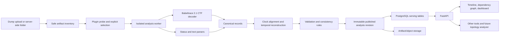
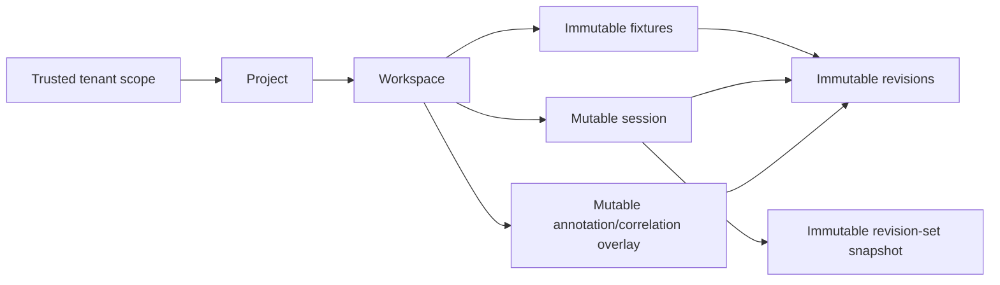

# Architecture and library decisions

Status: distributed-production target plus implemented local-profile notes,
updated 2026-08-23
Runtime: Python 3.12; the local prototype supports Windows and Linux/WSL, while
the production server and isolated analysis workers target Linux

## 1. Executive decision

The distributed-production target starts as a modular monolith with isolated
workers, not as microservices and not as a graph-database product. The shipped
single-host profile uses the same modular boundary: queue coordination remains
in-process, while strict durable plug-in probe and ingestion run in
deadline-bounded, killable child processes. An explicit trusted-inline
single-host deployment is the documented compatibility exception, not the
default production posture.



The distributed production serving-store target is PostgreSQL because this is
a concurrent server, the data volume in the brief is moderate, and temporal
interval queries fit its `int8range`, GiST, JSONB, and `inet` support. The
shipped single-host profile serves its selected browser workspace from
immutable revision/provider data and also provides a durable SQLite control
plane: content-addressed uploads and canonical datasets, a transactional
ingestion queue, tenant/project/workspace catalogs, multi-revision sessions,
immutable session snapshots, and a mutable audited review overlay. The
client-safe normalized-event search sidecar remains separate. See
[`control-plane.md`](control-plane.md) for that implemented profile. Use
S3-compatible object storage and server-backed catalog/queue/review stores
when moving the same contracts to multiple hosts.

If a revision grows from hundreds of thousands into tens or hundreds of
millions of records, add immutable Parquet fact datasets, publish them through a
revision manifest, and use DuckDB for offline/worker analytics. Do not make one
mutable DuckDB file a multi-process server database.

## 2. Correctness constraints that shape the product

### 2.1 Exact reverse history is not guaranteed

A latest snapshot and a sequence of received updates do not uniquely determine
past state unless every change is invertible.

- `property = 5` does not reveal the prior property value.
- A delete may omit the deleted object.
- A callback returning success does not prove all derived hardware writes completed.
- Internal mutations may have no corresponding gRPC message.
- A relationship may change without the old target appearing in the log.
- Status files from different layers may have been collected at different times.

Every plugin declares a reconstruction **default** of `exact`, `best_effort`, or
`unsupported`, but that is never promoted to a blanket guarantee. Every semantic
output carries orthogonal provenance (`observed`, `event_derived`,
`reconstructed`, `correlated`, or `plugin_default`) and quality (`exact`,
`best_effort`, `ambiguous`, or `unknown`). Field-level quality and explicit
unknown reasons override the record-level summary. Absence from a partial update
is not interpreted as deletion.

Prefer forward replay from the earliest coherent checkpoint or applicable
earlier observation anchors. Reverse replay from later observations is permitted
only through a plugin-supplied `revert()` reducer.
Here, "snapshot" means a collection of individual observation constraints, not
one simultaneous world: every resource, field group, and observed relationship
retains its own capture interval. A dump-wide timestamp is merely a collection
hint unless the capture mechanism proves simultaneity.

### 2.2 Preserve four different facts

Do not collapse these into one generic event table or one graph edge:

| Concept | Meaning |
|---|---|
| Observation | A value read from a status snapshot, with its capture-time range. |
| Event | Something recorded in a trace or debug log. |
| Mutation | A state/relationship change inferred from an event by a plugin. |
| Causal link | Evidence that events in different layers correspond or caused one another. |

Structural ownership, runtime dependency, reference, cross-layer correspondence,
and event causality are separate relation types with separate semantics.

### 2.3 Time is evidence, not just a timestamp

Keep all of the following:

- Raw timestamp and its clock domain.
- Stream and source sequence/ordinal.
- Normalized nanoseconds, when a transform is known.
- Uncertainty interval and clock-transform evidence.
- Deterministic ingestion order for reproducibility.

When uncertainty windows overlap, a strict cross-container order is not proven.
The system may use a deterministic linearization for stable output, but affected
states and causal links must be marked ambiguous. Use signed 64-bit nanoseconds;
serialize them as decimal strings in JSON because JavaScript numbers cannot
represent them exactly.

Absolute external queries name their clock domain. The core maps that instant
into every selected node independently through recorded transform segments and
returns the resulting local/absolute uncertainty ranges. Equal raw values from
different node clocks are never evidence of simultaneity. Under strict policy,
a missing transform is `clock_unaligned`, and an uncertainty range crossing a
state transition yields ambiguous alternatives rather than an arbitrary side.

Relative queries are anchored to a scoped completeness watermark, not the
greatest timestamp in a dump. The scope includes node, selected status
perspective, and optional topology projection. An offset of zero means the
latest completely reconstructed status for that exact scope; negative offsets
select its past. Resolving this independently across nodes produces a capture
vector, not necessarily one wall-clock instant.

At runtime, the node declares that anchor under the exact
perspective/projection pair. The coordinator qualifies it with immutable
member, revision, plug-in set, and plug-in-run identity. A complete local-only
declaration remains usable with `local_exact` resolution and null absolute
bounds; it does not require a clock transform. A narrow legacy compatibility
path may instead derive an anchor from capture time and declared projection lag,
but it is labeled `legacy_capture_lag` and still requires the node clock
mapping. New providers declare explicit scoped watermarks.

Events without a usable timestamp remain in an **unplaced events** collection
with their source ordinal. They can be reached from resource history and source
context, but must not be assigned a fabricated point on the global timeline.

## 3. Analysis revisions and ingestion lifecycle

Every import produces an immutable `analysis_revision`. The distributed target
records all of:

- Input content hash and node/case identity.
- Core schema/API version.
- Plug-in IDs, versions, immutable package/artifact identity, and configuration
  hash.
- Babeltrace decoder version and supported CTF/MIP version.
- Clock alignment configuration.

The implemented local profile represents that claim with the immutable,
versioned `PluginExecutionPlan`. New revisions use plan v4. It is an ordered
tuple of producer pins rather
than a synthetic composite plug-in, so each configured instance retains its
own artifact, configuration, schema, capability, role, and optional decoder
identity. The plan digest covers its node and source-revision basis and every
pin field plus the exact `composition_policy_digest`, v3-and-later
`execution_plan_authority`, and v4 PROCESS `process_bootstrap_digest`. A policy
change is a
new interpretation identity even when the selected primary-to-auxiliary rule
is unchanged. Configuration values and secrets are deliberately absent. Catalog
rows persist the canonical plan and digest; normalized datasets and correlation
revision vectors carry the same digest. Pre-contract rows remain readable with
an explicit absent plan instead of receiving invented provenance.

The registry also freezes a broader registered-execution identity before
selection. It covers artifact coordinates and digest, configuration digest,
the complete manifest fingerprint (including probe selectors), API/schema/
capability declarations, configured instance, decoder binding, and the full
non-recursive process bootstrap (loader kinds/targets, target executable
identities, verification mode, frozen ingestion/artifact limits, and repeated
reconstruction coordinates). Each external target identity covers exact static
import provenance, bounded target/implementation module bytes, and
relocation-stable Python code identity. Its bounded object graph follows exact
bytecode globals/static paths across package boundaries and binds callable
instance/class state; dynamic, sourceless, aliased, cyclic mutable, or opaque
targets fail closed.
Only the bootstrap's expected identity is excluded to avoid self-reference.
Probe candidates persist that identity, and ingestion refuses to run if a
restart supplies a different registration. Installed loaders provide real
distribution coordinates; direct-module loading uses an explicit
`direct-module` / `0` sentinel. A decoder pin appears in the revision plan only
when that decoder was actually used.

Registration authority lives in `plugin_registration`, below both the queue
and capability router. `ingestion_contracts` owns their shared scope,
publication, deadline, and bootstrap records. The SQLite publication adapter
lives in `session_catalog_publisher`, outside the `ControlPlane` composition
root; shared control-plane errors have a separate lower-level owner. Existing
imports from `ingestion_pipeline` and `control_plane` remain aliases to the
same classes, including compatibility lookups for saved process bootstraps.
These ownership boundaries preserve exact types and executable revalidation.

Parser probing and capability routing are deliberately separate. The durable
ingestion registry selects one primary parser for an upload. A deployment-owned
`CapabilityProviderRegistry` may hold many configured instances, including
distinct configurations of the same plug-in/version under distinct logical
instance IDs. The immutable plan—not a
mutable node map—selects which instance belongs to a revision. Exactly one pin
has `primary_parser`; additional pins carry core-assigned composition roles.
The registry can retain several exact releases of one logical instance so old
and new revisions are both replayable. Every v2-and-later pin carries the exact
`registered_execution_identity`, which covers the full frozen registration and
must never use the reserved all-zero digest. Retained plan-v1 rows have no such
wire member; decoding represents that absence internally with the reserved
`sha256:` plus 64 zeroes so legacy provenance is explicit rather than invented.
They also have no composition-policy digest or current timeline identity.
Those rows remain available to passive catalog/history projections but cannot
bind a provider, execute a capability, attach an auxiliary, or produce
private-analysis evidence.
Plan v2 remains executable and decodes its absent authority as
`legacy_unrecorded`; core does not rewrite its bytes or retroactively call it
PROCESS. V3 records the weakest whole-plan authority: PROCESS, trusted inline
with package-byte attestation, or trusted inline with manifest identity only.
PROCESS describes primary ingestion, not the isolation of later capability
hooks. The manifest tier is explicitly non-reproducible at the code-byte level.
V4 is the publication format. Each PROCESS pin also carries a canonical digest
of its complete non-recursive child bootstrap. The child compares that digest
before importing a plug-in, coordinator, or decoder target; trusted-inline v4
pins carry `null`. V2 and v3 retain their historical wire bytes and remain
executable without retroactively invented bootstrap authority.
An unfinished pre-contract queue row is different from published history. Its
upgrade transaction clears obsolete candidates and selection while binding the
composition policy explicitly active for the required re-probe. Staged and
completed publications are excluded, so migration cannot reinterpret an
already published revision.
Plan v1 has one decoder identity, owned by the primary pin. A primary
registration may have a decoder while a non-CTF revision leaves that plan field
empty; a non-primary decoder is unrepresentable and rejected. Changing
configuration creates a new logical instance ID even across revisions.

Reprocessing after a plugin upgrade creates a new revision. Published rows are
never reinterpreted in place. A small transaction changes the case's published
revision pointer only after validation succeeds.

The shipped runtime-v2 revision fingerprint includes the normalized plug-in
manifest, schema/input selection, and artifact content identity. The durable
queue separately pins the exact registered executable identity during selection.
The demo's `parser_plugin` exercises matching that runtime source revision to
the same input in the durable catalog. Its generated assembly compatibility
runtime has no durable admission adapter and cannot borrow a parser revision.
Trusted loaders may provide an immutable package/artifact digest; otherwise
core derives a bounded `package-sha256:<digest>` from the complete regular- or
namespace-package import scope. Any scope with a preceding PEP 420 namespace
begins at its first namespace ancestor and includes all of that ancestor's
search locations in import-precedence order, even when a later component is a
regular package; a genuine top-level module uses the
separate `module-sha256:<digest>` label. The digest encodes logical scope and
runtime search-root order without host paths, and core re-derives it immediately
before execution. Removing the defining root from runtime `__path__` fails
closed rather than collapsing to module scope. Sourceless Python bytecode also
fails closed: its marshalled code can embed a build path, so a trusted loader
must provide an immutable artifact digest instead. Headless ingestion, programmatic
registries, and every server control
plane fail closed by default if no executable identity can be derived and
reject a manifest-only identity. A local/test embedding must explicitly pass
`allow_manifest_identity=True` to obtain the compatibility fallback. Strict
durable deployment rejects that registry; an explicitly trusted descriptor may
publish it only with `allow_inline_only=True`. A top-level regular plug-in
package does not absorb an unrelated sibling distribution. A preceding
namespace portion is necessarily conservative: every contributing search root
enters its identity, including otherwise unrelated namespace siblings.

If that non-strict registry can revalidate package bytes but cannot attest a
stateful subprocess target, registration is retained only as `inline_only`.
It may back trusted in-process capability routing with package revalidation,
but it has no process bootstrap and is rejected by process execution. It can
enter durable publication only through the explicit trusted-inline deployment
mode. Strict mode and explicit artifact/package identities remain fail-closed.
Durable owners take sealed exact snapshots of both primary and provider
registries before creating queue authority. Later changes to a caller-owned
local registry cannot enter probe selection or plan publication, and
plan-bound routers reject `inline_only` records even when an unbound local
provider directory retains them, unless the router receives the matching
trusted-inline deployment policy and the v3-or-v4 plan records trusted-inline
authority.
Ordinary directories, including empty ones, enter the digest because they can
change import and resource-existence semantics. File reads are bounded by the
opened handle's declared size plus a growth sentinel and are accepted only when
handle/path identity remains stable. Contained link/junction aliases are
recorded without traversal, while external aliases fail closed.

The public `revision_id` is an opaque core-owned string and may contain `/`.
No plug-in, browser, or external client may infer node or resource semantics by
splitting it. Revision-scoped routes use a path-aware parameter, and clients
percent-encode the complete ID when constructing a URL.

Recommended job state machine (an exact configured match may pass directly from
`PROBED` to `SELECTED`):

```text
RECEIVED -> INVENTORIED -> PROBED
PROBED -> AWAITING_SELECTION -> SELECTED
PROBED -----------------------> SELECTED  (exact configured match)
SELECTED -> PARSING -> NORMALIZING -> ALIGNING -> RECONSTRUCTING
         -> VALIDATING -> PUBLISHED
```

Failures stay attached to an unpublished revision with structured diagnostics.
Send only job IDs and artifact references through the queue, never dump bytes.

The durable host reserves upload slots and spool bytes in SQLite before reading
input. HTTP pulls ASGI chunks on demand into the same pipeline spool used by
headless submission. Reservation/admission transitions share the quota
transaction; scoped idempotency groups avoid duplicate logical charges.
Reservations survive failed cleanup and are reclaimed only with canonical path
and unowned activity-lock proof. This host-local budget bounds staging, while
durable blobs, fixture copies, and extracted artifacts have separate retention
and capacity requirements.

### Stage details

The numbered flow is the production target. The executable local subset and
its limitations are stated immediately after it.

1. **Receive**: spool the upload to quota-controlled storage and compute SHA-256.
2. **Inventory**: walk archives without blindly extracting them; record logical
   path, parent archive, type, sizes, and content hash where practical.
   The core detects each compression/archive layer from observed content,
   applies its allowlist and quotas, and records the actual outer-to-inner codec
   chain. A plug-in may provide declarative artifact locators and role hints
   after safe inventory, but it never chooses a decoder or authorizes
   extraction. For example, `.zst.gz` is peeled as an outer gzip stream followed
   by the observed Zstandard stream; the suffix is not trusted as evidence.
3. **Probe/select**: run allowlisted plugin probes. If two plugins are plausible,
   persist candidates and pause for an explicit choice; never silently select the
   nearest software version. Record the chosen plug-in ID/version/exact
   registered package identity, probe-set hash, idempotency key, and
   request/response receipt before advancing. An exact retry therefore remains
   valid after the queue has progressed.
4. **Materialize selected inputs**: extract only plugin-selected artifacts into a
   private worker directory. CTF filesystem traces need a real directory containing
   `metadata` and stream files.
5. **Parse**: stream snapshot observations and trace events in bounded batches.
6. **Normalize/correlate**: assign typed resource identities, mutations,
   relationships, causal links, and clock anchors.
7. **Reconstruct**: create state and relationship validity intervals.
8. **Validate**: replay in the opposite direction where possible, compare terminal
   reconstructed state to observations, execute tri-state consistency rules, and
   record coverage.
9. **Publish**: bulk-load/index serving tables and atomically expose the revision.

The executable local `runtime.v2` slice handles one admitted artifact as a
regular file, directory, tar, or ZIP. `CoreArtifactReader` applies portable
relative-name rules, regular-member/link/collision checks, and count, depth,
per-file, total-expanded-byte, and compression-ratio quotas. It exposes only
logical artifact UUIDs, read-only streams, and session-private file/tree
copies. The durable control plane implements bounded raw-body uploads,
content-addressed storage, deterministic probing/selection over a deployment
allowlist, queue leases and recovery, retry/cancel, progress polling/SSE, and
immutable catalog publication. Fixture admission enters `admitting` only after
its complete catalog request is durable; validated output enters `publishing`
only after its complete revision request is durable. An optional node hint and
bounded caller import metadata pass consistently to plug-in inventory/probe
and parsing; catalog, queue, tenant, project, workspace, and principal
coordinates remain core-private. Nested codec detection, distributed object
storage/queueing, and hardened worker sandbox/container controls remain future
deployment work. The durable local profile already isolates plug-in probe and
ingestion faults in spawned child processes as described below.
Content-addressed objects are installed from verified same-directory
temporaries by atomic replacement; digest-invalid finals are quarantined and
self-healed. Store transactions explicitly recover from commit failure, and a
claim-time SQLite error backs off instead of terminating a queue worker.
Large-file work is deliberately outside the host-global publication fence:
the upload/dataset digest check, copy fallback, and complete fixture view are
prepared under private names first. The fence then spans only atomic final-name
publication and the SQLite transaction that makes those names reachable.
Workspace retention uses that same fence for its authoritative plan commit and
for one deletion/checkpoint batch of at most 32 work items at a time, releasing
it between batches. Its host directory walk and recursive size measurement stay
outside that fence. This closes the publication/reference race without
serializing unrelated hashing, copying, or host discovery across tenants or
holding publication behind the complete cleanup plan.

### 3.1 Implemented durable control plane

The control plane is a core composition layer rather than a new plug-in
protocol:



`router-dump-server` is the core-owned production-shaped composition root for
this profile. It constructs an explicit allowlisted `PluginRegistry`, requires
a deployment identity-resolver callable (or loopback-only trusted-header
development mode), and serves root health plus `/v1/control-plane` without an
analysis input, startup-runtime providers, frontend, or assets. Authenticated
`.../analysis/query` independently reads a selected durable revision through
the verified dataset boundary; it does not create a startup runtime. The ASGI lifespan owns
worker startup and shutdown. OpenAPI/Swagger/ReDoc are absent by default and
may be enabled only by an explicit option on a loopback listener. The ordinary
`router-dump-analyzer` process may
mount the same router beside one browser analysis for local review, but it is
not the required production entry point.

Both core CLI composition roots drive their FastAPI application's real ASGI
lifespan around the complete default server run, then start Uvicorn with its
second lifespan driver disabled. This preserves one startup/shutdown lifetime
while keeping failures from core-owned plug-in/runtime startup outside
Uvicorn's traceback logger, so the process boundary can project them as one
bounded, path-free CLI error. Direct ASGI embedding still drives the same
application lifespan normally; process-control exceptions are never converted
to public errors.

When an identity resolver returns an authorization `401` or `403`, its optional
response headers cross an atomic bounded safe-header validator. Invalid names,
values, duplicates, forbidden framing/representation/cookie-mutation fields, or excessive
size reject the entire map as a bounded `500` without resolver-supplied headers
while preserving two payload-free signals: the typed denial retains its
phase/reason with actual status `500`, and
`control_plane.identity_resolver.response_headers_rejected` records the
resolver fault with an exact empty field set. `Set-Cookie` and obsolete
`Set-Cookie2` are forbidden in every casing; cookie mutation belongs upstream
or in a dedicated endpoint, and any future exception must be a typed cookie
policy rather than a generic allowlist. Response `Cookie` remains under the
generic bounds because it has no browser cookie-mutation semantics. This keeps
resolver policy extensible without letting an invalid header tear down the
HTTP connection.
Wire-valid `obs-text` bytes `0xA0`-`0xFF` remain accepted. A future need for
Starlette in-process harness parity reopens this decision as one uniform
printable-ASCII policy, not production behavior specialized for a test client.
Redirect (`Location`/`Refresh`), CORS, CSP, and HSTS headers remain generically
bounded for compatibility, but are identified as policy primitives. The next
production hardening step is a typed resolver-header authorization policy that
defaults them (and response `Authorization`) to denied while retaining
`WWW-Authenticate` and explicitly registered custom headers; changing the
current behavior requires a deployment compatibility survey first.

`SqliteSessionStore` owns the catalog and selections.
`DurableIngestionPipeline` owns upload blobs, queue records, probe candidates,
leased work, progress, canonical datasets, and publication.
`ReviewOverlayStore` owns optimistic mutable annotations, manual event
correlations, tombstones, and append-only audit rows. Each store also owns a
bounded retention inventory and audit journal. `ControlPlane` validates
their cross-store invariants: scopes must exist; published dataset references
must reopen safely; review subjects must resolve inside their exact immutable
revision; and reports receive only selected client-safe observations.

Before any durable store is created, the composition root validates the
Windows path budget needed by ingestion's deepest fixed candidate
(`revisions/aa/bb/.{sha256}.json.{uuid}.partial`). Its 128-unit suffix leaves
131 UTF-16 code units for the resolved root under the legacy-compatible
259-unit usable budget. This conservative budget applies on every Windows host
so correctness does not depend on optional long-path support in every process
and filesystem. New fixture basenames are independently checked against their
private staging path before spooling; an exact idempotent replay has no new
fixture path to validate. These checks are Windows-only and their safe
diagnostics expose lengths and budgets rather than host paths.

A session member has a caller-visible member ID and exact fixture/revision
pair. This intentionally allows multiple revisions of one node in the same
session. Create, label/metadata update, member mutation, and deletion are
scope-bound and idempotent; versioned changes use optimistic integer versions.
A snapshot copies the member vector, default member, and session version under
a deterministic digest and never follows later session changes. A session
with snapshots cannot be deleted because those immutable records retain its
identity.

HTTP integer admission is split by semantic domain. Exact nanosecond instants
use signed 64-bit bounds and cross browser-facing JSON as canonical decimal
strings. Generic integer adapters require both bounds at every call site (an
unbounded side must be deliberate), so a paging coordinate cannot inherit a
timestamp limit by omission. Numeric offsets that are echoed to a browser are
bounded by `2^53-1`, with smaller endpoint-specific caps where useful.
Audit sequences are a public JSON-safe domain rather than a SQLite integer
domain. Caller-owned retention `audit_before_sequence`, annotation
`expected_audit_watermark`, review-audit `after_sequence`, and retention-journal
cursors use canonical unsigned ASCII decimal syntax bounded by `2^53-1`.
Catalog/review audit allocation and projection use the same exact integer
range. Sequence exhaustion or an out-of-domain stored row fails closed.

The queue is durable and its SQLite claims are safe across cooperating
processes on one host. Queue coordination workers remain threads in the
application process. Renewable fenced leases and heartbeats prevent a stale
worker from publishing after ownership changes; expired claims recover on
startup/claim. The durable `ControlPlane` defaults to process-isolated plug-in
execution, and `router-dump-ingest` always selects it. Both the complete
allowlisted probe and selected ingestion run in a fresh child created through
Python's `spawn` start method. The default 300-second deadline covers child
startup, plug-in work, bounded result transfer, and clean exit. Timeout causes
terminate, a two-second reap wait, kill if still alive, a second reap wait, and
partial-spool cleanup. Direct `DurableIngestionPipeline` construction also
defaults to process mode. An embedding can explicitly select `inline` for
trusted local/test code, but that path runs synchronously and provides no
timeout or bounded-shutdown claim. This avoids accumulating unkillable daemon
helpers after apparent timeouts; only process mode provides killable isolation.
All in-process plug-in entry points use the same dependency-free
`PROCESS_CONTROL_EXCEPTIONS` vocabulary. They rethrow `KeyboardInterrupt`,
`SystemExit`, and `GeneratorExit`, contain every other `BaseException`, and use
fixed public failure prose rather than plug-in exception text. Core-owned
adapters cover installed loading, ingestion descriptors and lazy streams,
runtime/session contexts, normalized providers, temporal readers, route
transition callbacks, capability hooks, and identity/runtime web providers.
They snapshot hostile descriptors once and include iterator construction,
`next()`, `close()`, `__enter__()`, and `__exit__()` in the boundary. The static
guard also recognizes list/set/dict comprehensions, generator expressions,
`list()`/`tuple()`/`sorted()`, starred expansion, `yield from`, direct
`iter()`/`next()`, tuple unpacking, and `any()`/`all()`/`sum()`/`min()`/`max()`
when their plug-in stream can be traced within the same function. Cleanup
cannot suppress or replace an in-flight core exception. Registration
snapshots validated manifest identity, so later queue work does not re-invoke a
hostile manifest descriptor. A source-wide AST census derives executable
contract members from `plugin_api.py`, scans every Python module under `src/`,
derives entry-point and dynamic-module loading from imported callable/type
semantics, follows attributes of imported module values, and asserts that every
discovered boundary has the process-control-first containment shape. It also
derives executable-process and ASGI fence reachability from registrations and
call graphs rather than filenames. Mutation tests plant unguarded calls, bare
`Exception` handlers, swallowed controls, and reversed handlers in modules
outside the old three-file allowlist and across loading primitives. This
remains a bounded static execution-boundary guard, not the broad flow-sensitive
opaque-payload analysis explicitly deferred in section 15. Reflective calls
hidden behind dynamic `eval`, native or custom `__import__` machinery, opaque
cross-module/container callback transport, and post-census monkey-patching are
documented blind spots.

Operational health is intentionally independent of an opened analysis
session. A read-only queue projection groups every non-terminal import,
separates intentional `awaiting_selection` waits, and marks other states
stalled after the configured stage-progress age. Lease heartbeats extend only
the fenced ownership deadline; they do not rewrite progress time, so a worker
blocked in a publisher call remains observable even while its thread and lease
are live. Publisher calls receive a separate deadline and inherit process
isolation by default. The budget includes spawn, provider work, result transfer,
and exit; an uncooperative child is terminated, killed if necessary, and reaped.
The built-in SQLite catalog reopens its durable database in the child and also
applies the context to Python lock acquisition and SQLite busy waits. Core
never pickles a live custom publisher: it reconstructs one from an explicit
module-level process target, or from an importable no-argument publisher class.
Stateful/configured publishers must use the explicit target; only an explicit
trusted `inline` mode remains cooperative-only.
Ambiguous deadline outcomes retain their exact idempotent outbox and pre-call
artifact pin, and health exposes them immediately. Configuration requires the
stall threshold to cover the larger of the bounded plug-in and publisher
deadlines plus two heartbeat periods. The
projection uses the `(state, updated_at_ns)` index and probes only active
states; terminal history does not make health checks progressively slower.
Root and control-plane HTTP health routes, plus `router-dump-health`, share
this total projection; HTTP adds live/configured thread counts and bounded
failure-class counters. Observer exceptions and malformed provider values are
collapsed into stable bounded observation errors and degraded HTTP 200 rather
than escaping as health-route 500 responses. The CLI opens SQLite in query-only
mode and never initializes the state directory.

Operational telemetry is a separate best-effort channel, not durable state.
Core publishes the closed `rda.operational.v1` vocabulary to the standard
`router_dump_analyzer.operations` logger through a fixed-capacity non-blocking
queue. Admission/publication boundaries, sampled worker failure/exit, retention
planning and per-source truncation, bounded cleanup batches, replay,
completion/failure, and typed control-plane access denials have explicit
events. Invalid resolver header maps additionally use a closed zero-field
event class. Fields are flat, scalar, and
bounded; dump content, paths, scope labels, raw payloads, and exception text
never enter the record. A slow handler can block only the daemon logging
thread, and dropped telemetry cannot affect ingestion or retention. Durable
queue/outbox/progress/audit rows remain authoritative; deployments own logging
handlers, exporters, retention, and alerting. Aggregate accepted/drop/delivery,
queue, and emitter-liveness counters are projected through both public health
routes without payloads or tenant identity; loss degrades health. Producer-side
validation catches ordinary exceptions but preserves process-control signals.
Authenticated `GET /v1/control-plane/diagnostics/operational-events` requires
the distinct `control-plane:instance-operator` role; tenant admin does not
imply instance operation. It exposes closed counters without payloads using a
hybrid scope: `operational_events` is process-global, while
`access_denial_sampling` belongs to the installed ASGI app and aggregates its
tenants. The view is no-store, advisory, concurrently moving, and
restart-reset; it does not weaken the anonymous aggregate-only health contract
or replace durable audit data.

Access checks raise one private typed decision carrying closed phase/reason
vocabulary. The common route wrapper emits it exactly once and recreates the
unchanged public response, which distinguishes an authorization-concealing
`404` from a genuine missing resource without scattering emit calls across
handlers. Exact enum types are checked when the decision is created and again
at the reporter boundary; the operational record validates the closed
phase-to-reason relation before enqueue.

The bounded key table never evicts an admitted sampler state. New keys after
capacity share one permanent overflow state, preventing key rotation from
recreating first-occurrence emission. Geometric/time coalescing is followed by
a process-global token bucket, so cardinality churn cannot bypass aggregate
admission. Intentional, global, overflow, invalid, and enqueue-loss counters
remain distinct. Optional within-process scope correlation is a process-keyed
HMAC of trusted resolved tenant identity, never requested header text. A
constant-space candidate algorithm emits it only when its lower bound proves a
strict majority for the sample window; uncertainty omits it. It is not a
sampling key or compliance identity. Credential authentication, client
attribution, rate limiting, and durable audit export remain deployment
responsibilities.

Sampler admission and state-window reservation happen under its lock, but the
non-blocking operational emitter is invoked after that lock is released. A
same-key observation during the attempt is coalesced into the next window; the
result commit then either discards the accepted reservation or merges it back
after enqueue failure. This prevents reentrant diagnostics from deadlocking
and preserves suppression, tenant-candidate, and enqueue-loss accounting. The
operational queue publishes a record and increments its accepted counters in
one counter-lock critical section, so its worker cannot expose a delivery
failure for a record that still appears unaccepted.

Child IPC carries at most 1 MiB of canonical JSON metadata. Ingestion writes
the canonical dataset to a unique parent-selected spool path; after renewing
the fenced lease, the parent verifies its regular-file status, returned byte
size, and SHA-256 before content-addressed installation. Registry-derived
package identities are re-hashed in the child immediately before use. The
parent sends no live plug-in/coordinator/decoder/registry/provider object. A
core-owned scalar/tuple bootstrap tells the child which module-level targets or
no-argument classes to reconstruct. The child re-registers the result and
compares its exact frozen execution identity before executing it. A configured
component must name an explicit module-level process target; default class
construction is reserved for genuinely default-constructed state. A
non-default plug-in `configuration_digest` disables an inferred class bootstrap
until an explicit module-instance `plugin_process_module_target` is supplied;
configured custom coordinator/decoder state requires the corresponding target.
An installed/direct loader may select a distinct parser process target from an
exact immutable `plugin_process_bootstrap` attribute on the live plug-in's
concrete class. Core never invokes a descriptor or inherits that declaration;
it snapshots the inert normalized target/boolean and later proves the target is
the same live instance or its exact no-argument concrete class. This is the
narrow bridge for a live application instance with a parent-only runtime
adapter: the child reconstructs only the stateless parser class, while artifact
identity continues to name the installed entry-point instance. No live runtime
object, configuration payload, or weaker inline-only identity crosses the
boundary.
The process-mode pipeline materializes these descriptors at construction, so
the queue cannot defer this mismatch until its first child execution. The
complete non-recursive descriptor is itself registered-identity material;
target-only or frozen-limit drift changes plan authority, and post-registration
mutation is rejected before a descriptor can be exported to a child. Target
executable bytes are revalidated immediately before spawn, re-attested by the
child before invocation, and checked again during child-plan readmission and
at final revision staging.

Idempotency is scope-bound and request-sensitive. The queue, catalog, and
review overlay are separate SQLite stores, not one cross-database transaction.
Before each external catalog call, the queue durably stages the complete
fixture-admission or revision-publication payload and operation ID. The catalog
records each operation idempotently, so recovery can replay a lost admission
response without a second fixture and a lost publication response without
re-running parsing or creating a second revision. These child processes are
fault isolation, not a plug-in security sandbox, and none of these mechanics
imply a distributed coordinator.

Retention is a core orchestration saga, not plug-in behavior. Quotas can be
enabled independently from deletion. Destructive policy is disabled by
default, inventories are bounded, catalog deletion is protected by session,
snapshot, review, retained private-analysis run, idempotency, and explicit
references, and review audit is
preserved unless an explicit compliance mode permits pruning. One advisory
single-host fence serializes review/private-run reference creation with catalog retention
across cooperating processes. Catalog deletion commits before exact artifact
pins are released; unacknowledged releases are replayed after a crash. A
versioned saga receipt freezes the actor, policies, and effective clock, then
checkpoints the review, catalog, and ingestion phase results independently.
Exact operation replay resumes the first incomplete phase or returns the same
completed result, while conflicting operation-ID reuse fails before mutation.
Store construction never performs retention. The tenant-owned part of a
workspace ingestion plan is deliberately provenance-bounded: it includes only
filesystem artifacts derived from eligible queue rows in that workspace. Rows
with live catalog artifact pins are retained until the catalog release journal
is reconciled; only then can one plan remove both the row and its unreferenced
content. This ordering prevents a pin from turning a scoped object into an
undiscoverable orphan.

Pre-pin ingestion databases are upgraded through a transactional, versioned
schema-migration ledger. The compatibility backfill and its completion marker
commit together exactly once. A catalog release is therefore monotonic across
process restart: construction never recreates a deliberately released pin
from the historical import row.

Schema creation and upgrades use the dedicated `.schema.lock`, independently
of both retention-operation serialization (`.retention-operation.lock`) and
the short publication fence (`.retention.lock`). Startup therefore does not
wait on either cleanup file lock; ordinary bounded SQLite transaction
coordination still applies, and process-safe migration remains serialized.
Pending retention cleanup stores one bounded outcome row for each processed
plan item in `ingestion_retention_cleanup_progress` and reuses one SQLite
connection for the resume; it never rewrites an accumulated JSON document.
Legacy `cleanup_progress_json` checkpoints are projected
transactionally into those rows on first resume and the legacy aggregate is
then cleared. One SQLite transaction checkpoints each cleanup batch of at most
32 work items, so journal write volume stays linear without paying one durable
commit per file. A crash before that transaction commits can leave a planned
path already absent; replay treats that absence as the completed planned
deletion and checkpoints the batch again. Concurrent resumptions refresh the
durable rows after acquiring the fence and adopt an already-completed report.

The operational logger emits one aggregate event after each committed batch
and explicit events for plan commit, replay, completion, failure, and every
bounded scan source that truncated. These records intentionally cannot replace
the per-item journal used for exact crash recovery.

Review and catalog stores own their retention candidate, inventory, result,
and release codecs. Saga recovery delegates to those same codecs and handles
only phase/schema/policy envelopes. Both replay paths reject duplicate items,
inconsistent counts/truncation, and malformed or oversized model fields while
retaining the existing persisted journal and phase formats.

Recursive artifact sizing happens during the advisory planning pass outside
the publication fence. The authoritative fenced rebuild consumes those sizes
but deliberately repeats database candidate selection, global reference and
pin revalidation, catalog mutation, and path-identity checks before committing
the immutable plan. That initial database phase therefore scales with the
stored import/pin population; the 32-item bound applies to cleanup after the
plan is committed. Cleanup releases the fence between those bounded batches.
Each deletion and its batch checkpoint share the same fence, so
waiting publishers can progress without reopening either the
publish-before-reference or delete-before-checkpoint race.

The migration deliberately treats an already-present legacy pin table as the
authority. The previous pin-aware build had neither release tombstones nor a
transactional backfill, so a table missing one projection may mean either a
deliberate release or an interrupted old migration. Core cannot infer which.
It preserves absence (and therefore release monotonicity) instead of
reconstructing ownership from historical import rows.

Construction and preview never inspect, advance, or mutate host-global staging
state. Explicit destructive execution also performs a host-global convergence
pass. Spool, blob, revision-dataset, and top-level fixture-view roots each
receive an independent scan and delete budget, with a deterministic globally
lexical resume cursor committed beside
the cleanup journal. Preview reports this boundary explicitly as
`host_storage_orphan_inventory="not_observed"`; execution reports
`"bounded_host_scan"`. The additive coverage value prevents a zero advisory
count from being interpreted as a complete host inventory without moving the
host scan back into preview or under its former blocking lock. Each cursor
advances monotonically to lexical EOF, where
its cycle completes and resets; no root can starve another, a restart continues
the bounded walk, and a root larger than one budget can still converge to an
untruncated empty-cycle result. The traversal order is the exact relative-path
string order used by cursor comparison, so a directory child cannot jump past
a punctuation-sorted sibling. Besides aged partial/publication locks, the pass
recognizes exact core-owned blob/dataset `.{leaf}.{32-hex}.partial` and
`.{leaf}.corrupt-{32-hex}` crash artifacts. Candidate activity locks fence live
writers; deletion revalidates immutable identity and prunes only exact empty
shard ancestors. Arbitrary dotfiles remain untouched. The pass also recognizes
only exact content-address layouts and selects unreferenced content
older than the orphan grace. Removing the last leaf performs exact, nonrecursive
`rmdir` pruning of its empty lowercase-hex shard ancestors; the bounded host
walk also journals legacy empty one- or two-level shard directories as explicit
cleanup work. Nonempty, symbolic-link, malformed, and unknown directories stay
outside deletion. It also recognizes exact core fixture IDs only at
the fixture root: a globally unreferenced, grace-aged fixture view is
recoverable after a failed row-derived deletion, while its children do not
consume scan budget. The potentially slow directory walk is ordered by a separate
retention-operation lock and remains outside the publication fence. The bounded
observations are accepted only after file-identity, age, global queue-row, and
catalog-pin revalidation inside that fence; accepted identities are journalled
and checked again during recovery under the content address lock before unlink.
This repairs publish-before-DB-
commit leaks without assigning host-global bytes to the workspace whose admin
triggered the pass. Unknown layouts, malformed or referenced fixture views,
and quarantine artifacts remain untouched. Completed ingestion retention journals share the idempotency
replay window and have a bounded execute-only prune path; cleanup-pending
journals are never pruned.

Content-address coordination uses persistent per-shard and per-address locks
under `locks/content`, not disposable lock files inside data shards. Persistent
lock pathnames are intentionally never unlinked. Dynamic spool lock files use a
separate stable namespace gate: contenders try the child lock without waiting
while they hold the gate, and an owner closes and unlinks the child while the
same gate prevents a fresh opener. This avoids POSIX close/unlink inode-domain
splits and the equivalent Windows open race. The storage layout has an explicit
stop-old-writers upgrade boundary from releases that still create in-tree
content locks.

Human review never mutates normalized data. Subjects are revision-qualified
events, source records, resources, relationships, or time ranges. Manual
correlations are event-only directed or undirected edges. The deterministic
report keeps plug-in inference, user assertions, and generic core
corroboration in distinct sections rather than treating agreement as truth.
Those origins use the core-owned `CorrelationReportProvenanceClass`; they do
not extend or reinterpret the plug-in fact `Provenance` vocabulary.
Every report requires exactly one bounded selector: explicit revision IDs, a
current mutable session, or an immutable session snapshot. Omission never
widens to the whole workspace. The default composition budget limits one
report to 128 revisions, 8 GiB of aggregate serialized datasets, 20,000 manual
correlation edges, and 10,000 selected client-safe observations.
The report wire is `correlation_report.v2`: every declared core-owned
nanosecond field is a canonical decimal string. The `_ns` suffix is not a
reserved semantic marker inside opaque plug-in mappings, so those keys and
their JSON value types pass through unchanged. One recursive,
Unicode-property-based core boundary renders `Cc`, `Cn`, `Cs`, `Zl`, and `Zp`,
every `Cf` character except U+200C ZWNJ and U+200D ZWJ, every `Zs` separator
except ordinary ASCII space, and assigned invisible or blank characters U+115F,
U+1160, U+17B4, U+17B5, U+2800, U+3164, U+FFA0, U+13441, and U+13442 in
AI-facing report strings and object keys as visible `\\uNNNN` or
supplementary `\\UNNNNNNNN` text. It covers the full Unicode TAG block, review
labels, and opaque plug-in metadata. Caller backslashes are doubled before
this conversion, making the projection injective: literal escape-looking text
and keys remain distinct from actual unsafe characters and therefore produce
different report digests. U+16FE4 KHITAN SMALL SCRIPT FILLER remains valid as
a legitimate cluster-layout control inside visibly anchored text. The explicit blank/filler
table is reviewed against Unicode 15.0.0 and must be re-swept when the runtime
Unicode database changes; it is intentionally not derived from character names
or combining categories because those include legitimate shaping controls.
The display projection additionally escapes combining grapheme joiner,
unregistered or misplaced variation selectors, U+FFFC OBJECT REPLACEMENT
CHARACTER, and private-use (`Co`) characters. These remain valid in bounded
source display labels; only the ambiguous character is made explicit.
U+FE0E/U+FE0F remain raw only for an exact adjacent pair registered by the
vendored Unicode 15 `emoji-variation-sequences.txt` data. The scanner evaluates
each selector independently, preserving multiple valid pairs across a ZWJ
sequence while escaping standalone, repeated-on-one-base, or unregistered
selectors. The identifier tier rejects every selector. The generated table
records the Unicode/emoji version, official source URL/date, pair count, and
SHA-256. Refresh it only through
`python scripts/generate_emoji_variation_sequences.py --source PATH_OR_OFFICIAL_URL`;
production never fetches Unicode data at runtime.
Review metadata rejects raw
control/bidi characters while body/rationale text retains ordinary tabs and
line breaks. Markdown inline values are escaped, and
temporal corroboration becomes explicitly unknown when clock domains are
absent or different. The live corroboration value objects also recursively
detach bounded evidence/provenance containers, including a fresh snapshot at
the operation boundary, so later caller mutation cannot alter a returned fact
or its report digest.
Catalog storage identities use a narrower policy than report prose: Unicode
`Default_Ignorable_Code_Point` characters (with only ZWNJ/ZWJ shaping
exceptions), U+FFFC, and private-use code points are rejected, while ordinary
combining accents and real-script shaping remain valid.

Both HTTP router fences translate FastAPI request-shape validation to fixed
bounded `422` details before the framework can echo caller input. Safe
adapter-owned `4xx` details remain intact, while service-originated HTTP
exceptions and unsafe/path-bearing detail fail closed. Syntactically valid
IPv6 prefixes are not mistaken for local POSIX paths during that check.

Annotation-list pagination is revision-bound rather than best-effort offset
walking. The store reads each page and the scope audit watermark in one SQLite
transaction. Later pages must echo the first watermark; a mismatch is a
declared conflict. This prevents a concurrent tombstone or insertion from
turning an apparently complete client scan into mixed review state.

The server mounts the implemented HTTP boundary at `/v1/control-plane` only
when `router-dump-analyzer` receives `--control-plane-dir`. The independent
`router-dump-ingest` command is the headless CI/documentation client. Both use
the same stores and queue implementation. Exact routes, states, headers,
limits, and operational caveats are in
[`control-plane.md`](control-plane.md).
The HTTP boundary exposes messages only from exact declared public validation
or conflict exception classes and only when their text is bounded and free of
controls. Generic `ValueError`/`TypeError` faults, including storage and path
failures, map to a closed `500` response without exception text.

## 4. Plugin architecture

Discover plugin bundles through Python entry points under
`router_dump_analyzer.plugins`. The reference protocol is in
`src/router_dump_analyzer/plugin_api.py`; operational rules are in
`docs/plugin-contract.md`. First-time authors use
`docs/plugin-author-quickstart.md` and the installable example in
`demo/rsl_demo_plugin/__init__.py` before consulting the full
normative contract.

### Three-owner rule

- **Core** owns trust boundaries and mechanics: safe artifact materialization,
  canonical envelopes and identity, clock transforms, interval reconstruction,
  persistence, budgets, APIs, orchestration, and generic rendering.
- **Node/device plug-ins** own platform-, release-, layer-, and protocol-specific
  meaning: parsing, typed keys, status normalization, mutations, local
  correlations, forwarding/topology projections, and declarative presentation.
- **Federation/linker plug-ins** own cross-node inference over bounded normalized
  claims: peer/domain matching, corroboration, ambiguity policy, and inter-node
  link semantics. They do not read raw node artifacts or replace node-local
  state.

Timestamp meaning follows the same boundary. Each node/device manifest declares
`absolute_unix_ns`, `revision_start_relative_ns`, or `source_clock_ns`; only the
last carries a plug-in-owned opaque clock-domain token. Core validates signed
ranges and uncertainty-expanded bounds, freezes the declaration into executable
identity and revision fingerprints, re-attests process-child output, and refuses
cross-clock equivalence without alignment evidence. Revision-start-relative
coordinates are already offsets and are preserved exactly; the declared
timeline start is a bound, not a second origin. This keeps vendor clock semantics
out of core while preventing a plug-in from silently changing an existing
timeline's meaning.

The core must not branch on plug-in kind, relation, source-type, source-group,
or key-field names. The detailed audit and migration ledger is in
`docs/core-plugin-boundary-audit-2026-07-22.md`.

#### Executable ownership guard

The three-owner rule is enforced by
`tests/test_node_semantic_boundaries.py`, not only by review. The guard parses
every Python module under `src/router_dump_analyzer/` and rejects executable
string literals or import paths containing the maintained high-signal set of
demo, device, vendor, and protocol vocabulary. Contract docstrings may explain
such protocols, and one exact capability-response sentence may enumerate
examples while declaring that they belong to the plug-in; neither exception
authorizes a core branch. Adding a new domain token requires moving the
interpretation to a node or federation plug-in rather than extending a core
switch.

Two compatibility exceptions remain executable and deliberately bounded:

- `normalized_data.py` still admits the exact `demo` bootstrap namespace at
  three allowlisted syntax sites while the public envelope is migrated to
  capability-named projections. No other core file or scope may use that
  fixture name.
- `multi_node_route.py` still adapts the legacy generated-projection mapping.
  Its exact `_generated_` identifier names, per-name reference ceilings, source
  file, and total executable `generated`-literal ceiling are recorded in the
  test. The allowance may shrink, but any new identifier, another file, or
  reference growth fails CI.

These are migration budgets, not extension points. New route input must enter
through typed, protocol-neutral projection contracts; completing that migration
deletes the allowlist instead of transferring it to another module.

### Distribution and executable ownership

The protocol-neutral core is the foundation and the only application
distribution:

```text
router-dump-analyzer-core[web]
    -> router-dump-analyzer executable
    -> dynamic plug-in/module loader
    -> FastAPI application, routes, middleware, and lifecycle
    -> generic API/query orchestration and browser distribution
    -X-> demo package or demo vocabulary

router-dump-analyzer-demo
    -> router-dump-analyzer-core
    -> one installed example plug-in and non-web runtime providers
    -> generated-fixture policy, scenarios, and generator
    -X-> executable, FastAPI objects, routes, or frontend assets
```

The core, demo, and independent scenario-generator distributions are PEP 561
typed. Each shipped Python module has a sibling `.pyi`, and each package root
has `py.typed`; this covers `router_dump_analyzer`, `rsl_demo_plugin`,
`rsl_demo_generator`, and `state_dump_generator` without a parallel `types-*`
distribution. The module-for-module layout preserves package ownership and
allows protocols and callable aliases to be resolved without importing optional
web dependencies. Stubs are generated projections rather than executable
policy: `scripts/export_type_stubs.py --check` enforces source/stub parity, and
`tests/typing/public_api.py` and
`state-dump-generator/tests/typing/generator_public_api.py` are the strict
consumer gates. The import-free exporter supplements its generator only for
source-derived facts the generator cannot retain: underscore-prefixed fields
that participate in a public dataclass constructor and direct
`SealedContractValue` subclasses that are closed to further inheritance. The
typing contract also rejects `Incomplete` exported annotations and a declared
type alias whose generated projection loses its defining expression.

`src/router_dump_analyzer/` is the core source root. It contains the core CLI,
application factory, runtime-session protocols, complete HTTP API, generic
services, and frontend host. The separately packaged `frontend/` tree is forced
into the core wheel and source distribution. FastAPI and Uvicorn remain behind
the core's optional `web` extra so contract-only and parser-only use does not
install a server stack. Every core web-shell factory defaults OpenAPI JSON,
Swagger UI, and ReDoc off. The analysis and headless server CLIs expose them
only after an explicit `--expose-api-docs` on a loopback listener; this host
gate is core policy and is not a plug-in extension point.

`demo/rsl_demo_plugin/` contains the example plug-in, its
device/protocol and generated-projection policy, and a non-web input/session
adapter for the generated archive. The sibling
`demo/rsl_demo_generator/` contains the dedicated fixture
generator and imports the plug-in package explicitly. The demo
depends on the core base distribution without the `web` extra. It publishes
only the `demo_router` plug-in entry point and no application executable.
Its Python import roots are the collision-resistant `rsl_demo_plugin` and
`rsl_demo_generator`; the distribution must not claim generic top-level
`plugin` or `generator` namespaces.

Package facades resolve compatibility exports on demand. Importing a core
contract does not initialize ingestion, routing, or the control plane; demo
catalog defaults are read only when a caller requests their values. The
standalone generator keeps its own independent loader. Demo parser declarations
remain at their original module path so strict source attestation and pickle
lookups retain their provenance; only access to the runtime-attached `plugin`
constructs the archive session. Public names, type stubs, and instance identity
are preserved and checked in fresh-process import/bootstrap tests.

The independent `state-dump-generator` editor obtains its physical canvas state
from a bounded view of the same Python replay used by reconstruction. The
browser owns editing and presentation, while the generator owns state
precedence and temporal ordering. Pending or stale preview responses cannot
assert physical truth, and this authoring view never enters node dump evidence.

The core dynamically loads a module-level plug-in instance either from an
installed `router_dump_analyzer.plugins` entry point (`--plugin NAME`) or a
direct development target (`--plugin-module PACKAGE[:ATTRIBUTE]`). Core never
imports the demo statically. Static dependency and package-content tests reject
reverse imports, demo-named core modules, a demo executable, web objects in the
demo runtime, and duplicated frontend assets.

Mixed prototype semantics remain plug-in policy until their inputs and outputs
become typed, protocol-neutral core contracts. A reusable-looking algorithm is
not promoted merely because the demo currently exercises it.

Fixture limitations describe producer evidence and coverage. Core capabilities
combine declared analysis providers with application-owned service configuration;
the demo does not maintain a second inventory of host uploads, persistence,
identity, or process controls. Configuration flags remain distinct from caller
authorization and live service health.

Analysis loading is observable without moving device semantics into core. One
application-owned `AnalysisLoadTracker` surrounds normalized dataset loads and
publishes only closed generic stages and bounded counters at
`GET /v1/analysis-load`. Runtime open and context entry remain synchronous so a
startup failure still crosses the existing bounded CLI error boundary. For a
frontend host, the core-built runtime-v2 store defers ordinary parser ingestion
until the first normalized workspace request; the HTML and progress endpoint
can therefore render while that request parses the dump. Compatibility
providers are tracked at their lazy topology/route construction boundaries.
The same tracker also surrounds archive reading, provider validation,
topology reconstruction, route-table queries, and explicit tracing with closed
generic stages. A nested operation on that tracker temporarily refines the
parent stage and restores it on success; failures retain their failing stage.
Nesting does not finish the parent's work.
No new plug-in hook is introduced: `report_analysis_load()` remains the optional
advisory channel. Browser JSON waits default to 180 seconds (overrides are capped
at 300 seconds), while progress observations wait at most 10 seconds. A timeout
offers manual retry without automatic replay and does not establish that
synchronous backend work stopped.
There is no detached load thread: an API-only host loads and indexes its default
revision synchronously before serving, preserving fail-fast and native
process-control semantics. Plug-ins may refine the currently bound operation
with the exported advisory reporter, but cannot supply tracker instances, UI
strings, routes, percentages, or identifiers. Unknown totals remain
indeterminate.

#### Runtime session boundary

`revision_queries.RevisionQueryService` executes bounded graph, correlation,
event-density, event-log, and timeline queries without importing HTTP or
consulting request context. Frozen query records carry validated selections;
nested JSON metadata is detached and immutable. Core callers supply a matching
normalized-data service, revision ID, dataset, optional history index, and
cancellation probe. The service scopes data-service reads to that revision but
does not independently attest that the supplied dataset and index correspond.
The HTTP adapter owns authentication, revision selection, wire parsing, and
translation of `RevisionQueryRequestError` into the existing safe 422 response.
Headless execution and parity with each HTTP query family are exercised by
`tests/test_revision_queries.py`.

Zoom queries keep bounded private indexes on the normalized-data service.
Per-resource timestamp and interval indexes select narrow windows; coarse event
clusters are counted before projecting/redacting bounded previews. Density
summaries retain exact type counters and reuse aligned time cells across levels.
State/lifecycle response limits carry explicit summary/truncation metadata so
omission is not interpreted as absence. These are core query optimizations;
the plug-in boundary and device semantics are unchanged. Cold index construction
and the runtime's initial history materialization remain separate costs.
Without `IndexedHistory`, timeline selection retains one full event-window
scan plus per-lane checks of matching events. Transient filtered lists are
not retained as reusable revision indexes.

The HTTP timeline/density wrapper drains the request body before monitoring
disconnects, then binds a thread-safe cancellation probe for core checkpoints.
It cannot interrupt arbitrary synchronous plug-in or archive work. The browser
aborts obsolete requests, uses revision/bounds-scoped aligned density pages,
and refines explicitly labelled cached summaries after gestures settle.

`TemporalTopologyService` likewise accepts an explicit optional `IndexedHistory`.
Providers forward the normalized source's index for that exact dataset/revision;
absence selects array traversal. Private dataset-key compatibility remains in
the source adapter, keeping the temporal engine reusable with independent
normalized sources.

The standard parsing contract is the normal hosted path. An ordinary parser
plug-in exposes no `runtime` attribute. Core validates the selected host input,
creates the safe artifact inventory, calls `describe()`, `probe()`, and
`locate_inputs()`, capability-dispatches parser hooks, validates outputs, and
constructs `router_dump_analyzer.runtime.v2` itself. The plug-in never receives
the original path or chooses extraction destinations.

The current core-built session yields the first three surfaces below and sets
the optional three to `None`:

1. a required immutable `revision_store`;
2. a required normalized `data_source`;
3. a required device/input `data_policy`;
4. an optional `temporal_provider`;
5. an optional `topology_provider`; and
6. an optional `route_provider`.

Its in-memory normalized source has no optional structural history index and
its data policy advertises no route catalog. Temporal, topology, and route APIs
therefore stay unavailable; core does not infer them from emitted names or
properties.

`plugin.runtime` with capability ID `router_dump_analyzer.runtime.v1` is a
compatibility path only for independently versioned precomputed fixtures, such
as the bundled million-event-per-node demo. Entering its context yields all six
structural surfaces above. Core validates the protocols, constructs the core
`NormalizedDataService`, owns the context lifetime, stores the active session
in application state, binds it request-locally, and closes it at shutdown.
Generic state, relationship, resource-table, dashboard, range, redaction,
search, and client projection stay in core. The plug-in owns input-format
interpretation and device/protocol policy; it cannot return an ASGI app,
replace a core query service, or contribute routes, middleware, templates, or
executable frontend code. The normative shapes are in
[`docs/plugin-contract.md`](plugin-contract.md#core-owned-ingestion-runtime-and-compatibility-sessions).

A plug-in runtime may own a validated precomputed-fixture materializer, but
that extension is not a standard parser hook and must not claim that a live
parser replayed data it did not parse. Its runtime loader validates the declared
provider, schema, materialization mode, and immutable members before publishing
a revision. Ordinary live device plug-ins use the standard capability hooks
instead.

The bundled demo plug-in's current provider identity, projection format,
coverage registry, evidence shapes, and validation rules are implementation
details maintained in the
[demo guide](../demo/README.md#generated-mock-dumps). That guide currently
names the illustrative provider `demo.example-router`; architecture depends
only on the boundary above, not on that identity, a particular demo format
version, or a scenario count.

A plugin bundle supplies:

- Platform/version probe and input locators.
- Status parsers, text-log parsers, and domain mappers for core-decoded CTF records.
- Typed resource keys and display metadata.
- Forward and reverse reducers.
- Dynamic relationship and cross-layer correlation rules.
- Raw clock domains, anchors, and device-specific anchor interpretation; the
  core fits and validates transforms and resolves temporal selectors.
- Consistency checks.
- Projection into a canonical forwarding model.
- Sensitive-field declarations for structured resource properties. The core
  owns public source-record projections, the authorization boundary, and
  raw-context access; the current protocol does not expose a plug-in
  source-context policy hook. The shipped server requires a host identity
  resolver and enforces its roles and optional project/workspace scopes, but
  does not authenticate credentials. The CLI's explicit local adapter only
  trusts headers.

Derived density, timeline, event-union, and redacted-event query caches belong
to the exact immutable history generation. A service must not keep a retired
generation alive through cached query values. Live leases may continue using
that generation until release; a replacement with the same revision string
must use its own derived state. Adapters that cannot carry generation-local
state receive request-local derived state instead of a process-global cache.

`HistorySearchCorpus.query()` returns a read-only `Sequence[int]` of exact,
ordered document ordinals. Consumers use length, indexing, iteration, and
bounded slices rather than assuming an `array` or copying the whole result.
Core chooses sparse ordinals, complement ordinals, or a bitmap with rank
metadata; retained query results are bounded by query count and encoded bytes
(`max_cached_bytes`, defaulting to four times `max_cached_ordinals`). An
oversized result remains queryable without being retained. Candidate refinement
must preserve literal case-folded substring semantics: only a cached shorter
needle contained in the new needle can safely supply candidates, and every
candidate still receives the exact substring check. Cold matching can share
corpus construction or sidecar validation scans, but results publish only after
complete identity, count, digest, and candidate-index validation succeeds.

A compatibility history adapter may provide `ordered_events_by_resource` as
an optional accelerator containing the same complete per-resource event
sequences in canonical temporal order. Core can bisect these sequences before
building a cold timeline window and count unique events from the selected
window, preserving inclusive nanosecond bounds and stable event identity.
This is not a new capability hook or a requirement for ordinary parsers.
Adapters without it retain the existing complete-history fallback. Treat the
sequences as immutable for the lifetime of their history generation.

The module-level entry-point target is an instance. Every plug-in has the
required `describe`, `probe`, and `locate_inputs` hooks; standard
`PluginCapability` values activate optional hooks, including the advisory
`EVIDENCE_ANALYSIS` hook for citation-scoped interpretation of already
authorized private evidence. `InputSpec.parser_kind`
selects status, CTF, or text-trace dispatch without interpreting the plug-in's
opaque `role` or `parser_id`. `AnalyzerPluginBase` gives authors safe no-ops for
undeclared capabilities and rejects declared behavior that was not implemented.
The hook can live on a separately identified capability-only auxiliary. A
deployment-owned composition rule attaches that exact instance to an exact
primary parser identity. The auxiliary is registered only as a capability
provider, so the primary parser registry cannot select it during probing. The
immutable revision plan records both pins and their roles, which lets different
device, firmware, and chip implementations coexist without making platform
names or model arguments provider-selection authority.
Parser hooks emit `SourceRecordEmission` before the core assigns stable
`SourceRecord` identity. The generic `router-dump-plugin-validate` command
checks this cold-start contract before product-specific conformance runs.
An emission may carry plug-in-materialized `copy_text` and one or more matched
event IDs. The plug-in must make copy text safe for verbatim export before
emission because its contents are opaque to core. Copy text is stored as
private source data and excluded from search, timeline, and bootstrap
projections. A core-owned selection service resolves immutable event-log
ranges to source links, validates type/NUL/size constraints, deduplicates, and
applies byte/item budgets before returning requested plain-text fragments. The
hosting service authorizes that endpoint; the browser owns selection gestures
and the final clipboard write.

The executable `IngestionCoordinator` rejects invalid output before
normalization. It enforces exact protocol classes and enums, declared schema
references, selected-input evidence, integer time/order fields, ordered
observation windows, true booleans, and configured count/depth/size budgets.
Cyclic or unsupported values, non-finite floats, oversized integers or atoms,
wrong parser outputs, and non-recoverable diagnostics fail closed without
publishing a valid prefix. Capability declarations and `InputSpec.parser_kind`
must select the same implemented hook. CTF dispatch additionally requires an
explicitly configured core `TraceDecoder`; this repository does not ship a
built-in decoder in runtime v2.

Custom coordinators do not bypass this validation or become publication
authorities. Publication first checks the exact frozen registration limits and
exact tuple counts without traversing coordinator-owned items, captures every
top-level result reference once, binds the selected node to the requested hint,
and then detaches the result. It revalidates portable inventory-name collisions
and the complete parent-artifact graph, source-record coordinate alignment and
uniqueness, schema/output types, and aggregate budgets. Core rebuilds the
closed dataset from those detached typed values and requires exact equality
with the coordinator-supplied dataset before the execution plan or consistency
stage can observe it.

The selection preflight shares that boundary rather than approximating it.
`validate_probe_report()` owns result and diagnostic field bounds, while
`validate_plugin_diagnostic()` is reused by ingestion and optional capability
execution. Durable probing constructs its safe inventory with the exact
`ArtifactLimits` carried by the registered coordinator, eliminating a
selectable-under-defaults/rejected-under-ingestion quota split.

The validation budget is ingestion-wide as well as per value: the default
aggregate limits cover two million outputs, two million decoder records,
100,000 diagnostics, four million each of evidence items, subject references,
and event links, 64 million normalized value units, and 256 MiB of UTF-8 text.
This bounds memory growth from many individually valid records; it is not an
execution deadline. The durable control plane separately applies its
killable child-process deadline to probe and ingestion (300 seconds by
default). Explicit trusted local/test inline execution is synchronous and
does not apply that deadline, because Python cannot safely cancel arbitrary
thread code. A production deployment still needs process mode plus
operating-system CPU/memory/output quotas in
addition to the wall-clock fault boundary.

The executable `PluginCapabilityExecutor` is the matching core boundary for
optional semantic hooks. It gates `apply`, `revert`, `correlate`, revision
relationship projection, consistency, topology, forwarding projection, and
forwarding-step calls;
wraps world access in one bounded read-only facade; closes output iterators;
and validates every exact request, result, schema reference, and diagnostic.
Patch operation names, conflicts, unknown-field metadata, and exact field
quality/provenance enums share one validator across result admission and
request detachment. This includes forwarding request changes; validation does
not make an extra copy of property payloads merely to inspect metadata.
Capability authority comes from a one-time exact snapshot of the manifest set,
not its overridable `supports()` helper.
Correlation receives the caller's bounded/indexed reader and an independently
validated window. Typed result envelopes retain recoverable diagnostics;
non-recoverable or invalid output fails the call without a partial result.
Reducer, correlation, and forwarding-projection admission transfers each output
into a bounded core-owned graph before iterator advancement, then revalidates it.
A shared exact core-DTO allowlist prevents arbitrary constructor execution;
read-only nested mappings and one aggregate snapshot budget prevent retained
producer aliases or output splitting from bypassing admission.
This executor makes the hook protocol testable but does not install runtime-v2
temporal, topology, or route providers.

The durable ingestion coordinator uses that boundary for two ordered scheduled
stages: revision relationship projection followed by consistency
materialization. After normalization and complete execution-plan freeze, core
constructs an immutable indexed
`IngestionRevisionWorld` by replaying validated snapshots and explicit
relationship observations with the same order/patch semantics as dataset
normalization. Its `WorldBasis` is an observed capture vector with independent
artifact/clock ranges; no latest-event timestamp is promoted to common truth.
One unknown-time observation makes its complete artifact/clock range unbounded,
even when sibling observations carry exact bounds.
The primary pin participates in either stage when it declares the corresponding
capability. An auxiliary relationship projector participates only through the
explicit `revision_relationship_projection` role; consistency uses
`revision_consistency`. Merely declaring a capability never schedules an
auxiliary.
Parser/discovery yields are detached through a bounded typed deep snapshot
before iterator advancement, so later plug-in mutation cannot alter either the
normalized dataset or this immutable revision world.
Each capability invocation also receives detached basis and perspective
objects, preventing one provider from changing the revision coordinates seen
by the next provider through `object.__setattr__`.

All projectors read the same base world. A projector cannot observe another
projector's same-phase output, so provider order does not become semantic and
there is no plug-in-controlled fixed point. Each `RelationshipDeclaration`
asserts one basis-scoped edge between resources that already exist in the base
world. It has no timestamp, presence field, basis, or producer: core attaches
the authoritative basis and complete selected pin. Its relation type and
optional perspective must belong to the primary schema; attributes are one
complete patch with no removals; evidence must belong to the revision.

The ordinary public executor validates a provider against its own schema. The
durable coordinator uses a private revision-only authority path so a selected
auxiliary can read the primary revision world and declare primary-schema
relationships without pretending that it owns that schema. This override is
not part of the public hook, executor, router, or stub API. Projection
diagnostics are accepted only as recoverable
`DiagnosticStage.RELATIONSHIP_PROJECTION` records and are rebound to the exact
selected provider.

Core qualifies local perspective references with the primary instance and
schema digest before world construction. Perspective is part of canonical
edge identity, and undirected endpoints are canonicalized, so different
perspectives remain independent while reversed undirected declarations join.
An explicit parser observation wins over a projected relationship only when
both address the same fully qualified edge.

Canonical identical claims collapse while retaining distinct provider and
evidence contributions. Conflicting semantic claims for the same edge remain
inspectable in a stable ambiguity group. The augmented world receives one
conservative ambiguous relationship containing only attributes common to all
claims; core never merges endpoint identities or lets provider order choose a
winner. Consistency is then evaluated against this augmented world.

`PlanBoundCapabilityRouter` executes those exact pins inside the same killable
child as PROCESS ingestion (or the explicitly trusted inline boundary), and
each revision-wide materializer layers aggregate
provider/output/reference/read/byte limits over executor limits. It
canonicalizes relationship claims, findings, and recoverable diagnostics with
producer and plan provenance, validates admitted evidence, endpoints, schema,
and basis, and writes complete/not-applicable envelopes. This happens before
dataset serialization and hashing, so any failure
prevents staging/publication and a policy/provider/output change changes the
published revision identity. Reads never execute a hook retroactively.
Both boundaries reject oversized capture-range and node-resolution vectors
before traversal or ownership snapshot, and cap nested plus aggregate basis
evidence.
The durable form retains evidence locators and the complete canonical basis;
reload derives the recorded digest from that validated basis and reconstructs
pre-deduplication occurrence, evidence, and byte charges. Its digest commits
to that richer basis. Public HTTP/browser projection is a
separate closed boundary: it omits locators, validates exact structural
domains, and applies descriptor-sensitive redaction only to plug-in-owned
finding details and projected relationship attributes.
The read side repeats the v3 storage checks: envelope fields and counts are
exact, evidence artifacts must be in the revision inventory, typed resource
keys are reconstructed and their canonical IDs rederived, and bounded
noncanonical data fails as dataset corruption rather than being repaired or
partly displayed.

The parent freezes every policy-selected auxiliary pin into the complete plan,
but transfers executable child bootstraps only for the primary and auxiliaries
carrying `revision_relationship_projection` or `revision_consistency`. Before
importing an auxiliary target, the
child compares its scalar bootstrap coordinates and order with those frozen
role-selected pins and rejects extras, omissions, duplicates, or mismatches.
An internal pin-scoped router retains the complete plan and plan digest while
binding only the pins selected for each stage; the public/default router
continues to bind and validate the complete plan. Consequently an unrelated
topology or evidence auxiliary is recorded in revision provenance without
being loaded for either scheduled stage.

`IngestionRevisionWorld` folds snapshot observations sharing a `ResourceKey`
and qualified status perspective before relationship projection. The resulting
state retains the final ordered observation's evidence rather than a raw
per-observation stream. Projectors
that need to compare observations collapsed under one key therefore require a
future, separately bounded observation/source reader; the world-scoped hook
does not pretend to preserve them.

The dataset and typed-world paths share `observation_reconstruction` for patch
application, observation order, perspective grouping, and directed/undirected
relationship identity. Neither path merges fields across perspectives. A
plan-bound rebuild qualifies primary-parser local perspective IDs with the exact
primary instance/schema; unplanned data remains unbound, and unrelated dataset
sections are preserved. A singular unselected lookup across multiple
perspectives is ambiguous, and
missing selected-perspective status remains unknown. `world_read_budget` owns
scan limits and aggregate reader forwarding across capability execution and
both materializers; exact explicit limits do not consume a sentinel outside
the requested slice. Materialization wire versions have a dependency-light
single owner in `materialization_contract`.

Other deduplicated primitives deliberately remain narrow: SQLite stores share
BEGIN/checkpoint/body/commit recovery fencing while retaining their own locks,
connection replacement, and error translation; deployment descriptors share
state-directory normalization and target grammar while keeping distinct exact
context types. Authorization and operational telemetry derive their closed
vocabulary from `access_control_contract`. Generator scheduling/classification
belongs only to the standalone generator, not to these core primitives.
The duplicate-source gate scans the generator too. Its two exact cross-product
constant exceptions are deliberate: the saved-scenario schema ID is a wire
contract between independently installable producers/consumers, and each
independent CLI owns its loopback default. Neither justifies an import dependency
between generator, demo, and core; additional owners still fail the gate.

`PlanBoundCapabilityRouter` is the production composition layer above that
executor. It digest-verifies and detaches a revision plan, resolves an exact
capability plus optional role/instance, and treats zero or multiple matches as
errors rather than using plan or registration order. It revalidates the full
registered executable identity and normalized schema before and after
invocation. Its provider directory may retain exact registry-created
manifest/inline compatibility records as inert history, but a strict router
rejects them; an opted-in router requires a matching v3-or-v4 trusted-inline
authority. Caller-asserted non-revalidatable records fail registry admission. A
mid-call mutation discards the result. A perspective-specific world must carry
the selected instance/schema qualifiers, and forwarding steps must name the
selected revision-set member. Every successful result retains a detached producer
reference with catalog revision, member, node, source basis, plan digest, and
full pin. Cross-provider aggregation remains an explicit federation concern.

Within core, `MultiNodeRouteService` consumes the `RouteTopologyAccess` protocol
from `route_topology`, rather than topology's private caches or selector helpers.
Topology owns node and projection selection, including ambiguity and perspective
validation. `RouteProjectionSelection` retains the selected plug-in set and
ordered plug-in/projection/perspective identities. Invalid requests use the
shared `MultiNodeTopologyRequestError`, also available at its original
`multi_node_topology` import path.

Context lookup returns a retained immutable snapshot, or `None` after eviction.
Node/catalog lookup reuses immutable metadata without copying projection facts;
a new catalog revision requires a new service. HTTP-facing queries and context
member responses remain detached mutable JSON. Alternate core topology services
can implement this interface without reproducing private storage, while provider
registration, exact executable attestation, and federation admission retain
their existing owners. `tests.test_route_topology_access` exercises an alternate
implementation, snapshot isolation, expired contexts, and selector mismatches.

`PluginCompositionPolicy` is the deployment-owned admission rule that creates
those multi-provider plans. The durable selector still chooses exactly one
primary parser. A rule matches that parser's instance ID and content-addressed
registered execution identity, then adds only its canonically ordered,
explicit auxiliary identities and roles. The policy contains no plug-in
objects, callbacks, configuration values, device heuristics, or name-based
fallback. Its digest is written to the import row before work begins; every
worker phase verifies the stored digest against its configured policy and
fails closed on drift. Consequently mixed platform/firmware revisions can
coexist in one session without making registration order semantic.
The parent revalidates every auxiliary executable fingerprint and manifest
immediately before freezing either an inline or child-safe process pin, so the
process path does not rely on provider-registry admission as stale authority.
After the process child returns, it repeats those checks around auxiliary
identity/schema reads and over the complete set at the final plan-readmission
edge. A provider that drifts during parsing therefore prevents revision
staging even when the returned plan exactly matches the earlier frozen pins.

`PluginCompositionDeployment` is the core-owned trusted descriptor around that
policy. It binds an exact primary `PluginRegistry`, complete
`CapabilityProviderRegistry`, and policy under one deterministic deployment
digest. The loader accepts only `PACKAGE:ATTRIBUTE`, calls a factory once with
a detached state-directory-only context, and exposes no device, firmware, or
chip matching heuristic to core. Server, headless ingestion, embedded durable
analysis, and private-analysis CLI roots select this descriptor explicitly and
pass all three authorities together. The headless operation fingerprint also
commits to its deployment digest.
The descriptor snapshots and seals both registries before validating that
digest. Caller-owned registries remain independently mutable for local use, but
later additions cannot change the descriptor's record set or deployment
identity.

Deployment contract v2 adds the exact-boolean `allow_inline_only` policy and
binds it into `deployment_digest`. False is unchanged strict PROCESS admission.
True admits registry-created inline-only records, including manifest-only
identity, for an explicitly trusted single-host composition. Core derives
`requires_inline_execution` across the complete sealed primary/provider
directory rather than the selected rule. Thus an unused provider retained for
historical plans forces the whole primary ingestion pipeline inline; per-job
mode switching cannot let one live object alternate between PROCESS and INLINE.
Server, headless ingestion, embedded durable analysis, and private-analysis CLI
roots forward the descriptor policy, while HTTP/input data has no toggle. The
publisher remains PROCESS by default unless an embedding independently
overrides it.

Inline durable ingestion shares live objects and mutable state across jobs,
tenants, and workers and inherits ambient process access. It has no subprocess
crash, CPU, or memory containment, no killable timeout, and no interruptible
`close()` guarantee. Every tenant/operator sharing the instance must trust it;
the plug-in must be thread-safe or the deployment must use `max_workers=1`.

Standalone roots spell the selector `--plugin-deployment-module`. The
interactive analyzer instead uses
`--plugin-composition-deployment-module` for its embedded durable control plane
and retains a separate required ordinary plug-in selector for the immediate
startup input. This prevents either authority from being silently reused for
the other lifecycle.

Published plans become executable only through
`ControlPlane.capability_router_for_revision()` and
`capability_router_for_revision_set()`. Those methods first load the immutable
catalog revision, then construct exact `PlanBoundCapabilityRouter` instances
from the deployment provider directory. Session/snapshot member identities
survive federation; a planless or stale member cannot fall back to current
installation state.

Plugins emit iterators/batches; they do not write the database. For production,
use Arrow `RecordBatch` messages between the plugin worker and coordinator so
100K+ records do not become millions of Python ORM objects. Validate every batch
against the core schema at the process boundary.

A Python child process is not a sandbox. The durable local runtime imports
trusted installed plug-ins, then executes probe and ingestion in killable
spawned children with bounded metadata and a wall deadline. Those children
still inherit the host user's filesystem, network, environment, and
operating-system privileges. Production must run plug-ins and a separately
configured native Babeltrace decoder in disposable, resource-limited Linux
processes/containers without network access or application database
credentials.

The worker/core owns `bt2` iterator lifecycle and converts every native message
into a dependency-free record: event; stream, packet, or activity boundary; or
discarded-event/packet notice, with trace/stream identity, stable message
ordinal, raw/default-clock time, payload/context, and source evidence. Native
`bt2` objects never cross the plugin call boundary. The core-assigned source
identity remains a typed field on the mapped domain event. The plugin only maps
those normalized records to domain events; this keeps decoder upgrades and
native failures inside one controlled boundary.

All input-dependent plugin methods can emit structured diagnostics; the static
`describe()` schema hook is validated or fails plugin loading. Correlation receives a
bounded, indexed `CorrelationReader` rather than the whole event list; it streams
candidates by time window, layer, event type, and subject, and can request a
read-only world at a time. World scans and relationship scans are iterators with
coordinator-enforced budgets, so checks and projections do not require a 100K+
object list in memory.

## 5. Canonical domain model

### 5.1 Resource identity

Each resource has:

- A stable opaque external ID derived from a canonical typed key.
- A dense internal `BIGINT` for joins and in-memory traversal.
- Node, layer, namespace, kind, and ordered typed key parts.
- An incarnation number so delete/recreate lifetimes are not merged.
- Optional unresolved-placeholder status for references seen before definitions.

Never hash a display name such as `vrf:id:uuid` without type information.
Integer `1`, string `"1"`, a UUID, and raw bytes are different key values.

A child resource may have a compound key containing the canonical key parts or
opaque ID of its parent plus a child-local part. For example, a plug-in may key a
path by `(parent_resource_id, path_id)`. It remains a first-class resource with
its own incarnation and intervals. The key is identity material, not an implied
edge: the plug-in must separately emit the time-valid parent/child relationship,
and the core never parses key fields to invent correlation.

### 5.2 State representation

Use a small stable envelope rather than a universal EAV table:

- Promoted columns: existence, admin state, operational state, severity,
  provenance, and quality where they apply.
- `state JSONB`: full plugin-defined properties.
- `unknown_fields JSONB`: per-field reason and evidence gap.
- Optional plugin-declared typed projection tables/indexes for commonly filtered
  values such as VRF, prefix, group ID, neighbor address, or result code.

A missing JSON key, an explicitly null value, and an unknown value are distinct.
Avoid a global GIN index over every state document until a measured query needs it.
Literal normalized-history search is now one such measured query at 125K-event
scale. After plug-in sensitivity declarations are final, publication should
materialize a revision-scoped, case-folded `safe_search_text` projection and
index it with PostgreSQL `pg_trgm`; exact substring verification remains the
core security boundary. Raw payloads and sensitive fields must never be placed
in that index. The demo uses the same contract through a bounded immutable
SQLite sidecar plus a bounded in-process result-posting cache; this keeps the
large safe-text corpus out of private Python memory and allows restart reuse.
The demo's optional external-content FTS5 trigram table supplies candidates only.
Every candidate is joined back to the authoritative safe-text table and checked
with exact literal substring semantics; short or parser-unsafe queries use the
same exact table scan. SQLite builds without the trigram tokenizer persist a
scan-only sidecar rather than changing results or reconstructing raw payloads.
An ordered safe-projection digest, strict ordinal and size bounds, and a stored
FTS vocabulary digest protect reopen reuse from stale document/index
combinations; FTS5's full source-aware integrity check runs before publication.

Client publication is a separate core projection over that storage model.

Historical state fallback is absence-based: a selected interval containing an
explicitly empty property mapping remains empty, including after deletion of
the last field. Only a resource without any state history uses the legacy
final-record fallback; a gap in declared history never borrows a future snapshot.
Shared half-open containment and tri-state
relationship-presence helpers serve both indexed and scanning consumers.
Legacy omitted presence means present; explicit false is excluded from active
graphs and table traversal; explicit null remains ambiguous with both presence
alternatives. History retains tombstone evidence. Browser fallback and
transport-normalization paths preserve the same distinctions.

Overlapping independent status perspectives remain ambiguous in singular
resource reads and named resource-table views: no final-state fallback fills
their empty state. Ambiguous resources and child branches remain discoverable
through table search in both indexed and scanning history; only explicit
absence excludes them from an active table.

Descriptor sensitivity and visibility rules apply only inside plug-in property
containers, including nested mappings/lists and literal dotted keys; they never
become a global blacklist over core envelopes. Revision/node/resource/event
identity, event classification, affected-resource references, timestamps,
schema, and capability fields therefore retain their core meaning even when a
plug-in property collides with the same name. Public evidence, provenance,
unknown-field, and incarnation values use bounded typed metadata shapes rather
than arbitrary plug-in maps.

Core-generated resource and event-subject labels use the same publication
policy to select permitted key values before formatting, with the resource
kind as an all-hidden fallback. Original typed keys and canonical identities
stay private and unchanged. This construction rule does not rewrite stored or
explicit plug-in-supplied labels; those remain intentional public presentation.

For an event, core assembles the applicable property policies from explicit
event/subject/effect resource kinds and from every referenced canonical
resource, including `affected_resources`, resolved through the immutable
catalog. Event `kind` is not a resource-kind hint. An unresolved reference or
missing policy fails closed by applying the union of declared sensitive fields.
A nested subject, affected-resource, effect, or relationship-effect record is
a typed core envelope: unknown children are dropped, scalar fields cannot carry
containers, and plug-in extensions remain inside descriptor-governed property
payloads.
A sensitive or non-client-visible condition remains the generic value
`unknown` in resources, intervals, event effects, and aggregate keys. The same
projection governs bootstrap, resource, search, range, interval, and event
responses so one endpoint cannot become a publication bypass.
Condition privacy follows the same relative-path and ancestor rules as payload
redaction, including literal dotted keys; a public child cannot override a
private ancestor.

Public field selection and resource search share the declared-path traversal
for nested mappings, list/tuple elements, and literal dotted keys. A selected
parent retains its subtree after privacy projection; a selected descendant
retains only matching sequence elements, preserving order but not original
indexes. Search collects selected values without serializing sibling branches.

### 5.3 Core tables

| Table | Essential purpose |
|---|---|
| `analysis_revision` | Immutable input/plugin/config identity and publication state. |
| `artifact` | Nested archive inventory, hashes, sizes, media type, and parent. |
| `plugin_run` | Capability, worker status, diagnostics, counts, output hash. |
| `clock_domain` / `clock_transform_segment` | Offset, drift, uncertainty, and alignment evidence. |
| `snapshot` / `snapshot_observation` | Collection metadata plus per-resource/per-field capture ranges, completeness, provenance, quality, and source evidence. |
| `relationship_observation` | Status-observed edges and scoped collection-completeness markers; kept distinct from mutations. |
| `resource` | Dense ID, external ID, canonical typed key, and incarnation. |
| `event` / `event_resource` | Raw/normalized time, source order, action, outcome, payload, subjects, evidence. |
| `state_mutation` | Before/after/unknown changes derived from an event. |
| `relationship_mutation` | Timestamped add/remove of typed relationships; replacement is explicit remove plus add. |
| `causal_link` | Cross-event correspondence with confidence and evidence. |
| `resource_state_interval` | Half-open `[start_ns,end_ns)` versioned state, provenance, quality, and field-level unknowns. |
| `relationship_interval` | Time-varying typed edge with attributes, provenance, and quality. |
| `reconciliation_finding` | Reconstructed-vs-observed differences and coverage gaps. |
| `forwarding_interval` | Versioned canonical FIB/next-hop/failover/adjacency/tunnel projection. |
| `reconstruction_watermark` | Latest complete local time per revision/node/status-perspective/topology-projection scope, with absolute mapping range and evidence. |
| `topology_interval` | Plugin-projected, time-valid connectivity identity/status referencing canonical resources and relationships. |
| `reconstruction_coverage` | Per plugin/resource/field/relation scope counts and reason-coded omissions. |
| `analysis_diagnostic` | Origin/stage, structured code, severity, artifact locator, and safe message. |
| `timeline_bucket` | Optional cached level-of-detail data after profiling proves a need. |

This is the target persistent model. The current in-memory runtime-v2 slice
validates and retains relationship-collection completeness markers only as
private normalized ingestion metadata; it does not yet materialize their
absence inference into public relationship intervals or provider queries.

Store time validity as `int8range` with canonical `[)` bounds, or as explicit
`start_ns`/`end_ns` plus equivalent constraints. Useful indexes include:

```sql
CREATE INDEX state_at_time
ON resource_state_interval
USING gist (revision_id, resource_id, valid_range);

CREATE INDEX relationship_from_at_time
ON relationship_interval
USING gist (revision_id, source_resource_id, valid_range);

CREATE INDEX event_history
ON event_resource (revision_id, resource_id, event_time_ns, source_sequence);
```

The composite GiST forms require `btree_gist`. Start with simpler B-tree indexes
on `(revision_id, resource_id, start_ns)` if measured plans are already good.
Bulk-load staging rows with PostgreSQL `COPY`; avoid one ORM object per event.

## 6. Temporal reconstruction

An observation is a constraint on one resource, field set, relationship, or
complete relationship collection during its own `[observed_min, observed_max]`
window. It is not permission to seed a global world at the import capture time.
Linked resources collected at different times remain a capture vector until
reconstruction proves a common instant. If no common instant is supported, an
"observed" route or consistency response returns that vector/range and must not
claim one point-in-time world.

Every `ReadOnlyWorld` therefore exposes a `WorldBasis`: reconstructed requested
and resolved time, an observed capture vector, an absolute-time mapping, or a
relative capture vector with the relevant ranges. Multi-node bases contain one
`ResolvedNodeBasis` per selected node, including clock domain, mapping method,
uncertainty, evidence, quality, or an explicit unresolved reason. State views
retain validity/capture ranges and evidence. Forwarding and consistency outputs
inherit/reference that basis instead of compressing several observation times
into one synthetic timestamp.

The following forward and reverse algorithms are target algorithms for an
explicitly configured replay host, not a shipped automatic stage of ordinary
parser ingestion. The current `IngestionCoordinator` normalizes observations
into intervals and retains ordered events; it does not schedule `apply()`,
`revert()`, `correlate()`, or checkpoints. Those hooks are executable through
`PluginCapabilityExecutor` and plan-bound routing, but require host scheduling
and persistence. Durable publication separately schedules revision relationship
projection followed by consistency checks. See the shipped-support matrix in
[`plugin-contract.md`](plugin-contract.md#shipped-execution-and-scheduling).
This distinction does not move replay mechanics into the plug-in: the host
owns ordering, storage, and budgets; the plug-in owns event semantics.

### 6.1 Target preferred forward algorithm

1. Normalize observation and event clocks when evidence permits; retain every
   uncertainty window.
2. Select a coherent earlier checkpoint when available. Otherwise seed each
   resource/relationship only from an observation anchor whose capture window
   supports the replay start; every other value begins unknown.
3. Order events by normalized time, then source sequence and stable source ID.
4. Call plugin `apply(event, world)`; one event may emit multiple direct and
   derived state/relationship mutations.
5. Close prior half-open intervals and open new intervals.
6. Create checkpoints every configurable event count or elapsed time.
7. Treat later observations as individual reconciliation constraints. Never
   copy them backward merely to fill an unknown gap.
8. Record exact/best-effort/ambiguous/unknown output counts by resource, field,
   relationship type, and time range.

### 6.2 Target final-snapshot reverse fallback

1. Initialize each resource or relationship at its own latest observation
   anchor, not at one global final time.
2. Traverse only events preceding the applicable anchor in reverse deterministic
   order; linked state outside its supported window is exposed to the reducer as
   unknown.
3. Call plugin `revert(event, world_after)`.
4. If a field or relationship cannot be recovered, close the known interval and
   create an unknown interval; do not copy the later value backward.
5. Replay each reconstructed span forward and report mismatches against every
   applicable observation constraint.

Checkpoints accelerate replay; they are derived cache, not new truth. Most
point-in-time API requests should read materialized intervals directly.

The core never propagates changes merely because a `depends_on` edge exists.
Only a version-specific reducer knows the proprietary update semantics.

## 7. Dynamic dependency graph

The graph at time `t` is an interval query, not one permanently mutable graph.
Persist edges relationally and hydrate only the selected-time, selected-depth
slice into compact adjacency arrays or `rustworkx`.

Graph queries require seed resources, direction, relation types, depth, and a
hard result cap. The UI should show collapsed summary nodes when the cap is hit.
The current core browser renders that bounded filtered slice with SVG and DOM
cards; it never sends the global 100K-resource graph to the browser. A future
Sigma.js/WebGL migration is an implementation choice justified by profiling,
not a plug-in capability or a change to the graph contract.

For a timeline lane whose dependency changes over time, intersect relationship
intervals with the viewport. Pack overlapping target intervals into deterministic
sublanes using interval partitioning (`O(k log w)`); aggregate when a configured
sublane cap is exceeded.

A separate graph database is not recommended initially. Reconsider only after
profiling proves that deep, arbitrary multi-hop traversal dominates and cannot be
served from interval slices plus an in-memory graph.

### 7.1 Topology projections and status perspectives

Connectivity projection and operational status are separate axes. Plugins
declare stable `TopologyProjectionDescriptor` IDs for their topology semantics
and `StatusPerspectiveDescriptor` IDs for independent layer-local status views,
such as control intent, programmed bridge state, or observed hardware. A
projection advertises supported perspectives and an optional display default;
the core validates the combination but never interprets the role as ground truth.
For simple multi-source status, the descriptor also chooses a generic
combination operator; the core executes that declaration but never chooses AND,
OR, quorum, or required-source semantics on the plugin's behalf.

The plugin materializes inferred topology as canonical resources and time-valid
relationships/status with provenance, quality, evidence, and unknown fields.
The core stores those intervals and serves historical slices. It does not infer
that `depends_on` means connectivity, resolve proprietary peer matching, or map
vendor status strings to usability. Conversely, a plugin does not align node
clocks, choose a substitute perspective, page API results, or fabricate state
outside its evidence range.

For the compact normalized-resource replay path, the core owns only generic
lifecycle mechanics. It evaluates the resource's half-open
`valid_from_ns`/`valid_to_ns` envelope, then replays eligible `changes[]` in
time order. Boolean `exists` is authoritative when present; otherwise the
generic operations `create`/`add`/`insert` and `delete`/`remove` open and close
the lifecycle. Status/state updates remain independent from existence, and
`state_changed: false` suppresses the entire proposed change. This allows a
down-but-present resource, a deletion gap, and recreation of the same canonical
identity without teaching core any device or protocol vocabulary.
Bounded topology-change queries use the same half-open convention:
`start_ns <= effective_time_ns < end_ns` for resource events and relationship
mutations. A boundary change therefore appears exactly once in the later of two
adjacent windows, and a zero-width window is empty.

When a host wires topology projection, it calls the logical worker hook through
`PluginCapabilityExecutor.project_topology(TopologyProjectionRequest,
ReadOnlyWorld)`. The plug-in streams bounded resource, endpoint, or link
records, and the executor returns their typed result envelope. Endpoint
references are exclusive unions of a canonical resource key and a declarative
plugin match reference. A match carries a namespaced matcher ID, typed arguments,
and plugin-resolved candidate keys; the core never implements the matcher.
The hook emits raw values and core normalizes them once. Stored/API projection
values are validated and canonicalized as normalized tagged transport values;
they are never routed back through raw normalization. Logical nesting limits
count plug-in containers, not the transport tag wrappers. Strict tag shape,
encoding, canonical mapping order, duplicate-key, and optional `typed_key`
integrity checks make malformed candidates unusable without guessing.
Every envelope repeats projection/perspective IDs and carries usability, source
resource keys, tri-state existence, validity, provenance, quality, unknowns,
and evidence. The
coordinator validates declarations/references, enforces total record and byte
budgets, materializes intervals, and exposes them through the revision API.

An API query therefore names both `topology_projection_id` and
`status_perspective_id`. The same topology identity can be evaluated against
different layer status. A missing selected-layer value remains unknown without
deleting the topology object or borrowing another layer's value. Reachability
ground-truth policy remains a third route-analysis choice; it is not implied by
the topology projection or its display default.

Relative selectors resolve against the exact node/perspective/projection local
watermark and do not require a wall-clock transform. The core requires a
registered clock domain only for absolute selectors, preserves optional
absolute uncertainty ranges, and keeps an ambiguous relationship as a possible
link rather than promoting it to definite topology.

### 7.2 Multi-node topology assemblies

A multi-node result is an immutable **assembly** of existing analysis revisions,
not a new synthetic node revision. Every member records its member ID, node ID,
analysis revision, required/optional role, and the exact plug-in runs used for
that query. Projection and perspective references are therefore qualified by a
plug-in run; a coordinator never assumes that two devices use the same local
descriptor IDs or even the same set of plug-ins.

Resource references in an assembly are structured as
`(member_id, revision_id, resource_id)`. This remains true when two device
plug-ins emit byte-for-byte identical local keys. The core fans the query out to
each member, resolves its chosen temporal basis, applies independent budgets,
and merges bounded result pages. One unavailable or unsupported optional member
produces reason-coded partial coverage instead of deleting the member or failing
the other results.

Local projection plug-ins may emit bounded connector claims. Each claim names a
versioned claim contract, an opaque normalized value, its local endpoint, time
validity, quality, and evidence. Exact equality is a core operation only for a
claim contract that explicitly declares exact-token semantics. Rich peer
matching, corroboration, aliases, one-sided observations, ambiguity, and
cross-vendor policy belong to an allowlisted federation/linker plug-in. The
linker receives bounded normalized claims rather than artifacts or database
access and emits matched, ambiguous, unresolved, or conflicting candidate sets.

The executable bridge is deliberately layered. `project_topology()` emits the
`TopologyProjectionOutput` union, including node-local `ConnectorClaim`
values. `PluginCapabilityExecutor` independently bounds and validates records
and claims. `RevisionSetCapabilityRouter` selects each exact immutable member
provider. `TopologyFederationCoordinator` adds `GlobalResourceRef` identity,
checks temporal validity and cross-provider policy agreement, and delegates one
group at a time to `FederationLinkExecutor`. The executor owns type-preserving
exact-token equality and invokes a plug-in only for an explicitly declared
`linker` policy. The topology service then exposes those normalized outcomes as
inter-node link and resolution records; the route service consumes the same
topology response as route evidence. No device plug-in sees another member's
world or artifact.

The composition root supplies a core-typed topology world-state provider for
this invocation path. For each immutable member provider it returns the
reconstructed `ResourceStateView` mapping; core copies those states into the
resolved `_TopologyProjectionWorld`, and `PluginCapabilityExecutor` enforces
the request's cumulative world-read budget. This is data-plane plumbing, not a
second semantic hook. The plug-in interprets only its own typed states through
`ReadOnlyWorld`. A dump, revision, node ID, or time-varying claim list must not
be hidden in a configured plug-in instance: the scalar process bootstrap binds
a configuration digest but does not transport the configuration. Stateless
module-level providers remain reproducible in spawned workers while
heterogeneous member and version selection stays in the immutable execution
plan.

This flow coexists with the older generated segment/attachment projection so
the demo can compare the two representations without making core depend on
demo vocabulary. Connector resolutions retain every bounded federation audit
outcome. They are not all graph edges: only complete, non-truncated matched
results with complete qualified endpoints enter authoritative
`inter_node_links[]`. Those graph links may be suppressed from the physical
drawing when the equivalent shared-domain view is available. For route use,
the link must additionally declare route-trace role `include`; `overlay`
remains presentation only. Directed evidence is joined against the route's
ordered source and target using the exact member, revision, provider,
projection, perspective, and typed resource identity. Reversal or incomplete
identity fails closed; undirected evidence may match either exact order. New
providers should use the typed path; record-only providers remain backward
compatible.

Connector identity and operational reachability remain orthogonal after that
join. A matched link with unknown normalized operational status is unresolved
and inactive in strict tracing. Best-effort tracing may preserve the selected
branch as provisional inferred reachability, but the segment remains
unobserved, lower-confidence, reason-coded, and explicitly attributed to core
inference. Only usable or unusable status is complete observed operational
evidence, and unusable status cannot form an active hop.

If otherwise paired claims disagree on normalized link type, the coordinator
emits one deterministic conflict with unknown link type/operational state,
sorted distinct claimed types, and reason `plugin_link_type_mismatch`; input
order never selects a winner. A presentation-role disagreement is also
fail-closed for route use.

All typed validity envelopes are half-open and are evaluated against each
member world's resolved `[resolved_at_min_ns, resolved_at_max_ns]` uncertainty
interval. The selection's requested `basis_time_ns` must equal that world's
`requested_time_ns`. A claim is authoritative only when its validity covers
the whole resolved interval. A wholly disjoint claim is inactive; a validity
boundary crossing or unknown basis for a bounded claim is incomplete rather
than guessed current. Claim accounting and duplicate detection occur before
temporal filtering, and coordinator output bounds are capped by the executor's
own limits. One member/linker failure is contained as scoped incomplete
coverage while other members and groups survive. Frozen route coordinates are
exact non-empty strings and capability availability is established by the
immutable route itself; neither coordinate coercion, revision fallback, nor a
separate metadata gate participates.

Rendering retains typed endpoints plus bounded claim/result/candidate
properties, evidence, provenance, quality, and ambiguity audits. Resource and
status rows remain qualified by projection and perspective, preventing
last-writer-wins collapse. Same-member fanout is an order-invariant ambiguity.
Only complete, non-truncated matched typed evidence may satisfy a strict route
boundary; ambiguous, conflicting, incomplete, or truncated evidence remains
inspectable but cannot close the boundary.

Shared media use the same graph algebra. A plug-in projects a subnet or other
connectivity domain as a `TopologyResourceRecord` vertex and projects every
interface-to-domain attachment as an ordinary `TopologyLinkRecord`. The core
orchestrates a selected federation/linker plug-in, then validates and renders
its returned bipartite node/interface-to-segment view; the core does not decide
that two non-exact claims identify one domain. It also does not expand a LAN
with N attachments into N-squared pairwise links. This preserves multiple
independent attachments from one node, as distinct from the physical members
inside one plug-in-described LAG attachment.

Only a declared, versioned exact-token matcher may be equality-grouped by the
core. Every atom in a compound key is recursively type-tagged, JSON-safe, and
assembly/matcher-version scoped. UUID, binary, numeric, and string atoms remain
distinct; missing differs from null. The comparison profile accepts finite
floats and caps nesting at four container levels, each container at 32 items,
the whole key at 1,024 value units, string/byte atoms at 4,096 units, and
integers at 4,096 bits. Invalid snapshot keys are not candidates, and invalid
requested keys fail the request. Stable attachment identity excludes ephemeral
plug-in run IDs, which remain provenance only. Prefix parsing,
VRF/VPN disambiguation, VLAN/LAG/subinterface membership, interface/neighbor/
route corroboration, management or loopback exclusion, and external-network
classification remain plug-in/linker responsibilities. One visible attachment
is only single-sided under the selected query coverage; it is not automatically
external. Every domain and attachment retains temporal existence, validity,
quality, confidence, provenance, evidence, and unresolved semantics.
Resource-table preview pagination is independent of the bounded topology claim
projection and therefore cannot remove a subnet attachment.

Provider output crosses a typed semantic boundary before generic coordination.
The open plug-in role is retained for display, while
`TopologyPluginSemanticsDescriptor` exposes only the declared
`TopologyDomainRole.EXTERNAL` plus complete boolean coverage to core logic.
Likewise, `InterNodeLinkPresentation` converts the two plug-in claim roles
`INCLUDE` and `OVERLAY` before branching. `CONFLICT` belongs to core
aggregation and cannot be supplied by a provider. The wire strings remain
stable, but core decisions no longer depend directly on opaque dictionaries.
All merge-critical envelopes pass bounded strict-JSON validation and
type-preserving comparison; there is no lossy `str()` fallback.

Generated route candidates keep the topology join declarative. Coverage owns
all forward/reverse candidate sequences; the node plug-in projection owns the
per-candidate, per-visit forwarding decision. A legacy next hop names one exact
connectivity-domain matcher/key with the source and target attachment
resources. A typed next hop instead carries a `typed_inter_node_link`
reference with the ordered endpoint nodes, local next-hop resource IDs, and
plug-in-owned typed resource keys. The forwarding plug-in does not know a
core-generated link hash or frozen member/provider qualification. Core binds
the declared keys to the frozen topology's fully qualified endpoint
references, then resolves that pair through `_matching_link`. A declared typed
reference is authoritative for the decision and cannot downgrade to a
coexisting domain reference: malformed identity, no unique exact match,
reversed-directed, overlay, incomplete, or truncated evidence leaves the
boundary unresolved. The route-side join also requires globally complete,
non-truncated typed federation evidence and a complete inter-node-link page;
a locally complete link cannot escape an incomplete assembly envelope or page
slice. Resource-record preview completeness remains an independent budget and
does not taint a complete typed claim/link result. A resolved boundary derives
its presentation semantic owner, narrative, and narrative source from the
link's validated inference owner, preserving the
distinction between core exact matching and an allowlisted linker. The
response-level boundary owner is a closed aggregation of the complete rendered
boundary owners, not a hardcoded linker attribution. If there is no typed
reference, the existing domain path still requires one usable domain and one
current usable attachment per side and fails closed on missing, ambiguous,
conflicting, truncated, or down evidence. Neither path parses prefixes,
addresses, VLANs, labels, node names, or explanation text to reconstruct the
relationship.

Legacy pairwise inter-node links remain a route-trace compatibility projection,
not the physical shared-medium rendering. When segment records are present, the
physical view suppresses those route-only links to avoid drawing both models at
once. VPN domains carry a plug-in presentation plane and may be rendered in a
separate logical view without changing the core storage model.
The renderer preserves optional display declarations rather than converting
missing values into exclusions, and retains declared logical attachment kinds.
These are generic presentation rules; VRF, route-target and VNI interpretation
remains in the device plug-in.

The link-status UI may expose presentation-only element filters for subnets,
VLANs, physical interfaces, LAGs, and subinterfaces. These filters operate on
the plug-in-declared attachment model; the core never classifies a resource by
parsing its key or display label. Hiding a layer contracts that part of the
visual attachment chain without changing the reconstructed graph. In
particular, a hidden subnet remains an internal junction so a multi-access
network is not rewritten as misleading pairwise router links. Filter state is
client presentation state and has no effect on stored identities, temporal
existence, status, provenance, or topology-query results.

Absolute assembly queries map one requested instant independently through every
member clock. Relative queries resolve against the exact member/plug-in-run/
projection/perspective watermark and return a capture vector with
`simultaneity: not_implied`. A reconstruction context freezes those resolutions
and selections for navigation. Core-generated navigation targets use that
context to move from a fabric endpoint to the corresponding node resource and
back without re-resolving a later watermark or accepting plug-in-supplied URLs.

The browser route hierarchy mirrors that ownership. `/` is the primary
multi-node topology entry point, `/topology` is a compatibility alias for that
page, core-generated topology actions open an assembly member in the
individual-node workspace at `/node`, and `/analysis` hosts the core-owned
workspace-scoped private-analysis lifecycle and explicit human proposal-review
workflow. The node workspace carries its
frozen context and exposes a return target to the primary topology page, so
navigation does not silently reconstruct a different time or member selection.

The browser implementation itself is part of the core distribution. Core owns
the generic pages, table/timeline/graph components, selection behavior,
virtualization, and the `/v1/workspace` bootstrap schema. The core application
opens the selected plug-in runtime and serves the same pages and routes for
every valid session. The demo contributes an example generated revision store
and non-web providers; it does not compose or replace the application.
Plug-ins contribute validated declarative labels, icons,
table/dashboard descriptors, hover/copy text, topology projections, and route
explanations. The current v1 node plug-in schema does not carry browser
topology-profile roles; the coordinator or assembly profile adapter attaches
`presentation_roles` and optional `empty_action_label` around the selected
projection. Plug-ins do not ship executable page templates or duplicate the
core frontend. A full node workspace declares
`history_mode: server-windowed`; a bounded topology member snapshot declares
`point-in-time` so the generic UI does not invent unavailable history.
For server timeline lanes, core includes `has_lifecycle_history` before window
filtering. The browser preserves returned intervals exactly, including empty
arrays, and treats absent intervals as known absence only inside the returned
half-open window when lifecycle evidence exists. Missing evidence remains unknown;
a final resource snapshot or preview event cannot fill a server history gap.
Topology API errors now produce an explicit unavailable result with no local
reconstruction. A point-in-time node snapshot is read from its exact recorded
`node_snapshot.node.plugin_results` entry only when immutable scope and original
basis/clock policy match. Controls initialize that recorded basis; selector
changes do not reinterpret the snapshot. Existence, links, and missing clock
bounds are preserved, and resource layers never synthesize capabilities.

The all-node route table may include a plug-in inventory row with no candidate
path, for example a null-scenario local route. Such a row is preserved with
`traceable: false` and an empty trace request. The core browser renders it as
non-actionable rather than fabricating a destination or borrowing a candidate
from another row.

## 8. Route and forwarding calculation

The dependency graph is not a forwarding model. Each platform plugin projects
state into a core-versioned, discriminated forwarding IR. Version 1 contains
typed `VrfForwardingState`, `FibEntry`, `NextHopGroup`, `NextHop`,
`FailoverGroup`, `Adjacency`, `TunnelAction`, and `InterfaceForwardingState`
records. References use canonical typed resource keys, not display strings.
Admission validates each variant's required/optional fields, exact flags and
ranks, payload mappings, dependency tuples, and IP address/prefix syntax.
Resource kind IDs remain opaque. The executor validates references against the
schema; a host with the complete retained IR index checks existence and target
roles across projection batches rather than inferring them from kind names.
Individual IR records preserve the unresolved references and attributes that
their type declares; the enclosing `ForwardingMutation` carries provenance,
quality, and evidence for the projected change.

A `ForwardingMember` may also carry bounded
`ForwardingCandidateConstraint` values. Each constraint uses one opaque,
plug-in-owned `ForwardingPolicyScope`, optional traffic-class applicability,
and explanatory `ResolutionContribution` records. The core understands only
the declared generic comparison operation (`exclude_exact_scope`) and compares
the entire typed scope by equality. It does not parse ESI, bridge-domain,
route-reflector, AS-path, VLAN, or vendor identifiers. This is the common
ingress-dependent policy mechanism used by split-horizon and similar rules
without putting protocol semantics in core. The projection or federation
plug-in also declares whether the ingress-scope set is complete; an applicable
non-match with incomplete evidence remains unknown rather than being permitted.

Projection is incremental. A wired host calls
`PluginCapabilityExecutor.project_forwarding(request, world)`, which invokes
the plug-in hook with a `ForwardingProjectionRequest` containing the negotiated
IR version, fully qualified `StatusPerspectiveRef`, optional bounded
`ChangeSet`, and hard
output/world-read budgets. A request without changes streams the initial
bootstrap; later requests emit only affected `upsert`/`delete` mutations with
effective time and uncertainty. The core validates the IR version and
references, then opens/closes `forwarding_interval` rows. Conformance tests
periodically compare incremental output with a clean full projection so stale
derived objects cannot accumulate silently. A plug-in never performs LPM or
returns a final route answer; those algorithms remain core-owned.

Before plug-in entry, the executor snapshots the projection's authoritative
IR, qualified perspective, and budgets and gives the hook a separate request
object. Output validation refers only to the retained snapshot, preventing a
hook from rewriting negotiated scope between validation and use.

The node browser uses a smaller capability-gated adapter before asking for a
route explanation. The coordinator advertises bounded node/revision-qualified
route choices, exact opaque `route_id` values, executable basis kinds, and
plug-in provenance. The core frontend selects only an advertised `route_id`;
it does not invent a destination, VRF, route family, label/SID, or fallback
resolver. The coordinator resolves that exact identity through the selected
node's projection/resolver and rejects unknown IDs. The current v1 Python
protocol has no separate route-catalog hook: a production coordinator derives
this browser capability from `FORWARDING_PROJECTION` or another versioned
plug-in projection. A point-in-time member snapshot that lacks a matching
node-local response reports route resolution unavailable instead of reaching
into a different global revision.

Single-node route resolution at time `t` is:

1. Select active forwarding intervals.
2. Longest-prefix match in the requested VRF.
3. Apply the plugin-projected lexicographic `selection_rank` (lower wins), exact
   selected status when available, and explicit multipath grouping. Equal rank
   alone never invents ECMP. A legacy route-executor v1 envelope may omit its
   mode only when zero or one candidate is selected, which normalizes to
   `single_active`; multiple selected candidates without a mode fail validation.
4. Evaluate each plug-in-declared ingress-dependent candidate constraint
   against the request's typed traffic class and carried ingress policy scopes.
   Preserve blocked, not-applicable, and unknown decisions instead of deleting
   rejected candidates.
5. Recursively expand next-hop and ECMP groups.
6. Evaluate failover/admin/operational predicates.
7. Resolve tunnel and adjacency dependencies.
8. Detect cycles by exact `ForwardingTraversalStateKey` equality and enforce
   the independent recursion and branch budgets.
9. Return every viable branch plus rejected and unresolved alternatives and an
   explanation tree.

`ForwardingTraversalStateKey` includes member, status perspective, forwarding
object and domain, ingress resource, lookup and packet context, active policy
scopes, and `policy_scopes_complete`. Re-entering the same router is therefore
not enough to prove a loop: a decapsulation, service-chain hairpin, or new
lookup context may
legitimately revisit it. When the complete key repeats, core returns a
`ForwardingCycleReport` containing the first occurrence, the closing repeated
occurrence, and the exact closed state sequence. The closing occurrence remains
visible to callers; it is not deduplicated into the earlier node. An
incomplete policy-scope set, packet state, packet layer, or packet-size
observation cannot prove a cycle.
The compatibility candidate's `identity_complete` flag defaults to false and
becomes `canonical_identity_complete` in the public result. Repeating an opaque
key whose identity is incomplete neither marks a node occurrence repeated nor
produces a cycle; independent hop and recursion budgets still terminate it.

The request selects an observed capture vector or reconstructed time. The
response echoes that basis, resolved revision/time or capture ranges,
provenance, quality, and evidence so a caller cannot confuse an observed
forwarding object with a best-effort historical one.

PostgreSQL `inet` plus an appropriate GiST/SP-GiST operator class can serve LPM;
plugins may maintain an in-memory radix structure for batch calculations.
`rustworkx` shortest-path algorithms are for the future multi-node topology
analyzer, not a substitute for single-node FIB semantics.

### Packet evolution at one node

Persistent forwarding records describe what the device has installed. A
trace-time packet transition describes what one node-local resolver says
happens to one packet at one step. These are intentionally different public
contracts:

1. A `ForwardingStepRequest` fixes the member, qualified perspective,
   forwarding object, ingress and lookup context, bounded candidate count, and
   current `ForwardingPacketState`.
2. A plug-in with `FORWARDING_TRACE` implements
   `resolve_forwarding_step()`. A wired host invokes it through
   `PluginCapabilityExecutor.resolve_forwarding_step()` and receives one typed
   execution envelope containing a validated `ForwardingStepResult` or
   recoverable diagnostic. The plug-in owns
   the selected candidate, local action semantics, disposition, next local
   object/context, explanation, and evidence.
   A `continue` result is non-terminal and requires that next object; every
   other disposition terminates the current linear branch and has no next
   object/context.
3. The result's `ForwardingPacketTransition` carries exact before/after packet
   states. Packet layers are ordered outermost to innermost and use opaque
   plug-in contract IDs. Core validates structure and reports identity-based
   added/removed/changed/moved layers; it does not interpret MPLS, SR, VPN,
   tunnel, or proprietary vocabulary. Human labels are presentation-only;
   structural diffs compare relative retained-layer order and expose whether
   both packet identities were complete.
4. The executor and traversal core check complete before/after continuity
   across the branch and enforce
   an independent maximum step count. Incomplete identity makes continuity or
   cycle evidence unknown rather than permitting a guessed transformation. A
   executor checks the request step, packet-before state, and any exact user
   steering/candidate coupling before the traversal accepts the result.
   The authority request and plug-in request are separate deep snapshots of
   the step/member, perspective, keys, packet, lookup context, and steering
   rules. A rule injected or rewritten by the hook cannot authorize a
   `user_forced` transition.
5. A packet-size observation and MTU limit are compared only when both are
   complete and use the exact same opaque basis contract. Core performs integer
   arithmetic; the plug-in supplies the basis, overhead, effective limit, and
   the resulting continue/drop/punt semantics.

This representation naturally handles push, swap, PHP, explicit-null,
decapsulation, nested tunnels, and VPN-over-transport without teaching core
those protocols. For example, an outer layer may disappear while an inner VPN
layer remains, and the same node may then be revisited with a different
packet/lookup context without being a loop.

User steering is a separate counterfactual path. A
`ForwardingSteeringRule` exact-matches one step and optionally its packet-before
snapshot. Core selects one highest-priority exact rule, rejects an
equal-priority ambiguity, applies only its declared candidate/packet/disposition
override, and marks the resulting transition `user_forced` with actor and rule
provenance. A device's observed policy decision remains `node_plugin`.
Counterfactual output may be compared or displayed, but cannot replace
observed projection or serve as reachability ground truth.

The packet IR, validation helpers, step request/result types, and optional hook
are implemented in the core package. The generated demo exercises them with
demo-provider transitions correlated to generated route and forwarding
evidence; its current case inventory is maintained in the
[demo guide](../demo/README.md#generated-mock-dumps). This is not yet a
production coordinator that discovers and invokes `resolve_forwarding_step()`
across independently selected plug-ins at every member boundary. The current
core runtime hosts one selected plug-in session; architecture and examples must
preserve that distinction until heterogeneous per-member orchestration is
implemented.

### 8.1 Cross-node multi-path route traces

An end-to-end trace is a query over a frozen multi-node reconstruction context,
not a new topology fact. The request identifies an immutable traffic source and
destination, an independent forward traversal start/ingress, VRF, temporal
basis or existing `context_id`, the per-member topology projection and status
perspective, an explicit reachability ground-truth policy, a completeness
policy (`strict` or `best_effort`), and bounds for hops, branches, local
candidates, and boundary matches. The start may be a transit member where the
packet was observed; it is not evidence that the traffic originated there.
Reusing a context is preferred because it fixes member revisions, plug-in runs,
local watermarks or absolute mappings, endpoint attachments, and
federation-linker selection.

The visible topology projection is a display/query scope, not a ceiling on
node-local route evidence. A resolver may require another projection owned by
the same selected node plug-in set (for example EVPN control state while the
map shows an underlay view). The core evaluates that auxiliary projection at
the same member basis, records its separate evidence context, and keeps the
original topology context authoritative.

The core executes a bounded state machine:

1. Resolve the immutable context and validate the selected ground-truth layer
   for every participating member.
2. Run the core LPM and forwarding traversal over the selected start member's
   projected IR, preserving the immutable flow endpoints and the plug-in-owned
   candidate membership, group semantics, candidate constraints, local terminal
   classifications, and human-readable resolution text at that node's resolved
   basis.
3. Preserve the plug-in's explicit path-group semantics: `single_active` has at
   most one selected primary and separate standby candidates, whereas
   `all_active` contains every explicitly declared ECMP member. Equal rank or
   multiple viable candidates never invents ECMP.
4. Ask the selected federation linker to match each egress claim to bounded
   remote-ingress candidates. The core records matched, ambiguous, unresolved,
   and conflicting boundaries without guessing one.
5. Carry exact ingress policy scopes, their completeness, packet/lookup
   context, and traffic class across each matched boundary. Scope contract IDs
   are not globally interchangeable: the owning node or federation/linker
   plug-in must explicitly preserve a compatible contract or project a mapped
   remote scope. If it cannot, the receiving scope set is incomplete rather
   than a guessed non-match. Continue local resolution on every `PERMITTED` or
   `NOT_APPLICABLE` member; retain `BLOCKED` and `UNKNOWN` policy candidates
   with their plug-in evidence.
   The linker likewise preserves an exact compatible packet-state contract or
   performs an explicitly declared mapping. It never adds, removes, reorders,
   or interprets packet layers as a hidden forwarding action.
6. Detect an end-to-end loop only when the complete canonical traversal state
   repeats, and enforce hop, recursion, branch, local-candidate, and boundary
   budgets independently. Stop when a plug-in-declared local terminal
   classification exactly matches the direction's target endpoint attachment,
   or at a discard or policy-block action, cycle closure, or incomplete
   boundary. A resolved line ending at a different node is not endpoint
   reachability.
7. Return stable ordered paths, rejected and unresolved alternatives, coverage, and
   cross-perspective consistency findings; never collapse disagreements into a
   single apparently exact answer.

For a bidirectional query, core keeps the flow pair immutable. The forward goal
is the traffic destination. The return goal is the traffic source, and the
default return traversal starts from a time-valid destination attachment
declared by the participating plug-ins. It is not required to visit the forward
start. An explicit return start is eligible for an endpoint-to-endpoint pair
verdict only when it resolves to such a destination attachment; a mid-return
observation is a directional trace and cannot prove the omitted prefix. Core
classifies the pair with
`evaluate_endpoint_reachability_pair()`: both directional goals must be reached
for the pair to be consistent. Mirrored, asymmetric, and non-comparable node
sequences are a separate `path_relation`; they are descriptive and do not
change that verdict. A transit-start forward prefix and a full return path are
`not_comparable`, because they cover different spans.
An unverified return start is also `not_comparable`
(`reverse_endpoint_start_unknown`); core does not infer endpoint-to-endpoint
path symmetry from directional reachability alone.

A compatibility scenario fixed to one endpoint pair may accept that exact pair
in reverse order. Core then selects the executor's opposite directional
candidates and decisions while keeping the caller-facing direction and
constructing the counterpart from the caller's reversed flow. A
multi-attachment fixed destination cannot be reversed safely without an
explicit source-attachment contract and fails closed.

For a plug-in-selected multipath set, core requires every selected active
branch to reach the directional goal. A mixed success/failure set is
`partial_active_reachability`, not a successful endpoint result. Unknown
terminal or attachment evidence remains unknown instead of becoming a
confirmed one-way failure.

Every path has a stable `path_id`, a role (`primary`, `standby`, `ecmp`, or
`alternative`), and `steps[]` in increasing `step_index`. Step identity is
derived from the frozen context, branch, member, canonical resource references,
and phase, rather than display text. The normalized phases are stable enough for
clients to render and compare: local lookup, candidate selection, next-hop or
failover evaluation, tunnel action, adjacency/egress, federation boundary, and
remote ingress. Node plug-ins own each local step's `resolution_text`, local
candidates, and mapping of proprietary status to selected/degraded/unusable/
unknown. The node plug-in also owns normalized endpoint attachment declarations
and the local decision that a forwarding action delivered to one of them. The
core validates references and ordering, inserts orchestration envelopes,
exact-matches the declared terminal to the requested endpoint, and never
rewrites vendor meaning. Core owns type-preserving equality only for a
declared exact-token boundary; an allowlisted federation linker owns semantic
inter-node boundary and endpoint-attachment candidate matching for a declared
linker policy. Neither chooses a node's route or infers delivery from display
text.

For `single_active`, only the selected primary represents the forwarding path;
standbys are reported for failover explanation and must not be rendered as
concurrent traffic. If selection itself is uncertain, candidates are
alternatives rather than an invented primary. For `all_active`, all members of
an explicit multipath group are returned as concurrently eligible branches,
with plug-in-projected weights or selection metadata preserved. The core does
not infer load distribution from branch count.

Layer comparisons resolve the same flow independently under each requested
status perspective. They can therefore report different egress interfaces,
next hops, destinations, encapsulations, failure predicates, or termination
members. A consistency finding points to the first divergent stable step and
retains both complete ordered paths. One perspective may be named ground truth
for the query, but that choice is explicit policy and does not change the
provenance or quality of another perspective.

Directional endpoint reachability and cross-perspective consistency are
orthogonal. `complete` means the retained observations and traversal are
complete enough to classify; `reachable` requires an active branch whose
plug-in-declared terminal exactly satisfies the directional endpoint goal.
Likewise, forward/return path symmetry is never used as a proxy for
reachability or consistency.

Materialized route findings use the declared `affects_consistency` flag to
aggregate disagreement, including plug-in-specific categories. The core does
not interpret vendor label/VNI comparison rules. The demo compares separately
captured boundary observations with both resources' provenance; corrected
observations clear the disagreement, while missing observations remain
unknown rather than proving a mismatch. These findings do not relax the
packet-transition invariant or substitute inconsistency for unreachability.

Under `strict`, a missing required member, unsupported perspective, unaligned
clock, unknown required status, or ambiguous/unresolved boundary prevents a
complete path. Partial prefixes may be returned for diagnosis, but `result`
remains incomplete and no guessed continuation is emitted. Under
`best_effort`, the core may explore bounded plug-in/linker candidates and return
provisional paths with reason-coded assumptions. Their evidence, quality,
unknown fields, and member-local observation times travel on every step and the
aggregate path. A best-effort path may be cached or exported only with those
semantics intact; it is never reused as ground-truth reachability merely because
later orchestration produced a continuous line.

In the topology UI, packet source, destination, and trace start are distinct
labels. A transit start is presented as an observation point, without drawing
an invented source-to-start segment. Hover or keyboard focus on a resolution
step highlights exactly one plug-in-selected topology node or link and dims the
other route elements. Node and link chips in the ordered path rail expose the
same bidirectional correlation; shared endpoint resources do not broaden the
focus to adjacent steps. A bounded hover card shows
role, result, selected ground-truth perspective, hop count, egress and
encapsulation summary, first divergence, and uncertainty/coverage reasons.
Single-active standby and all-active ECMP branches use distinguishable semantic
styles in addition to color. Clicking pins path focus; selecting a step follows
a core-generated link to the exact member resource in `/node`, carrying
`context_id`, `path_id`, `branch_id`, and `step_id`. Returning restores the same
topology path focus. Hover alone never changes time, selection, or context.

## 9. Timeline and dashboard

### 9.1 Timeline response contract

Every request includes revision, visible lane IDs, `[start_ns,end_ns)`, viewport
pixel width, filters, and a maximum glyph count. The server returns:

- Exact state intervals when below the cap.
- Event clusters with counts by action/outcome/severity.
- First/last timestamps and representative event IDs.
- Worst severity plus status-duration fractions; never only dominant status,
  because that hides brief failures.
- Dynamic dependency spans and overflow summaries.
- The actual immutable revision and clock uncertainty.

Choose a bucket width that produces roughly one or two horizontal buckets per
pixel. Raw events are returned only when sufficiently zoomed in. A cluster drill-
down endpoint paginates exact events. The opaque `cluster_id` binds the immutable
revision, normalized query/filter digest, lane, and exact bucket bounds. Expansion
uses deterministic `(event_time_ns, source_sequence, stable event_id)` order
and an opaque cursor. The current ordering contract is version 2: temporal
cursors emitted with the internal `tt2` version reject older encodings, and
server cluster IDs contain `server-v2` so old-order selections cannot alias a
current cluster. Clients still treat both as opaque. A missing/expired cached
aggregate can be recomputed from that bound query; a mismatched version,
revision, or query digest is rejected rather than silently expanding a
different result.

Every lane has one immutable canonical resource ID. State intervals, lifecycle
intervals, event marks, and relationship spans on that row always describe that
resource. A relationship query may dynamically add or remove *rows* as the
selected time changes, but a row must never switch from one related resource to
another. This makes an operator's vertical comparison stable and keeps resource
selection independent from temporal selection.

A searchable lane chooser lets users add/remove types and individual resources,
drag lanes into a preferred order, and append any clicked related resource below
the current group. Hovering a mark shows a bounded summary; selection opens exact
events and provides an explicit jump to the raw CTF/text source locator. A
cluster summary exposes its count and a bounded preview, while the exact-event
endpoint supplies a deterministic scrollable remainder.

Log inclusion has one core-owned normalized-event stream plus zero or more
plug-in-declared source-record presentation groups.
`PluginSchema.source_record_groups` supplies opaque group IDs, labels,
descriptions, and default inclusion state; each
`SourceRecordTypeDescriptor.stream_group` references one declared group. The
browser renders these descriptors generically and submits explicit source-type
filters. A group may also declare the safe label for a copy action, while each
record's optional plug-in `copy_text` determines eligibility and content. A
mixed-group selection uses the core's generic copy label. A source-record group
is only UI/query metadata: it is not a decoder
stream, a clock domain, or a storage partition. Names such as `ctf` and
`external` are demo plug-in vocabulary and must never be inferred by the core
from a source type or label.

### 9.2 Browser implementation

The shipped core frontend is a dependency-free set of HTML pages, CSS, and
native JavaScript modules under `frontend/`. It uses:

- semantic DOM controls and direct windowing for the timeline, resource tables,
  and million-event-scale normalized-event log;
- SVG layers plus DOM cards for correlation, topology, and route geometry;
- core-owned pure view-model helpers for exact `BigInt` time transforms,
  health/status presentation, request supersession, and route/dashboard
  normalization; and
- Node's built-in test runner for those same production helpers.

Resource labels, sticky rulers, controls, and accessible detail panels remain
DOM elements. Every graph or timeline interaction has a keyboard-accessible
control or mirrored event/resource list; visible SVG geometry alone is not an
accessible data surface. A future Canvas/WebGL renderer or framework migration
is allowed only behind the same core contracts and after profiling demonstrates
that the current server-windowed DOM/SVG implementation is the bottleneck.
Plug-ins cannot select that renderer or provide browser modules.

The node page's core-owned durable-review client consumes `/context` and its
`can_write` decision. Read-only identities can hydrate annotations and
generate explicitly selected reports, while mutation controls remain
disabled. The client follows bounded collection continuations, caps hydrated
review/catalog collections, applies 30-second ordinary and 60-second report
deadlines, and never silently treats a first page as a complete selection.
It refreshes an exact mutable session immediately before reporting, validates
immutable snapshot vectors, and rejects empty, duplicate, invalid, or
over-bound selections before sending the report.
Marker/correlation creates carry client-generated record IDs plus stable
idempotency keys; ambiguous transport outcomes are reconciled by exact ID or
bounded collection refresh before retrying the same operation. Before sending,
the client persists a SHA-256-bound operation identity in a schema-validated,
size-bounded browser journal. Limits apply both per durable scope and globally;
scope discard and warned all-scope reset are distinct recovery operations.
Identity uniqueness follows the server's tenant/project/workspace namespace,
not the narrower UI connection key that also contains principal and revision.
Known failures release the identity; ambiguous results retain it across reload.
Annotation hydration uses one watermark-bound retry and atomically replaces the
confirmed marker projection only after a complete scan. Failure preserves the
prior same-scope projection, while scope change or disconnect clears it. Report
and review writes are mutually exclusive. This is generic client reliability
policy, not plug-in presentation behavior.

The primary topology page also contains one core-owned **reconstructed status**
selector. Its axis comes only from the topology capability response's
`time_bounds`:

- `absolute_time` uses the advertised UTC `start_ns` through `end_ns`;
- `relative_to_watermark` uses offsets from `start_ns - capture_ns` through
  zero, where zero is the latest complete watermark for each selected
  projection; and
- a relative axis is a common offset applied independently to each member's
  watermark, not one simultaneous wall-clock instant.

The selector shows the last successfully applied immutable reconstruction
separately from a draft handle. Click, drag, and keyboard range-input actions
edit the existing basis controls; releasing the pointer or committing a
keyboard change submits a new reconstruction. The graph continues to describe
the applied response until that request succeeds. The control is disabled
before the first successful reconstruction, while a request is pending, or
when the draft and applied basis types/ranges are not comparable. This selector
is generic core interaction state: a plug-in supplies normalized history and
watermark evidence through its declared providers but never supplies the
control, labels, JavaScript, or coordinate transform.

Interaction mapping:

- Wheel: vertical lane scroll.
- Horizontal trackpad gesture or Shift+wheel: pan the exact logical time
  window. The physical DOM surface stays at an ordinary, bounded CSS width
  (with a usable horizontally scrollable minimum on narrow screens), so deep
  zoom does not depend on a browser's maximum scroll width.
- Ctrl/Cmd+wheel and pinch: frame-coalesced zoom about the pointer. The
  ordinary wheel remains available to the page and timeline scroller.
- Horizontal drag on a timeline track: highlight a range; the explicit brush
  mode makes the same intent persistent across gestures. Handles and numeric
  start/end inputs provide non-drag adjustment. Holding a drag at either
  visible edge pans the logical window; pointer cancellation restores both the
  original range and viewport, while completion records one history entry.
  Native wheel scrolling is suppressed while the pointer brush owns the
  gesture, preventing the time beneath the captured pointer from drifting.
- **Zoom range**, `Z`, or Enter fits the selected duration with padding while
  preserving the fixed global time domain and the selected endpoints.
- `+`/`-` zoom around the selected time or viewport center; `0` fits the full
  capture; `C` centers the selected moment or range; Left/Right pans a focused
  timeline by one tenth of the visible span.
- Viewport-only changes are kept in a bounded, coalesced previous/next history,
  available from the toolbar or `Alt+Left`/`Alt+Right`. Fit preserves lanes and
  selections; the separate Reset action restores lane, layer, range, and zoom
  defaults.
- Right-click uses one delegated listener on the stable timeline surface.
  **Actions** exposes the same menu for touch and keyboard users; `Shift+F10`
  or the Context Menu key opens it from the focused timeline. Menu commands
  cover item inspection/log reveal, resource focus/visibility, moment and range
  selection, zoom/navigation, copy, and clear operations. Escape closes this
  menu before it is allowed to clear deeper timeline state.
- Click empty track: select an arbitrary exact time.
- Click event: select the event and move the exact-time cursor without disabling
  empty-track clicks or range brushing; Enter opens the source context.
- Event inspection, exact-time cursor, and selected range are independent UI
  state. Selecting one does not silently clear or lock the others.
- Sticky ruler remains at the top only while the timeline viewport is active.

The core represents the visible interval as exact integer-nanosecond start and
end coordinates and projects only that window onto a bounded physical track.
Finite zoom values are converted to exact decimal rational factors before the
window duration is rounded upward with `BigInt`; zoom and pan therefore retain
distinctions beyond JavaScript's safe-integer range without asking the browser
to lay out a track millions of pixels wide. Resource lifecycle, status, and
relationship spans keep their half-open semantics at virtual-window edges,
while point clusters, density bins, and selected moments retain inclusive
endpoint semantics.
Window changes are frame-coalesced for gestures and debounce the server-windowed
timeline query; a wheel or trackpad burst becomes one previous/next-history
entry rather than one entry per input event. Every logical-window mutation
invalidates the older in-flight query before it can commit. Cross-view reveal
operations center the same logical window first and ask the bounded cluster
preview to retain the selected event, so a jump remains exact even when its
target was outside the prior viewport or in the middle of a large cluster.
Density pages retain the full capture's bin origin, total resolution, and
global half-open index slice. This keeps bin boundaries and counts identical
across adjacent or overlapping cached pages even when the inclusive capture
span is not divisible by its logical resolution. Boundaries use one exact
floor partition of the inclusive integer-nanosecond domain, and timestamp
assignment uses its exact inverse, so every event falls inside the interval
shown for its bin. Optional failure/type secondary indexes accelerate this
aggregation without becoming requirements of the core `IndexedHistory`
protocol; compatible adapters that omit them use one derivation and are not
mutated.

Hover cards use a short open delay and a grace interval while the pointer moves
between the glyph and card. The card remains interactive for scrolling, fades
only after leaving both regions, and can be pinned with a click. An exact mark
shows the operation, outcome, resource, resulting status, and duration to the
next accepted state change. A clustered mark adds total/failure counts and a
scrollable event list.

The main dashboard should report both failures and coverage:

- Parse errors and skipped artifacts.
- Clock alignment quality.
- Snapshot completeness by layer.
- PASS/FAIL/UNKNOWN consistency counts.
- Failed update chains and cross-layer propagation latency.
- Dangling/ambiguous relationships.
- Route/forwarding resolution success and unresolved branches.

It also provides one point-in-time table per plugin-declared resource kind.
Columns come from generic presentation descriptors and include current status,
status age, last event, failed updates, active correlations, quality, and
evidence. A plug-in may additionally declare a bounded relationship-tree table:
root kinds, ordered relationship hops, direction, optional target kinds, columns,
and expansion limits. The core traverses only relationships and endpoint
lifecycles active at the selected moment, so temporary children and paths appear
only for their valid intervals. Every nested row is still the same independently
addressable resource used by timeline lanes, events, and graph queries; visual
nesting does not change storage ownership. A selected range highlights
intersecting intervals/events and may show an endpoint state/correlation diff
without changing the point-in-time cursor.

Plugins can additionally compose modular dashboards from a small declarative
widget vocabulary. Each descriptor chooses declared resource kinds, safe field
paths, bounded filters, a common aggregate or table columns, and default
open/collapse/move behavior. The core validates descriptors when loading the
plugin schema and evaluates every module against one point-in-time resource
result; it does not branch on resource-kind names. The browser renders an index
of available modules at the end of the page, opens the plugin defaults, and
stores only presentation preferences—open modules, collapsed modules, and
ordering—in local storage. Reordering by drag or accessible move controls never
mutates analysis data.

Dashboard evaluation is presence-aware: explicit null is data, missing is not,
and generic envelope fields do not fall through merely because their value is
null. Strict descriptor validation runs both at schema construction and at the
serialized query boundary. Invalid declarations return structured diagnostics
without partial results. Aggregation sample counts include only admissible
values; empty sum remains zero while the other empty numeric aggregates remain
unknown.

Do not accept plugin-provided HTML, CSS, JavaScript, templates, remote URLs, SQL,
or expression-language programs for dashboards. New reusable widget types belong
in a versioned core contract with validation and query budgets. This preserves a
modular page without turning installed parser plugins into unrestricted frontend
code.

### 9.3 Frontend deployment boundary

Browser source belongs to the core distribution under `frontend/`. A
frontend-owned, versioned manifest maps public page routes to HTML files and
declares the asset directory. The optional core web adapter validates that
manifest, mounts only its assets, and can be disabled entirely for
split-process development. It does not select page filenames, construct HTML,
or expose the page directory below the asset mount.

The integrated deployment remains same-origin because the browser clients use
root-relative, revision-scoped API URLs. A dependency-free development server
may host the pages separately when it reverse-proxies those paths to FastAPI.
That proxy is deployment tooling, not a plugin surface. Plugins still contribute
only validated data and presentation descriptors; they cannot ship executable
browser code or templates.

Domain-free browser decisions live in importable pure view-model modules. The
same production functions used by the page have executable Node tests for
health/status normalization, route seeding and forwarding presentation,
dashboard presence/aggregation semantics, bounded range summaries, request
supersession, and visible descriptor errors. Static source assertions may guard
deployment wiring, but they do not substitute for behavioral tests.

The **core** source distribution and wheel must both include the frontend
distribution; the demo artifacts must not duplicate it. An explicit
`ROUTER_DUMP_FRONTEND_DIR` can select another complete build, while
`ROUTER_DUMP_SERVE_FRONTEND=0` or the core CLI's `--api-only` option leaves
only the backend endpoints enabled.

#### Management console and request-scoped durable inspection

The manifest also declares `/manage`, whose core-owned management modules
implement catalog, import, session, administration, health, and durable
inspection views. The page consumes existing control-plane APIs; it does not
introduce plug-in HTTP, tenancy, UI, or database hooks. A deployment-owned
configuration summary is read-only. Context publishes closed role/mode flags,
not an introspection of resolver objects or host configuration. Tenant-admin
and instance-operator authority remain distinct and do not imply ordinary
read/write access.

The dedicated `management_analysis` module resolves one explicit authorized
revision/session/snapshot member vector. It verifies every catalog binding,
loads only the selected revision through `ControlPlane.load_revision_dataset`,
and uses a request-local single-revision adapter and the existing generic
ingestion policy/normalized observation engine. The resource index contains
only that revision's existing observations. No application-wide runtime/default
revision is changed, and no installed provider is selected as a fallback.
The response is a bounded client-safe projection, not an arbitrary snapshot
JSON dump or a new browser-accessible filesystem path.

Validated revision-level relationship projections are a second inspection
class alongside temporal observations. Core reuses its closed projection
serializer, labels their revision scope and leaves selected-time presence
unknown. It does not feed them into temporal observation reconstruction or
arbitrate them against parser facts. Plug-ins retain ownership of correspondence
meaning, while the core retains evidence boundaries, paging and provenance.

Session vectors retain member IDs and allow distinct revisions of one node;
they are not coerced into `AssemblyDescriptor`, whose node IDs must be unique.
A digest binds ordered member identities and the default member. The browser
uses it as a continuation guard and requires an explicit reload after live
membership changes. Nanoseconds remain strings/BigInt, with no invented
cross-revision clock equivalence. Route/topology execution is deliberately
unavailable in this inspector, even if another startup runtime has providers.
Fabric/Node navigation continues to address the startup runtime only.

The page keeps identities/scopes in live memory, uses same-origin requests,
discards stale-scope responses, and serializes writes. Ambiguous writes disable
further writes pending explicit inspection/reconnection; unlike the node's
durable review journal, management does not persist retry identities or replay
uncertain writes. Retention preview/confirmation and disclosure-policy
confirmation are explicit user steps, not automatic actions on navigation.

Paging limits returned rows/bytes but does not claim a new disk-backed query
engine: unfiltered event pages project only requested rows, search scans safe
projections, relationships use the existing observation reconstruction, and
the current verified loader returns a detached dataset per request. The
lightweight 1.25-million-event regression proves page projection/count behavior,
not full-archive latency or peak-memory bounds beyond the configured dataset
ceiling. See [the API contract](api-contract.md#scoped-durable-analysis-query)
and [operator workflows](control-plane.md#management-console-and-durable-inspection).

### 9.4 Why not a Python-only browser framework

Parsing, correlation, reconstruction, APIs, and route logic remain Python 3.12;
the reusable FastAPI asset host lives in the core's optional `web` boundary,
and the concrete application composition is also core-owned. A
Trace Compass-like browser timeline with 100K items still needs browser-native
interaction code; Canvas/WebGL is a profile-gated future option rather than a
requirement of the shipped DOM/SVG renderer. Dash, Panel, or server-rendered
templates can prototype dashboards, but they do not remove JavaScript and
would make the custom lane interaction harder. Keep the JavaScript surface thin
and domain-free.

## 10. API surface

The application has two related HTTP surfaces. Analysis-data reads use
immutable revision scope and cursor pagination; the list below is the
analysis-data contract/target whose shipped subset depends on the selected
runtime providers. Normative JSON payloads, time-basis unions, pagination, and
errors are in `docs/api-contract.md`:

```text
POST /v1/imports
GET  /v1/imports/{import_id}
GET  /v1/imports/{import_id}/events              # SSE progress
GET  /v1/imports/{import_id}/plugin-candidates
POST /v1/imports/{import_id}/plugin-selection
POST /v1/imports/{import_id}/resume

GET  /v1/revisions/{revision_id}/capabilities
GET  /v1/revisions/{revision_id}/resource-types
GET  /v1/revisions/{revision_id}/resources
GET  /v1/revisions/{revision_id}/resources/{resource_id}
GET  /v1/revisions/{revision_id}/resources/{resource_id}/history
POST /v1/revisions/{revision_id}/state/query
GET  /v1/revisions/{revision_id}/topology/providers
POST /v1/revisions/{revision_id}/topology/query
POST /v1/revisions/{revision_id}/topology/changes/query
GET  /v1/topology-assemblies/{assembly_id}/capabilities
POST /v1/topology-assemblies/{assembly_id}/query
GET  /v1/topology-contexts/{context_id}/members/{member_id}
POST /v1/revisions/{revision_id}/timeline/query
GET  /v1/revisions/{revision_id}/timeline/clusters/{cluster_id}/events?cursor=
POST /v1/revisions/{revision_id}/graph/query
GET  /v1/revisions/{revision_id}/events/{event_id}
GET  /v1/revisions/{revision_id}/events/{event_id}/source-context
GET  /v1/revisions/{revision_id}/routes/capabilities
POST /v1/revisions/{revision_id}/routes/resolve
GET  /v1/revisions/{revision_id}/consistency-findings
GET  /v1/revisions/{revision_id}/export?format=jsonl|arrow|parquet
```

Use `202 Accepted` plus a job resource for imports. Server-sent events are enough
for one-way progress; use WebSockets only if a later feature needs bidirectional
live control. If an endpoint accepts `latest`, resolve it once and return the
actual revision ID. Batch state queries are essential for dashboards.

Plugin selection includes the probe-set/inventory hash and exact plugin package
identity. A stale or concurrent choice returns `409`; repeating the same choice
under the same scope-bound request receipt is idempotent even after the import
advances. Resume continues only from a validated durable stage. It replays the
exact fixture admission or revision publication operation when one was staged,
and never reuses partial unpublished output from a different plugin build.

Apply limits to upload size, selected lanes, graph breadth/depth, timeline span,
bucket count, raw context bytes, route recursion, and query duration.

The implemented durable administrative, review, and private-analysis surface
is separate and workspace-scoped:

```text
GET,POST /v1/control-plane/projects
GET,POST /v1/control-plane/projects/{project_id}/workspaces
GET,PUT  /v1/control-plane/projects/{project_id}/workspaces/{workspace_id}/private-analysis-policy
GET      /v1/control-plane/projects/{project_id}/workspaces/{workspace_id}/private-analysis-capabilities
GET      /v1/control-plane/projects/{project_id}/workspaces/{workspace_id}/private-analysis-runners
GET,POST /v1/control-plane/projects/{project_id}/workspaces/{workspace_id}/private-analysis-runs
GET      .../private-analysis-runs/{run_id}
POST     .../private-analysis-runs/{run_id}/execute
POST     .../private-analysis-runs/{run_id}/cancel
GET      .../private-analysis-runs/{run_id}/report
POST     .../private-analysis-runs/{run_id}/proposals/{proposal_id}/decision
GET      .../private-analysis-runs/{run_id}/proposal-decisions
GET      .../private-analysis-runs/{run_id}/proposal-decisions/{decision_id}
POST     .../private-analysis-runs/{run_id}/proposal-decisions/{decision_id}/recover
GET      /v1/control-plane/projects/{project_id}/workspaces/{workspace_id}/fixtures
POST     /v1/control-plane/projects/{project_id}/workspaces/{workspace_id}/analysis/query
GET      /v1/control-plane/projects/{project_id}/workspaces/{workspace_id}/revisions
GET,POST /v1/control-plane/projects/{project_id}/workspaces/{workspace_id}/sessions
GET,PATCH,DELETE .../sessions/{session_id}
PUT,DELETE .../sessions/{session_id}/members/{member_id}
POST       .../sessions/{session_id}/snapshots
GET        .../snapshots
GET        .../snapshots/{snapshot_id}
GET,POST   .../imports
GET,POST   .../annotations
GET,POST   .../correlations
GET         .../review-audit
POST        .../correlation-report
```

It can be hosted independently with `router-dump-server`. That composition
requires one repeatable plug-in allowlist family and a verified synchronous
identity resolver. It constructs no startup single-node analyzer runtime or
frontend host; durable inspection remains available through the scoped
read-only query. The private-analysis lifecycle is present but inert because the shipped
composition registers no model runner. An operator may explicitly add
`--private-analysis-deployment-module PACKAGE:ATTRIBUTE`; the embedded analyzer
accepts the same option only with `--control-plane-dir`. Both entry points pass
the canonical state root to the frozen local deployment boundary and otherwise
keep the empty default.
The loopback-only trusted-header resolver is a development adapter, not the
production identity boundary.

The abbreviated child routes include get/update/delete, queue progress,
selection, resume, and cancellation operations documented exactly in
[`control-plane.md`](control-plane.md). Catalog fixtures/revisions and session
snapshots are immutable; sessions and review overlays use optimistic versions.
This surface requires a host-supplied identity resolver, then verifies that
tenant/principal headers, read/write roles, and optional project/workspace
scopes agree. Tenant retention administration and instance-level operational
diagnostics use separate admin and instance-operator roles. `GET /context`
exposes the resolved principal and `can_write` so generic clients can remain
useful under read-only access. The built-in loopback adapter trusts those
headers, grants read/write/admin by default, and is not authentication. The
loopback-only `--grant-instance-operator` option explicitly adds the fourth
role; it is rejected for production resolvers and non-loopback listeners.

## 11. Libraries

| Area | Baseline choice | Rationale and boundary |
|---|---|---|
| HTTP/API | FastAPI + Pydantic 2 + Uvicorn | Typed OpenAPI, streaming uploads, SSE. Heavy analysis is queued, never a FastAPI background task. |
| Jobs | Current single-host profile: SQLite queue, in-process coordination threads, fenced renewable leases, and spawned child processes for plug-in probe/ingestion. Distributed target: Celery 5.6 with RabbitMQ. | Current queue survives restart and safely coordinates cooperating local processes. Plug-in calls have a bounded, killable fault boundary, but no OS security sandbox or CPU/memory/network quota. A distributed broker/worker deployment sends IDs only. |
| CTF | Babeltrace 2.1.2 `bt2`, pinned in a Linux decoder image | Babeltrace 2.1 adds full CTF 2 support through MIP 1. Treat it as a native dependency, not a normal pure-Python wheel. |
| Archives | Current: streaming `tarfile`/`zipfile` reader for one top-level container. Future: `zstandard` for a narrow known set and `libarchive-c` only when broad packaging is real. | Current code streams selected members without `extractall()`. A future nested extraction path must apply `filter="data"`/`tarfile.data_filter` at every tar layer, then stricter regular-file, path, collision, member/depth/expanded-byte/ratio rules. |
| Status parsing | Streaming line readers; TextFSM for stable table/line state machines; Lark LALR for genuinely nested grammars | Keep grammars inside version/platform plugins. Do not parse a 100K-line file with one giant regex. |
| Plugin discovery | `importlib.metadata.entry_points`; Pluggy only if hook ordering/wrappers become necessary | A small explicit protocol is easier to version and isolate. |
| Inter-process batches | Apache Arrow RecordBatch | Typed, columnar, bounded batches without per-row JSON overhead. |
| Serving data | Current control plane: SQLite catalogs/review/queue plus content-addressed filesystem data. Distributed target: PostgreSQL + psycopg 3 `COPY`; SQLAlchemy Core/Alembic for schema and ordinary queries. | SQLite is the implemented transactional single-host profile. PostgreSQL remains the concurrent multi-host target for temporal/JSON/network indexes. Avoid hot-path ORM entity creation. |
| Overflow/offline analytics | Parquet + DuckDB; Polars inside plugins when columnar text transforms help | Add after profiling or for export; immutable files, coarse partitions, one publishing coordinator. |
| In-memory graph | rustworkx | Efficient directed/multigraph traversal and future shortest paths; retain stable external ID mapping. |
| Timeline | Current: dependency-free JavaScript, server-windowed data, direct DOM windowing, and SVG overlays. Profile-gated future: Canvas/WebGL plus a virtual-list/scale library. | The shipped frontend keeps exact time and selection semantics in tested core view models. A renderer migration must preserve the API, keyboard mirror, and plug-in boundary. |
| Dependency graph UI | Current: core SVG/DOM renderer. Profile-gated future: Sigma.js + Graphology or an equivalent WebGL renderer. | The server owns temporal graph queries and plug-ins provide only validated graph data/presentation descriptors. |
| Observability | structlog, OpenTelemetry, Prometheus client | Structured job/plugin diagnostics with import/revision correlation IDs. |
| Testing | pytest, Hypothesis, testcontainers | Golden fixtures, malformed archive properties, reducer round trips, and real database plans. |

Do not pin these versions in prose forever. Lock and record exact versions in
the deployment image and in every analysis revision.

## 12. Performance design for 100K+

100K records is comfortable for PostgreSQL and a Python worker. The real risks
are interval multiplication, Python object overhead, repeated JSON decoding, and
trying to render everything.

- Stream archive members and Babeltrace messages.
- Parse and validate in bounded batches (for example 4K-64K rows after profiling).
- Use dense integer IDs in reconstruction and graph adjacency structures.
- Bulk-load staging tables and build expensive indexes after load.
- Reconstruct state/lifecycle intervals lazily for the bounded resource set a query touches; do not expand every event effect during ingest.
- A virtualized browser view must also avoid allocating one JavaScript wrapper per logical row; retain compact arrays and calculate visible rows and jump indices directly.
- Partition by revision/node/plane only when partitions are large enough; never
  partition by individual resource or tiny time bucket.
- Virtualize lanes and never send non-visible rows.
- Query/aggregate to the screen resolution.
- Cache only immutable revision queries and include resolution/filter keys.
- Benchmark with 100K, 1M, and a high edge-fanout case; a simple event count is
  not a sufficient load model.

Initial acceptance targets should be set by measurement on representative
hardware. Reasonable starting goals are: progress visible within one second,
viewport timeline response under 250 ms at p95 after warm-up, and no response
containing more than a few times the viewport's drawable glyph count.

## 13. Security and proprietary-data handling

### 13.1 General dump and service security

Treat every dump as hostile and sensitive.

- Reject absolute paths, `..`, symlinks, hard links, devices, path-normalization
  collisions, excessive nesting, too many members, oversized expansion, and
  suspicious compression ratios.
- Extract only selected regular files into a private quota-controlled directory.
- Do not execute archive content or load a plugin supplied by a dump.
- Production target: run native decoders/plugins with CPU, memory, file,
  process, output, and wall limits; disable network and provide no database
  credentials. The current durable local runtime supplies spawned,
  deadline-bounded, killable children for plug-in probe/ingestion, but not
  those OS-level security/resource controls.
- Allowlist and pin plugin bundles; signing is preferable for production.
- Escape source text and never render log HTML.
- The durable control-plane requires a host identity resolver, verifies
  tenant/principal headers against it, enforces read/write/admin and the
  separate instance-operator role, and hides
  disallowed project/workspace scope. A production deployment must
  authenticate credentials, strip client identity headers, and construct that
  resolved identity; the CLI's loopback adapter merely trusts headers. The
  local adapter also allowlists the exact `Host` and mutation `Origin`.
- Core exposes only closed ingestion failure codes/messages; arbitrary plug-in
  exception text stays in a private diagnostics table with no HTTP route.
- Apply plug-in redaction declarations before publishing client-safe
  projections; never treat opaque `copy_text` as safe unless the plug-in made
  it so.
- Provide encryption at rest, external export audit logs, and deployment-level
  backup/restore. The local profile already supplies bounded retention and
  deletion audit but not those infrastructure controls.
- Bound regex work and every graph/timeline/route query to prevent CPU denial of service.

The current `CoreArtifactReader` recognizes one top-level regular file,
directory, tar, or ZIP, inventories regular members, and streams selected bytes
to private materializations without calling `extractall()`. It enforces
portable normalized names; no symbolic/hard links, devices, or special members;
collision checks; and member, depth, expanded-byte, per-file, and compression
ratio limits. Plug-ins consume only this validated reader and may not extract
archives themselves.

Python 3.12 does **not** make the safer tar extraction filter the default. If
the future nested-codec pipeline uses tar extraction, every layer must
explicitly use `filter="data"` or `tarfile.data_filter` and then apply the
stricter policy above. Recursive codec detection and outer-to-inner chain
recording remain production work, not current runtime-v2 behavior. Hardened
sandbox/container isolation and OS resource controls also remain production
work; the current durable child boundary provides wall-time fault isolation
only. The Python documentation still requires archive inspection and
additional resource limits.

### 13.2 Private AI analysis

The private-model trust, transport, disclosure, provenance, and promotion
boundary is frozen in [Private AI analysis boundary](private-ai-analysis.md).
Core supplies only trusted in-process and local-subprocess model transports;
it does not ship a public-model SDK, endpoint, API-key setting, or network
fallback. An authorized private model may inspect full-fidelity proprietary
workspace evidence through revision-scoped read-only tools, but its output is
advisory and cannot directly mutate immutable revisions or impersonate
plug-in/core evidence.

Local runner composition is deployment-owned. One explicit
`PACKAGE:ATTRIBUTE` resolves to an exact frozen `PrivateAnalysisDeployment` or
a factory invoked once with a frozen context containing only the canonical
absolute state directory. The bounded descriptor holds exact runner
registrations and optional copied execution limits and application ceilings.
Each runner registration has exactly one evidence mode: a deployment-owned
spawned process factory, a trusted-inline compatibility factory, or a core
revision-evidence policy whose transport must match the runner. The third mode
asks the owning control plane to revalidate
the exact workspace/policy/catalog/plan bindings and freeze an immutable,
indexed corpus before runner entry. Public runner ID/version pairs cannot be
ambiguous. The loader contains
ordinary import, attribute, factory, and descriptor failures behind static
messages while preserving process-control signals. This is a trusted Python
composition root, not a sandbox, device plug-in capability, public-provider
adapter, or caller-controlled configuration surface. With no selected target,
all shipped hosts remain inert.

The separate `router-dump-private-analysis` composition root opens the same
durable catalog, policy, run store, and application service without ASGI or
ingestion workers. It requires exact plug-in allowlisting and
tenant/project/workspace scope, then offers `runners`, `create`, `get`, `list`,
`execute`, `cancel`, `report`, `decide-proposal`, `list-decisions`,
`get-decision`, `recover-decision`, `recover-expired`, and create-execute-report
`run` operations. The proprietary query is accepted only inside a strict
bounded JSON file using the
same caller-intent shape as HTTP, never as command-line text. It emits a closed
bounded JSON result for CI/document workflows. It does not create workspace
authority, retry, change runners/transports, or automatically promote advisory
proposals. An explicit promotion consumes a separate human-authored decision
document and a pending saga resumes only through an explicit conditional
recovery command.

Expired-run recovery is an explicit actor-attributed, workspace-scoped batch.
It may terminalize an expired unfenced attempt but never invokes the model a
second time. A cleanup fence without a live process handle remains fail-closed
across restart.

Exit `0` is success, `2` is a terminal advisory error from `run`, and `1` is a
bounded command/service failure. The actual bridge to a locally approved model
remains deployment code, with no core network, key, endpoint, shell, ambient
environment, or fallback path.

The core corpus freezes revision metadata and plan pins plus retained source
records, normalized events, state intervals, and relationship intervals at the
request's independently resolved time for each revision. Half-open interval
semantics exclude expired facts and future records. Indexes cover scope,
revision, kind, node, producer, and subject so a narrow tool query does not
scan a 100K-event member; the deployment ceiling is two million entries.
Generic records cite the exact `primary_parser` role, while optional provider
evidence cites an exact declared capability. Client-safe projections use the
existing redaction policy. Full-fidelity plug-in-owned normalized fields and
retained `copy_text` are available only when both the workspace and local
runner policies opt in; `never_assistant` is never released to the runner.
This is an envelope-classification guarantee, not automated secret detection:
the built-in revision adapter has no per-field private-evidence classifier and
does not infer one from a nested `disclosure_class` property. Authorized
full-fidelity payloads can include credential-shaped text. Deployments must
exclude unsafe evidence before admission, provide a filtered source, or decline
full-fidelity access; client sensitivity rules are not private-mode exclusions.
Active-resource ordering uses deterministic bounded chunk sorting plus merge,
with cooperative cancellation during input collection, each chunk boundary,
and merge. Selected-record normalization, payload hashing, reference
construction, and immutable payload freezing are separately bracketed so one
large record cannot defer observation until the next 256-row checkpoint.

Disclosure is bound by a dedicated append-only workspace policy, not generic
catalog metadata. Missing policy resolves to an explicit disabled version 0.
The closed `client_safe` tier permits only public metadata and redacted
client-safe projections; `full_fidelity` additionally permits proprietary
evidence. Both require an explicit subset of the two local transports, while
`never_assistant` is an unconditional deny. Policy writes are admin-only,
optimistic compare-and-swap mutations. A workspace-rooted canonical record
chain seals scope, version, policy, actor, timestamp, and predecessor; its tip,
a redundant durable head, exact-revision receipts, and complete history are
reconciled on every read and write. This detects torn or independently
corrupted catalog state. The SQLite file, schema/triggers, and state-directory
administrator remain trusted: coherent replacement of every anchor or a full
snapshot rollback requires an external independently administered WORM
checkpoint if it belongs in the deployment threat model. The evaluator
intersects the runner capability ceiling with
the workspace policy, sees only the declared evidence class, and returns a
payload-free decision, keeping later evidence retrieval and ledger recording
on the other side of this boundary.

The implemented evidence value layer is atomic and content addressed. An
`EvidenceReference` binds authorization scope to one fixture digest, immutable
dataset revision digest, node, execution-plan basis/digest, exact producer,
closed coarse evidence kind and fact-provenance class, plug-in subject/schema
vocabulary, disclosure class, explicit clock coordinate, opaque locator
digest, and projection content digest. Planless catalog revisions fail closed.
A catalog-aware adapter resolves plug-in producers by the exact plan digest,
instance ID, and capability, then verifies the plug-in ID from the selected
pin; the display-only `plugin_ids` projection never routes or authenticates
evidence.

Raw subject identity is not carried by the reference. Core derives its locator
digest from a versioned strict-canonical typed object, keeping artifact paths,
resource keys, and runtime handles inside the disclosure-gated data channel.
An `EvidenceEnvelope` deep-detaches one bounded canonical JSON object and binds
the allowed disclosure decision. The decision carries a domain-separated
scope digest, preventing a grant for one tenant/project/workspace from being
replayed into another. It rejects `never_assistant`, class or scope mismatch,
payload substitution, missing or empty wire digests, noncanonical wire values,
duplicate JSON members, Python-only container types, unsafe-sized integers,
and all unknown fields. Core producer IDs and deterministic fact provenance
are closed core enums; invented assistant or mutable-user labels cannot enter
either authority channel. The envelope digest is transport/audit integrity;
the reference digest is the only citation identity.

Cross-node analysis composes several atomic references rather than assigning
one source revision to a synthetic multi-node fact. The immutable
`PrivateAnalysisRequest` now owns the exact scope and canonical revision
vector, selected runner/version/transport/configuration digest, disclosure and
instruction-profile digests, exact closed tool-catalog digest, untrusted query,
clock policy, and bounded work limits. Its self-digest is the identity used by
later execution and storage.

The matching advisory-output contract is deliberately narrower than an
annotation or reconstructed fact. A `PrivateAnalysisResult` contains one
support-labeled summary claim, bounded additional claims, and
`assistant_suggested` proposals. There is no free-form result-summary channel.
Evidence-supported summary/detail claims and all proposals cite atomic
evidence-reference digests; unsupported hypotheses must not cite evidence.
The required summary consumes one slot from the positive request claim budget.
Acceptance requires validating the result against both the
original request and the exact reference ledger disclosed during that run, so
a syntactically valid reference from another scope or revision cannot be
laundered into the result. Proposal payloads are deep-detached strict-canonical
JSON under a producer schema and have no mutation authority.

Typed failures use a closed stage/code/retryability matrix and static safe
messages rather than arbitrary diagnostics. A versioned outcome is exactly one
result or one error. Every request, citation, claim, proposal, result, error,
and outcome is exact-field, bounded, canonical, and self-digested. Parsing
checks representation and integrity only; it does not perform authorization,
retrieve evidence, establish policy freshness, execute a runner, persist a
run, or promote a proposal. The durable run store is a separate orchestration
stage and revalidates these values against current catalog identity.

The adjacent tool layer is intentionally inert. A self-digested catalog fixes
the complete vocabulary to `query_evidence`, `read_evidence`, and
`analyze_evidence`, with closed argument/result contract versions and no
callable or resource authority. Request- and catalog-bound calls use distinct
typed query/read/analyze arguments.
Queries return only unique `EvidenceReference` values in digest order; reads
return one matching disclosure-gated `EvidenceEnvelope`; analysis returns one
derived envelope whose node/revision, arguments, parent citations, and
host-selected exact configured provider are bound by the trusted service.
Keyset cursors bind
the request, catalog, canonical query fingerprint, immutable eligible-set
snapshot digest, and last reference digest. This makes filter, request,
catalog, and snapshot replay detectable without giving the model an offset,
database handle, filesystem path, shell, socket, dynamic loader, or live
plug-in object. Closed payload-free errors keep storage and runner diagnostics out of
the wire. The values themselves still do not authorize, retrieve, ledger, or
execute.

The v2 query fingerprint includes an optional evidence-time basis, clock
domain, and inclusive overlap window. Signed-64 nanoseconds use canonical
decimal strings on the wire. The immutable corpus indexes point times and
uncertainty-expanded intervals, freezes matching digest membership once, and
serves bounded keyset pages from a bounded snapshot cache. Thus revisions with
more than 100,000 homogeneous events remain pageable without rebuilding or
revalidating the full tuple on every cached continuation. Cache eviction
expires that cursor: the provider fails it before rebuilding membership, and
the tool boundary reports `cursor_invalid`, so interleaved query churn cannot
turn cursor replay into an unbounded rescan. The same rejection applies when a
cursorless rebuild of that query is already in flight; continuation admission
never waits for or joins a replacement snapshot producer.

A separate core-owned `PrivateAnalysisToolService` now interprets those inert
calls for one exact request. It admits only the shipped catalog digest and a
runner policy whose transport matches the request, then re-authorizes each
request/call binding and resolves the current matching workspace policy both
at call admission and immediately before release. Its deployment-owned
adapters deliberately separate authorization, scope-bound policy-snapshot
lookup, candidate reference query, exact reference lookup, trusted-catalog
binding validation, and payload materialization. Core composition explicitly
selects page-query and batch-validation mode; callback arity is never inferred
by retrying a failed call. The page-query adapter receives the request-bound
cooperative cancellation/deadline probe as its fourth argument. Provider
values are detached and checked; the default control-plane adapter also
resolves the unique plan-bound `EVIDENCE_ANALYSIS` provider for one target
revision. It accepts no provider selector from the runner, invokes the plug-in
only with immutable facts derived from already-materialized envelopes, and
retains the validated v3 result in a request-local overlay rather than mutating
the immutable corpus;
provider failures are contained behind static payload-free errors, except for
process-control signals.

Core query acts on one bounded page from a disclosure-class-filtered immutable
candidate snapshot. Foreign-scope, unrelated-revision, conflicting, ineligible,
or invalid binding data fails closed. Page references are binding-validated in
one batch, so durable fixture/revision lookup cost is per distinct revision,
not per reference. Every continuation verifies the same canonical membership
digest. Direct read conceals absent, foreign, and disclosure-denied references
with one `evidence_not_found` result. Payload
materialization occurs only after reference identity, membership, binding, and
initial disclosure checks, followed by authorization and policy readmission
before envelope release.

The service probes immediately around each page-provider call. Corpus snapshot
construction probes during indexed candidate materialization, filter scans,
bounded-chunk sorting, membership hashing, and page copying. Singleflight
followers wait with a bounded timeout and run probes outside the corpus lock.
Cancellation of a follower leaves the producer intact; cancellation of the
producer clears only its build ownership, wakes followers, and publishes no
partial snapshot. Probe faults and non-boolean results become typed static
failures that the tool boundary maps to retryable `evidence_unavailable`;
process-control exceptions remain uncontained.

The service has an in-memory, request-local unique-reference citation ledger;
query results join it because their metadata can support a claim. One lock
protects call-ID admission and atomic ledger/byte commits. The tool-call budget
is consumed before provider work, the item budget counts unique reference
digests, and the cumulative byte budget counts canonical UTF-8 reference or
envelope bytes for every successful transfer. A rejected commit cannot add a
partial reference or byte charge. The service remains ephemeral and
non-mutating: it owns no model runner, durable run or ledger store, HTTP API,
database, filesystem, network, shell, annotation mutation, or promotion
authority. It may invoke the one bounded deployment-supplied capability
analyzer described above; that callback alone resolves and calls the exact
plan-bound plug-in route. The catalog, runner arguments, and service never
expose a plug-in object or dynamic provider selector.

The core-owned `SqlitePrivateAnalysisRunStore` is a separate local persistence
boundary. It admits an exact multi-revision request only after `ControlPlane`
re-derives every durable fixture/revision/execution-plan binding while holding
the same single-host fence used by catalog retention. Its closed lifecycle is
optimistic-versioned and lease-fenced; expiry terminalizes without automatic
model retry. A cancellation request is one-way and race-linearized, but does
not pretend to preempt arbitrary in-process Python. If cancellation commits
first, an ordinary result cannot overwrite it; if terminal completion commits
first, the later cancellation conflicts.

Disclosure accounting is write-ahead. A runner's optional accounting observer
must commit the complete canonical reference ledger and budget before the
corresponding response is released. The ledger cannot shrink, replace an
identity, cross scope/revision bindings, or move counters backwards. Terminal
commit revalidates successful output against the exact stored ledger and the
request's output/claim/proposal limits, then requires that ledger/budget and a
`PrivateAnalysisTranscriptSummary` binding request, catalog, instruction,
runner configuration, transport, outcome, and evidence snapshot.

The store keeps proprietary canonical request/outcome documents and disclosed
references in a dedicated SQLite database with WAL, `synchronous=FULL`,
`secure_delete=ON`, strict tables, bounded busy waits, schema locking,
snapshot-consistent reads, `BEGIN IMMEDIATE`, self-digest reconstruction, and
fail-closed audit-chain verification. The state seal includes accounting and
all lifecycle timestamps as well as state and content digests. Its audit and
retention journals contain only identities, closed lifecycle vocabulary,
timestamps, and digests. Audit chains are capped at 10,000 entries per run and
reserve terminal capacity. Retention is disabled by default, selects only
terminal runs, preserves payload-free tombstones, and removes a run's catalog
revision protection only when its proprietary data is purged. An independent
active-run guard plus live-admission anchor make missing head/guard combinations
fail closed, and a 10,000-run per-scope ceiling bounds catalog-reference reconstruction. A committed logical
purge is replayable until a truncating WAL checkpoint completes. Secure
deletion clears candidate cells without a full-database `VACUUM`, so online
retention work does not scale with unrelated runs; optional page reclamation
is offline maintenance. Pre-purge backups and storage-layer copies remain a
deployment responsibility.

`ControlPlane` binds the database's opaque installation identity to a
root-level initialization record under a file lock. Once initialized, a missing binding or missing,
zero-length, or replacement database fails startup closed rather than being
silently recreated with an empty revision-reference set. SQLite
administrators remain trusted; coherent rollback or replacement of both files
requires an external WORM checkpoint to detect. No HTTP/CLI/model scheduler is
added by this layer.

Proposal review is a separate application and persistence boundary, not a
runner capability. `PrivateAnalysisProposalReviewService` reopens one terminal
report through `PrivateAnalysisService`, verifies the exact run version,
result/proposal digests, proposal ID, and target revision set, and takes the
actor only from the authenticated caller. It accepts either a rejection or a
separately human-authored review-overlay target; proposal payload remains
untrusted read-only data.

`SqliteProposalReviewStore` owns
`private-analysis-proposal-reviews.sqlite3`. A unique scoped run/proposal row
and scope-bound request digest make the decision idempotent. Receipt replay
also binds the stored request digest and decision ID to the deterministic
candidate before materializing and authenticating that exact row. Separate
domain-separated projections of that digest produce the decision ID and, for a
promotion, target ID; the overlay key derives from the verified decision ID.
Every materialized decision is authenticated before generated identities are
trusted. Retention scans and authenticates the complete decision table before
scope and lifecycle classification, so moving a row between scopes or changing
an ID cannot hide protected work. A separately supplied 32-byte key
authenticates an HMAC-SHA-256 reservation attestation over the scope, request digest,
disposition, generated IDs, derived overlay key, and lifecycle
state/version/timestamps. Completion updates lifecycle and attestation
atomically; retention avoids predicates on unauthenticated scope and state. The
core composition keeps that key in an exclusively created file outside SQLite
and treats it and the database as one recovery unit. If any pre-existing
database lacks the key, startup fails and requires an explicit legacy migration;
current row contents can never authorize key replacement. Coherent rewriting
of public projections cannot forge authority. Rejections complete without
overlay mutation. Promotions first reserve a `pending` decision containing the
validated human target and a deterministic target ID, then call the existing
annotation/correlation writer with a decision-derived idempotency key, and
finally transition to `completed`. The created overlay is authored by the human
and tagged `assistant-promoted`. This small saga makes process interruption
visible without permitting duplicate overlays. The service requires a
cleanup-complete terminal report, resolves all human subjects before
reservation, and holds the same cross-process review/catalog fence across
validation, reservation, and overlay application. GET operations and repeated
decision POSTs never execute the saga; an explicit version-conditional recovery
POST reconstructs the target, proves its canonical bytes still match the
original request digest, and re-resolves its subjects. A lost overlay receipt
can be recovered only through an exact live version-1 target comparison, never
by overwriting or accepting a modified target. Pending-decision scans are
bounded and fail closed; their revision IDs join catalog retention protection
and their decision-derived overlay keys block review-receipt retention. The
same shared wire parser/projection serves HTTP and the headless CLI, preventing
their accepted target vocabulary or lossless integer representation from
drifting.

The adjacent `PrivateAnalysisExecutionCoordinator` is the core-owned,
synchronous execution composition. Its immutable registrations route by exact
runner ID, version, transport, configuration digest, and instruction-profile
digest; no plug-in discovery, registration-order selection, or fallback is
allowed. It claims the durable run before constructing the request-bound tool
service, so one fence winner is the only process that creates a service or
invokes the runner. A zero-accounting factory/binding failure, including a
permanently consumed zero-tool service lifetime, is terminalized without
inventing a transcript.

Production custom evidence factories are inert module targets plus canonical
configuration, executed by a fixed core-owned `spawn` target. The exact service
stays in the killable child and a closed parent proxy validates bounded
canonical IPC, one in-flight exchange, and complete monotonic accounting. Its
effective identity binds the target and configuration digest without
persisting configuration, and also binds the deployment semantic digest plus a
content-addressed executable identity. Registration resolves only exact
source-backed module callables and fingerprints their exact import provenance
plus either one top-level module file or the complete package scope. The target
digest also binds source-declared recursive bytecode, names, signatures,
defaults, live class methods/bases, and safely verifiable global/static
attribute dependencies. Exact referenced helpers and statically resolvable
local imports continue recursively across package boundaries; fingerprinting
does not execute imports, so referenced modules must already have exact loaded
provenance. Local-import source is token-count preflighted against the remaining
node budget before AST construction. Function-owned executable state participates under one 64-level,
32,768-node, 2,048-code-object, 32-MiB
runtime-state budget. Callable instances bind canonical `__dict__`/slot state,
ordinary class attributes, callable members, and descriptors. Generated code,
unsafe closures, custom builtins, unsupported mutable state, and
mutable/dynamic global dereferences fail closed. Frozen dataclass and enum
constants are instead bounded and bound by their canonical field/member values.
All retained live class/member and mutable-object snapshots are rechecked after
the traversal before the identity is returned.
No live callable, raw path, or executable bytes enter the descriptor, durable
record, IPC, or representation. Parent launch and child invocation each
independently re-import and revalidate the fingerprint; attribute swaps,
file-byte drift, sourceless code, and dynamic/unverifiable targets fail closed.
Deadline/cancellation cleanup terminates, kills, joins, and closes the child
before unstarted terminalization. A factory proxy or local model-adapter
session remains cleanup-authoritative and retryable until child/helper cleanup
is confirmed; an unreaped child or live helper produces a static infrastructure
failure without sealing the attempt or releasing its receipt. Before either
launch, a separate strict SQLite table fences the exact scoped run/execution with a
domain-separated SHA-256 verifier and payload-free retry diagnostics. The
random 256-bit release capability remains only beside the live process handle;
neither it nor a PID is durable or exposed through diagnostics.
Terminal store mutations and generic lease recovery reject or skip that fence.
The originating coordinator retains the real process/session or bootstrap
cleanup owner and retries one bounded terminate/kill/join operation per
explicit cleanup pass; confirmed cleanup and the unpersisted capability must
precede verifier-backed fence deletion. If row deletion is interrupted, that
capability and idempotent owner remain retained for the next pass.
After restart, absent live ownership leaves a durable nonterminal diagnostic
instead of guessing from a reusable OS identifier or treating copied durable
fields as authority. The table is additively created when an earlier run
database opens.
Child tracebacks are contained. The separately named trusted-inline compatibility factory is
cooperative and unbounded and carries no thread-cancellation claim.

One bounded monitor owns lease renewal and cross-process cancellation polling.
Monitor, write-ahead accounting, and terminal completion serialize through one
attempt-local version owner, reconcile a stale version once only under the
same live fence, and never retry model execution. In-process cancellation is
cooperative. Local-child cancellation participates in bounded protocol waits
and seals `cancelled` only after child/helper cleanup is attested. A late
cancellation re-seals the existing payload-free transcript commitments against
the cancelled outcome. Store/fence/monitor failures discard late receipts and
leave explicit expiry recovery authoritative. If completion races a terminal
writer, the store's exact receipt comparison—not terminal state alone—decides
whether replay is idempotent. Each configured runner carries its own execution
gate, so sharing one runner instance across coordinators cannot invoke it
concurrently.

After the attempt is registered locally, an immediate durable refresh precedes
service construction, closing cancellation in the claim/registration gap. A
post-tool accounting commit never aborts its observer before the runner adopts
the same snapshot; cancellation is latched and observed at the next runner
boundary instead. Thus a cancelled receipt cannot lag its durable evidence
ledger.

`ControlPlane` creates this coordinator with an empty registration set by
default and closes it before the durable run store. The coordinator adds no
model endpoint, credential, network client, HTTP/CLI route, scheduler, or
promotion authority.

Coordinator shutdown stops admission before attempting cleanup and applies one
deadline to active runs, monitors, and pending reaps. One locally owned cleanup
worker can finish an already-started bounded reap after the caller times out;
it starts no further reaps after that deadline. Repeated close calls share that
worker. The coordinator remains closing, retaining live handles and durable
fences until cleanup is confirmed; dependent stores must remain open after a
close timeout. Cleanup failures, including process-control exceptions, reach
the closing caller.

The core-owned `PrivateAnalysisService` is the application boundary above the
catalog, run store, and coordinator. It accepts only caller intent and derives
all authority-bearing values from the authenticated workspace path, immutable
catalog records, current disclosure policy, exact local registration, and
closed tool catalog. It returns immutable payload-free run views and a terminal
report whose outcome is re-bound to the same request digest. Public runner
identity is unique by `(runner_id, runner_version)` even though internal
execution routing retains the complete transport/configuration selection.

The control-plane router exposes that service through authenticated read/write
routes for closed capability discovery, runner discovery, and run
create/list/get/execute/cancel/report.
Create is idempotent, mutations are optimistic-versioned, detail/mutation/report
responses have a matching ETag, and all responses are non-cacheable. Execute waits through
`asyncio.to_thread` for the already durable synchronous coordinator; it is not
a FastAPI background task, does not retry, and does not switch registrations.
The router never accepts provider endpoint/key, transport, configuration,
policy/instruction/catalog digest, callback, plug-in, execution-fence, or
evidence-payload authority. The shipped registration set remains empty, so
this lifecycle is inert until deployment composition supplies an approved
local runner.

Capability discovery is computed from core enums, application ceilings, and
the current workspace policy. It advertises only closed task, limit,
policy-approved transport, lifecycle-state, and action descriptors; it does
not fold runner registration, provider configuration, or plug-in vocabulary
into the endpoint. A terminal report independently resolves the exact set of
outcome citation digests against the run's canonical stored disclosure ledger
and emits only generic display-safe producer/optional plug-in, revision/node,
classification, schema, provenance, and time metadata. Ledger count/digest,
ordering/uniqueness, scope/revision, and citation mismatches fail closed; raw
evidence, locators/paths, raw content digests, and uncited references never
cross the application boundary.

Runner composition claims a pristine service through a permanent single-run
lease. Lease acquisition is atomic with direct-call execution, refuses an
active or previously used service, and blocks every non-lease call while and
after the runner owns it. A separate direct-use latch is set on the first
admitted direct attempt, including zero-budget and authorization failures, so
empty counters cannot make a direct-mode service eligible for a runner lease.
A budget-neutral lease operation performs the same exact authorization and
pinned-current-policy admission without disclosing an
evidence item. This closes the race in which another trusted holder could
change the ledger between model return and result validation.

The adjacent `ConfiguredPrivateAnalysisInProcessRunner` is an ephemeral
trusted-local adapter, not a provider client. Its configuration must equal the
request's runner ID/version/transport/configuration and trusted
instruction-profile digest. Before it exposes the detached request and shipped
catalog, it claims the exclusive service lease and requires current run access.
Registration owns a detached runner clone and a bounded seal of the exact
retained callback. Source-backed code, imports/globals, defaults, closures,
function-owned executable state, and callable class/instance behavior are
attested. Frozen configuration binds by value; native synchronization and
similar external capabilities bind by exact same-process identity plus
type/code provenance while their volatile state remains runtime data. Core
recomputes the seal immediately before entry and repeats access, deadline, and
cancellation checks afterward. Any callback-slot, closure, instance, class, or
executable-state drift fails before invocation. Detached registrations retain
the original execution gate, so cloning does not widen concurrency authority.
The operator callback receives only those detached values and a narrow
synchronous gateway. The gateway parses canonical closed-catalog call JSON,
executes through the lease, and returns detached typed tool results/errors; the
supported callback interface exposes no service/provider/store/plug-in handle.
The gateway necessarily retains private in-process execution state. Python
reflection can reach and mutate that state, so a deliberately introspective
callback is outside this process-trusted adapter's threat model rather than a
capability this layer can contain. Detected unsupported bypass fails with a
static protocol outcome instead of leaking a finalization invariant; the
local-child transport is required when callback code itself is untrusted.

The gateway is owner-thread-affine and non-reentrant. Protocol misuse latches
one closed failure that wins over any later callback result. It records a
domain-separated constant-memory digest chain of validated call and response
digests, bounded to the configured tool-call count plus one exhaustion
response. It stores no raw query, evidence payload, model output, exception,
path, timestamp, or callback representation. After the callback returns, core
closes the gateway, rechecks current run access, snapshots the detached ledger,
strictly parses canonical result JSON, applies output/count limits, and binds
citations with `validate_private_analysis_result`. The internal receipt is a
detached outcome plus ledger/budget snapshots and the payload-free transcript
seal. It also projects a transport-neutral, payload-free summary that a
separate durable coordinator can persist; the runner itself neither routes nor
stores it.

The in-process and local-child adapters share one last-complete detached
accounting primitive. Successful tool work refreshes it before any later
attestation can fail; an optional observer durably commits the complete pair
before local publication and before the tool response returns to the model.
Observer failure propagates with the prior pair intact. Final snapshot and
lease-close faults retain that prior complete pair and become static runner
failures. Receipt construction also
detaches the supplied transcript before storing it. For detected reflective
private-lease bypass, the in-process transcript binds the real disclosure
ledger and budget and counts calls not represented in the gateway hash chain
as `unattributed_tool_call_count`; it never rewrites a consumed run into an
empty one.

Gateway exchange counters, chain state, and terminal state have no public
callback-facing properties. After owner-thread close, runner finalization uses
one private atomic snapshot, avoiding individually observable metadata reads
that would otherwise weaken the thread-affinity contract.

The monotonic deadline is checked again after result parsing, budget checks,
and citation validation. A result that was timely when returned but became
late during validation is discarded as `timeout` rather than sealed.
Candidate access, tool, and protocol errors are accumulated until the common
post-operation clock check, so an operation that crossed its deadline is
reported as `timeout` instead of whichever error happened to return late.

Monotonic checks make a late access/tool/model response fail as `timeout`, but
trusted in-process Python cannot be forcibly terminated safely. A callback
that never returns and never cooperates can block the host indefinitely. The
adapter starts no worker thread to fake cancellation. Its callback is
process-trusted and unsandboxed; core can avoid granting a filesystem, network,
shell, subprocess, plug-in, database, or mutation handle but cannot prevent
deliberately hostile code already running in-process from acquiring global
Python authority. The adjacent implemented local-child runner is the hard-kill
fault boundary. No public provider dependency, endpoint/key setting, automatic
network fallback, API/CLI, durable lifecycle, retry, annotation write, or
promotion is introduced here.

#### Local-subprocess execution boundary

`ConfiguredPrivateAnalysisSubprocessRunner` consumes the same exclusive
request-local tool-service lease but treats its operator-approved peer as
untrusted protocol input. The runner selection must name `local_subprocess` and
bind the exact v2 launch-configuration digest. That launch value covers a bounded
argument vector, an absolute executable, an absolute working directory, the
complete explicit bounded environment, adapter identity digest, the
content-addressed actual executable and ordered helper artifacts,
runtime-data argument indices, stderr and terminate/kill limits, and the
invariant `descendant_policy: forbidden`. Every argv file operand and every
non-option operand must be an attested helper or explicitly classified runtime
data; runtime data cannot identify/load code, and generic `-c`/`-m` forms are
rejected. Canonical artifact paths, metadata, and bounded bytes participate in
the seal but never enter durable/wire/representation output. Coverage and
artifact content are revalidated with cancellation/deadline checkpoints
immediately before child creation.
Command-interpreter `.bat`/`.cmd` files are rejected. On Windows, executable
and working-directory components ending in a period or space are rejected
before that extension check so Win32 normalization cannot change the sealed
effective path. Core invokes the absolute
executable with `shell=False`, binary pipes, `close_fds=True`, the supplied cwd
and environment, and no new process session; it does not merge the host
environment or resolve the executable through `PATH`.

The protocol layer remains a separate inert value module with no process or
I/O authority. Its bounded frames are strict canonical UTF-8 JSON objects plus
exactly one LF. Each exact envelope carries the protocol version, run digest,
global JSON-safe sequence, closed kind, one kind-specific object payload, and a
self digest. Duplicate, missing, unknown, noncanonical, non-object,
non-finite, BOM, CR/CRLF, invalid-UTF-8, oversized, or incomplete frames fail
closed. The run digest binds request, catalog, instruction, runner
configuration, and launch configuration without disclosing those values in the
initial handshake.

The parent sends empty `HELLO 0`; only an empty, same-run `READY 1` triggers a
fresh authorization/policy check and `START 2` carrying the detached request
and closed catalog. All later child and parent messages share one sequence and
advance by exactly one. Child `TOOL_CALL` objects are typed only after frame
admission, executed through the lease, and answered with `TOOL_RESULT` or
`TOOL_ERROR`. The only terminal child messages are `ANALYSIS_RESULT` and a
payload-free `RUNNER_FAILURE` reason (`unavailable` or `failed`). This
pre-disclosure handshake prevents a merely launchable executable from
receiving proprietary request/catalog content before it demonstrates protocol
readiness for the bound run.

The monotonic deadline brackets lease admission and every tool-provider call:
core checks it after typed-call parsing and before provider entry, then again
after provider return. Result outcome construction, transcript sealing, and
receipt detachment also receive late checks, so successful release cannot be
based on an earlier clock sample. Ordinary finalizer failures become the
static runner failure; captured process-control exceptions retain precedence
while cleanup and lease close run best effort.

Terminal acceptance has a transport-level commit condition: core closes
stdin, requires stdout EOF with no trailing frame, waits for exit status zero,
and rechecks live access, all before the original monotonic request deadline.
An extra frame is `runner_protocol_error`; premature EOF, stdio or stderr-limit
failure, nonzero exit, generic child failure, or unsuccessful cleanup is
`runner_failed`; launch unavailability and child reason `unavailable` are
`runner_unavailable`; and deadline expiry is `timeout` with post-operation
precedence. Final typed result parsing still maps malformed content to
`invalid_result` and request ceilings to `budget_exceeded`.

One non-daemon helper performs lockstep stdin/stdout exchange while another
continuously drains stderr. Stderr content is discarded; only its bounded byte
count reaches the transcript. A `finally` cleanup signals the pump, terminates
the direct child, escalates to kill after a bounded grace, waits again, closes
stdin/stdout, and preserves stderr until its helper drains buffered bytes to EOF after child
exit. A still-live child has stderr closed to unblock the helper; both helpers
are bounded-joined before sealing. A cleanup that cannot observe direct child
exit and stopped helpers withholds the receipt behind the run's durable cleanup
fence. The coordinator retains the exact live handle and unpersisted release
capability for bounded retry; only confirmed cleanup reseals and releases the
receipt, and no PID is persisted or reconstructed. This is fail-closed terminal
acceptance, not an unconditional OS reaping guarantee. The runner also does not
claim process-tree containment:
adapter-created descendants are forbidden because this portable implementation
does not establish a Windows Job Object or equivalent tree-reaping boundary.

The subprocess transcript is a constant-memory, payload-free hash chain. Its
message links retain only direction, sequence, kind, message digest, and frame
size; the seal additionally binds request/catalog/instruction/runner/launch/run
digests, counts, admitted stderr bytes, budget state, evidence-ledger digest,
and outcome digest. It retains no model text, request/query, evidence or tool
payload, stderr, exception, path, argument, environment value, or timestamp.
The detached receipt exposes the same transport-neutral summary for later
durable routing, but is not persisted or routed by the subprocess stage.

This subprocess boundary provides killable direct-child fault isolation, not
an OS security sandbox. Unlike the process-trusted in-process callback, the
child cannot reach the parent's Python object graph through the supported
interface; unlike a container, it still has the host user's filesystem and
network authority and no core-applied CPU/memory limit. Deployments must add
those controls and must enforce the no-descendants rule when required. The
adapter itself is not wired to package-level provider configuration, a durable
scheduler, public-provider SDK, endpoint/key setting, network fallback, retry,
annotation mutation, or promotion workflow. The application service above may
invoke an explicitly registered local adapter only through the exact durable
run and fence.

## 14. Delivery sequence

This is the broader distributed-product sequence, not a list of missing local
features. The repository already ships the single-host durable control-plane
slice described in section 3.1; distributed storage, hardened worker
sandbox/container controls, and operational identity remain later deployment
work.

### Milestone 0: contracts and fixture corpus

- Freeze canonical records, provenance/quality vocabulary, plugin API, and revision identity.
- Add synthetic bundles per platform/version and Babeltrace positive/negative traces.
- Test parser determinism, provenance, and malformed input limits.

### Milestone 1: ingestion and latest snapshot

- Safe inventory, explicit plugin selection, status/CTF parsing, artifact/source navigation.
- Latest observed state API and basic dashboard.
- No historical claims yet.

### Milestone 2: temporal reconstruction

- Forward/reverse reducers, clock domains, unknown propagation, state/edge intervals,
  reconciliation, and property-based reducer tests.

### Milestone 3: scalable timeline and graph

- Screen-resolution timeline API, server-windowed virtual lanes, dynamic
  dependency spans, a bounded filtered graph, and event-to-source navigation.
  Canvas/WebGL renderers remain profile-gated implementation options.

### Milestone 4: consistency and forwarding

- Tri-state rule engine, forwarding IR, single-node route resolver, and explanation trees.

### Milestone 5: multi-node preparation

- Stable export/API contracts, node clock/capture metadata, topology links, and
  `rustworkx` multi-node path algorithms. Do not merge node states until clock and
  revision semantics are explicit.

## 15. Choices intentionally deferred or rejected

- **Full flow-sensitive opaque-payload policing now**: the executable AST
  guards are a conservative non-growth boundary, not a whole-program proof.
  Expanding them across every mapping/attribute/control-flow shape requires a
  dedicated typed analysis or removing the remaining compatibility payloads;
  that multi-day refactor is deliberately deferred rather than reported as a
  repeatedly rediscovered defect. Reopen it before a new opaque payload reaches
  durable identity, authorization, retention, or AI-report decisions, or when
  the compatibility-cell allowance would otherwise grow.
- **Immediate decomposition of `app.js` and `topology.js`**: pure timeline,
  view-model, and durable-review controllers are exported and unit tested, but
  the two browser entry modules remain integration-oriented scripts rather
  than importable libraries. Splitting them safely requires staged module and
  DOM-fixture extraction (or a TypeScript migration), so zero exports in those
  entry files is an accepted structural position for now, not a claim of full
  mutation coverage. Reopen the extraction before adding durable-write,
  authorization, idempotency, conflict-resolution, or other correctness-
  critical state logic to either entry script; repeated regressions that cannot
  be killed through the exported model/controller tests are the same trigger.
- **Exhaustive signed-decimal structural enforcement in every adapter now**:
  high-risk timestamp and durable-catalog coordinates use bounded canonical
  parsers, while several compatibility request fields still use older parsing
  helpers. Their remaining migration is tracked as contract cleanup; existing
  guards prevent silent widening of the protected fields but do not assert
  universal coverage. Every new adapter field must use the typed shared parser;
  reopen the sweep when an older field becomes a durable coordinate, an
  authorization input, or a browser-round-tripped JSON number.
- **Sourceless `.pyc`/`.pyo` identity derivation**: core continues to reject
  bytecode-only plug-ins unless a trusted loader supplies an immutable artifact
  digest, because embedded build paths make a host-derived digest relocation-
  sensitive. Reopen only when a real supported distribution requires
  sourceless packages and brings a loader identity/relocation contract. This
  does not exempt ordinary files whose basename resembles a cache directory;
  those now participate in the package fingerprint.
- **Authenticate anonymous health by default**: root and control-plane health
  remain aggregate, payload-free probe endpoints. Reopen if the deployment
  threat model treats queue depth/timestamps as sensitive or detailed health
  must cross an untrusted boundary; the compatible design is minimal public
  liveness plus protected/configurable detailed readiness, not silently adding
  identity requirements to the existing probe.
- **Neo4j/Kuzu/another graph DB now**: dynamic validity intervals and revision
  publication are already relational; a graph DB adds operations before a proven need.
- **Kafka/ClickHouse now**: 100K-scale offline imports do not justify them.
- **Pure event sourcing without materialized intervals**: point-in-time UI queries
  would replay too much and make uncertainty harder to inspect.
- **Automatic dependency propagation**: a dependency edge does not define proprietary update semantics.
- **Callback success as hardware truth**: it is only evidence about callback handling.
- **Full graph/timeline transfer to browser**: violates the scale requirement.
- **Python-only UI promise**: incompatible with the requested high-performance browser interaction.

## 16. Primary references

- Babeltrace 2.1 release and CTF 2 support: https://babeltrace.org/docs/release-notes/babeltrace-2.1.0-release-notes.html
- Babeltrace Python bindings installation: https://babeltrace.org/docs/v2.1/python/bt2/installation.html
- Babeltrace Python iterator examples: https://babeltrace.org/docs/v2.1/python/bt2/examples.html
- Current CTF 2 specification: https://diamon.org/ctf/
- Python 3.12 `tarfile` and extraction filters: https://docs.python.org/3.12/library/tarfile.html
- Python entry points: https://docs.python.org/3.12/library/importlib.metadata.html#entry-points
- FastAPI uploads: https://fastapi.tiangolo.com/tutorial/request-files/
- FastAPI heavy background-task guidance: https://fastapi.tiangolo.com/tutorial/background-tasks/
- FastAPI server-sent events: https://fastapi.tiangolo.com/tutorial/server-sent-events/
- Celery brokers and result backends: https://docs.celeryq.dev/en/latest/getting-started/backends-and-brokers/index.html
- `libarchive-c`: https://github.com/Changaco/python-libarchive-c
- Python `zstandard`: https://github.com/indygreg/python-zstandard
- TextFSM: https://github.com/google/textfsm
- Lark parser: https://lark-parser.readthedocs.io/en/stable/
- PostgreSQL range types and GiST: https://www.postgresql.org/docs/current/rangetypes.html
- PostgreSQL JSONB: https://www.postgresql.org/docs/current/datatype-json.html
- Psycopg 3 and COPY: https://www.psycopg.org/psycopg3/docs/
- Apache Arrow columnar format: https://arrow.apache.org/docs/format/Columnar.html
- DuckDB Parquet pushdown: https://duckdb.org/docs/stable/data/parquet/overview
- DuckDB concurrency: https://duckdb.org/docs/current/connect/concurrency
- rustworkx API: https://www.rustworkx.org/api/index.html
- Sigma.js/WebGL: https://www.sigmajs.org/
- PixiJS particle-container guide: https://pixijs.com/8.x/guides/components/scene-objects/particle-container
- TanStack Virtual: https://tanstack.com/virtual/latest/docs/introduction
