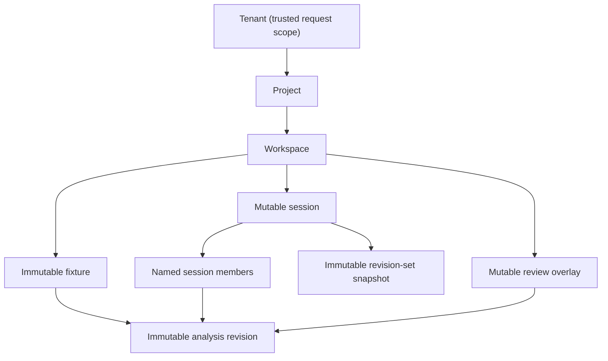

# Durable control plane

Status: implemented local/single-host profile

The durable control plane adds six core-owned capabilities without changing
the normalized plug-in contract:

1. a tenant, project, and workspace catalog for immutable fixtures and
   analysis revisions;
2. mutable multi-revision sessions plus immutable revision-set snapshots;
3. durable upload, plug-in selection, ingestion, retry, and progress records;
4. mutable review annotations and manual event correlations, with a
   deterministic JSON or Markdown correlation report;
5. a default-deny private-analysis policy plus a durable, authenticated local
   runner/run/report lifecycle; and
6. bounded, disabled-by-default retention with quotas, dry-run inventory,
   durable audit journals, and crash-safe artifact-release replay.

It is available through the Python API, the HTTP routes under
`/v1/control-plane`, the API-only `router-dump-server`, the
`router-dump-ingest` headless command, and the `router-dump-maintain`
maintenance command. The
implementation uses SQLite and content-addressed files under one state
directory. It is a durable **single-host** profile: transactions, idempotency,
optimistic concurrency, upload limits, queue leases, recovery, and integrity
checks are implemented. It is not a distributed database, identity provider,
TLS terminator, plug-in process sandbox, or cross-database atomic commit
system. Fixture admission and revision publication instead use two durable
outbox stages plus idempotent catalog receipts. The HTTP boundary requires a
host-supplied identity resolver and enforces its declared roles and optional
project/workspace scopes.

## 1. Start it

Install the core with its web dependencies and an independently packaged
plug-in. To add the durable routes to the normal server, provide a state
directory:

```powershell
router-dump-analyzer --plugin demo_router `
  --input .\demo\fixtures\minimal-status.jsonl `
  --control-plane-dir .\.runtime\control-plane `
  --no-browser
```

The server still opens the selected `--input` as its initial browser
workspace. `--control-plane-dir` additionally starts the durable queue with
the selected plug-in as its allowlist, installs the explicit
`TrustedHeaderIdentityResolver` development adapter, and mounts:

```text
http://127.0.0.1:8765/v1/control-plane
```

Enabling the routes does not implicitly admit the startup input. Use
`router-dump-ingest` or the upload endpoint to publish it into an explicit
project/workspace before a browser review can resolve that runtime revision
to durable subjects. No match or an ambiguous match keeps browser markers
local and produces no durable write.

When `--control-plane-dir` is omitted, those routes return `503`; the existing
single-input runtime remains unchanged. The built-in adapter trusts the caller
headers and is not authentication. The CLI permits it on a loopback listener
by default. Binding it to a non-loopback `--host` fails unless
`--trust-control-plane-headers` is supplied; that switch is an explicit
controlled-development override, not production hardening. A production ASGI
host installs its own `ControlPlaneIdentityResolver` backed by verified
credentials.

The development resolver grants the exact role set
`control-plane:read`, `control-plane:write`, and `control-plane:admin` by
default. `--grant-instance-operator` adds the independent
`control-plane:instance-operator` role only when the built-in trusted-header
resolver is selected on a loopback listener. Argument validation and the
composition root both reject every other combination. The option grants the
role, not the diagnostics route specifically; future routes may use the same
role without changing this contract.

The trusted-header adapter also validates the exact listener `Host` on every
request and the exact `Origin` on mutations when one is present. This closes
the DNS-rebinding gap for the local profile; it does not turn caller-supplied
identity headers into authentication.

For a browser-runtime-independent production HTTP process, use the core-owned
API-only entry point and a deployment-owned resolver:

```powershell
router-dump-server --plugin your_plugin `
  --state-dir .\.runtime\control-plane `
  --identity-resolver-module deployment.identity:resolve_control_plane_identity `
  --host 0.0.0.0 --port 8765
```

`router-dump-server` requires an explicit state directory, exactly one
repeatable plug-in selector family (`--plugin` or the development-only
`--plugin-module PACKAGE[:ATTRIBUTE]`), and exactly one identity choice. The
module target for `--identity-resolver-module` is a synchronous module-level
callable that verifies credentials and returns `ControlPlaneIdentity`. The
alternative `--trust-control-plane-headers` is accepted only on a loopback
listener. Uploaded data can select only from the resulting immutable plug-in
allowlist.

The API-only process exposes aggregate root `/health` and
`/v1/control-plane`; it has no `--input`, single-node browser analysis runtime,
frontend, or static assets. It does construct the durable private-analysis
service/coordinator, but its local runner registration is empty by default.
OpenAPI JSON, Swagger UI, and ReDoc are disabled by default.
Operators may opt in with `--expose-api-docs` only on a loopback listener; both
argument parsing and the composition root reject a non-loopback combination.
Its ASGI lifespan owns worker start and close, and a construction or bind
failure closes the partially built control plane. Use
`router-dump-analyzer --control-plane-dir` only when one selected browser
analysis and the durable surface intentionally share a process.

`GET /health` and `GET /v1/control-plane/health` intentionally bypass tenant
identity resolution so infrastructure can probe them. Their payload is bounded
and aggregate only: no tenant/project/workspace identifiers, host paths, event
fields, credentials, or exception messages are included.

To enforce admission quotas or permit retention, provide the same versioned
policy used by the maintenance command:

```powershell
router-dump-analyzer --plugin demo_router `
  --input .\demo\fixtures\minimal-status.jsonl `
  --control-plane-dir .\.runtime\control-plane `
  --control-plane-retention-policy .\retention-policy.json `
  --no-browser
```

For CI, batch import, and documentation examples, use the separate headless
entry point:

```powershell
$env:PYTHONUTF8 = "1"
router-dump-ingest --plugin demo_router `
  --state-dir .\.runtime\control-plane `
  --tenant example-tenant `
  --project lab-project `
  --workspace regression-2026-07 `
  --project-label "Lab project" `
  --workspace-label "July regression" `
  --input .\demo\fixtures\minimal-status.jsonl `
  --node-hint router-1 `
  --metadata-json '{\"platform\":\"demo-router-os\",\"software_version\":\"1\"}' `
  --output .\artifacts\ingestion-result.json `
  --pretty
```

Add `--retention-policy .\retention-policy.json` when headless admission must
enforce the same tenant/workspace byte and import-count quotas as the server.

The single backslash before each JSON quote is required by Windows PowerShell
5.1 when it passes this value to a native Python launcher; an unescaped
`"` is stripped, while doubled backslashes reach the JSON parser literally.
In a POSIX shell, write the same argument as
`--metadata-json '{"platform":"demo-router-os","software_version":"1"}'`.

Repeat `--input` to create several fixtures in the same invocation. Repeat
either `--plugin` or `--plugin-module` to build a multi-plug-in allowlist; the
two selector forms are mutually exclusive in one command. The command creates
the named project and workspace when absent, derives deterministic
idempotency keys from the scope, file digest, effective media type, selection
options, optional `--node-hint`, bounded `--metadata-json` object, and complete
registry fingerprint, waits for each import, and emits
`router_dump_analyzer.headless_result.v1`. The node hint and caller-supplied
metadata are passed unchanged to plug-in inventory/probe and parsing. Core
tenant/project/workspace, fixture, import, and principal coordinates are not.

Headless exit codes are:

| Code | Meaning |
|---:|---|
| `0` | Every input published a revision. |
| `2` | At least one input is waiting for an explicit plug-in selection. |
| `1` | A command error, timeout, failed import, or cancelled import occurred. |

`--no-auto-select` deliberately stops after probing. `--preferred-plugin`
requires the matching plug-in ID. The per-import wait defaults to 900 seconds
and is bounded to seven days.

## 2. Storage and identity model



- A **tenant** is the outer isolation key. Every store lookup includes it.
- A **project** groups workspaces for one tenant.
- A **workspace** is the catalog, import, session, and review boundary.
- A **fixture** identifies one admitted content digest and is immutable after
  attachment.
- An **analysis revision** points to one validated, immutable canonical
  dataset, its node ID, plug-in IDs, identity digest, and publication
  metadata. The catalog revision ID is distinct from the plug-in/source
  revision ID retained in metadata. New publications also persist one
  immutable execution plan that pins the ordered producer instances, exact
  executable/configuration/schema/capability/role identity, and optional
  decoder. Its configuration field is a digest, not a value. Legacy rows keep
  an explicit absent plan. The catalog prevents a planful row from being
  downgraded to planless, while unfinished pre-contract queue work is re-probed
  and already-staged legacy publication is replayed unchanged. Once staged,
  the complete publication payload is immutable; publication re-hashes the
  dataset and requires its embedded plan digest to equal the catalog plan.
- A **session** is a mutable named selection. Each member has its own
  `member_id`, exact `fixture_id`, exact `revision_id`, node ID, and opaque
  role. Different revisions of the same node can coexist under different
  member IDs.
- A **revision-set snapshot** copies the session's exact member vector,
  default member, and session version. Its deterministic digest and contents
  do not change when the source session changes later.

The catalog does not use a special `latest` member. Callers choose exact
revisions. Session mutation uses an integer version, so concurrent clients
cannot silently overwrite each other.

The state directory contains separate SQLite databases plus content-addressed
upload blobs and canonical revision datasets. Published datasets are reopened
only after relative-path containment, size, SHA-256, UTF-8, JSON shape,
revision identity, node identity, count, ID uniqueness, and timeline checks.
Loaded values are returned as detached copies.

On Windows, choose a resolved `--state-dir` no longer than 131 UTF-16 code
units. The longest fixed core-owned staging pathname reserves 128 units inside
the legacy-compatible 259-unit usable path budget. Core applies that portable
budget on every Windows host rather than depending on optional long-path
registry, process-manifest, or filesystem support. Construction validates the
limit before creating any database or directory and reports only the measured
lengths, never the host path. A new upload basename is checked separately
before spooling because the private fixture-staging directory consumes another
fixed prefix; its available length therefore depends on the selected state
root. An exact idempotent replay creates no new fixture and remains valid after
a supported state-tree relocation. POSIX state roots are not constrained by
this Windows-only budget.

## 3. Upload and ingestion lifecycle

One import follows this durable state machine:

```text
admitting -> queued -> probing -> awaiting_selection -> ready -> ingesting
                              \___________________________/       |
                                                                   v
                                                            publishing
                                                                   |
                                                                   v
                                                               completed

non-terminal states may become failed or cancelled
failed may be explicitly resumed while attempts remain
```

An HTTP upload is the raw request body. Supply `original_name` as a query
parameter and the media type in `Content-Type`; multipart parsing is not used.
The endpoint spools at most 8 MiB in memory before using a temporary file, then
streams fixed-size chunks into content-addressed storage. The default total
upload limit is 8 GiB. Optional `X-Node-Hint` and a JSON-object
`X-Import-Metadata` header supply the same plug-in-visible parsing inputs as
the headless flags. They never replace the trusted tenant/principal headers.

The queue:

- stages the complete fixture-admission request and a deterministic operation
  ID before asking the catalog to attach the fixture;
- records admission and progress before probing begins;
- probes only the server's explicit plug-in registry;
- sorts candidates deterministically and records a hash of the complete probe
  set;
- auto-selects only when the configured policy produces one unambiguous
  choice;
- requires an explicit selection to echo `probe_set_hash`, plug-in ID,
  plug-in version, and exact returned package identity, preventing a stale UI
  from selecting a changed registered identity;
- stores each explicit selection's request digest and response under its
  scope-bound `Idempotency-Key`, so an exact retry remains valid after the
  import has progressed while key reuse for another choice conflicts;
- writes a canonical immutable dataset and durable publication-outbox payload
  before calling the catalog;
- publishes with one deterministic operation ID, so a lost response or worker
  restart repeats the exact catalog request without re-running the plug-in;
  and
- keeps bounded progress events available through polling or server-sent
  events.

An uninterrupted auto-selected import emits
`upload_staged`, `admission_started`, `upload_admitted`, `probe_started`,
`plugin_auto_selected`, `ingestion_started`, `revision_staged`,
`publication_started`, and `revision_published` in that order. Manual
selection uses `plugin_selection_required` followed by `plugin_selected`;
recovery appends `import_failed` and `import_resumed` without rewriting the
earlier evidence.

Queue coordination workers are threads in the server process. SQLite claims
are transactional across processes sharing the database, and every in-progress
claim has a fenced lease plus heartbeat. Startup and claim paths recover
expired leases. An import is retried only through the bounded attempt policy;
its descriptor exposes `attempt_count`, configured `max_attempts`,
`attempts_remaining`, and an error's current retryability. Callers may resume
a failed import and may cancel a non-terminal import that is not currently
leased.

The durable `ControlPlane` and `router-dump-ingest` run both allowlisted probe
and selected plug-in ingestion in fresh child processes created with Python's
`spawn` start method. The checked child deadline is 300 seconds by default and
covers process startup, plug-in work, result transfer, and clean exit. The
headless command caps that deadline to its per-import `--timeout`. On timeout
the parent terminates the child, waits two seconds, kills it if necessary,
waits two more seconds, closes/reaps it, removes any partial staged dataset,
and records `plugin_execution_timeout`. A child that cannot start, crashes,
returns malformed/oversized metadata, or reports a plug-in failure records
`plugin_execution_failed`. Neither failure publishes a partial revision.

Child-to-parent IPC is canonical JSON metadata limited to 1 MiB; a successful
ingestion child instead writes the canonical dataset to a unique
parent-selected spool path and returns only revision/node identity, digest,
byte size, and counts. The parent first renews the fenced lease, then validates
the staged file as a regular file with the returned size and SHA-256 before
content-addressed installation and publication staging. Registry-derived
executable identities are re-hashed in the child immediately before each probe
or ingestion use. A loader-supplied immutable executable identity remains a
trusted loader assertion.

This is killable fault isolation, not an untrusted-code sandbox. A plug-in and
its coordinator must be importable and spawn-picklable, and the child inherits
the host user's filesystem, network, environment, and operating-system
privileges. `DurableIngestionPipeline`, durable `ControlPlane`, and the
headless command default to `process`. An embedding may explicitly select
`inline` only for trusted local/test code. Inline probe and ingestion run
synchronously and do not claim a timeout or bounded shutdown: Python cannot
safely cancel an arbitrary thread, so core does not create a daemon helper
that survives an apparent timeout. Process mode is the only killable
production boundary.

The candidate field is named `package_hash` for compatibility, but its value
is an opaque exact registry identity. A trusted loader may register an
immutable package/artifact digest. Otherwise core derives a bounded
`package-sha256:<digest>` from a complete regular- or namespace-package import
scope, or `module-sha256:<digest>` for a genuine top-level module. Every search
location of the first PEP 420 namespace ancestor is included in
import-precedence order even if a later component is a regular package, and the same scope
is revalidated immediately before execution. Sourceless `.pyc`/`.pyo` modules
require a trusted loader-supplied digest because their embedded build paths are
not relocation-stable. Registries,
headless ingestion, and the server control plane fail closed when that
executable identity cannot be derived. A compatibility-only local/test caller
must explicitly construct `PluginRegistry(..., allow_manifest_identity=True)`;
headless and server control planes reject that registry. Clients always echo
the returned value.

Content-addressed publication uses verified same-directory temporary files
and atomic replacement. A truncated final object left by an interrupted older
writer is quarantined and self-healed after digest verification. SQLite commit
failures roll back or replace the poisoned connection, and transient claim
errors and unexpected claim/iteration failures back off with jitter without
copying exception text into health data. `GET /health` and the analysis-session
independent `GET /v1/control-plane/health` report configured/live workers,
pending and selection-wait queue depth, the oldest pending update, the number
past `PipelineLimits.stalled_import_seconds`, bounded exception-class labels,
and unexpected worker exits. Either route degrades when a worker is missing,
the queue cannot be observed, an import is stalled, or a claim/iteration
failure has not yet been followed by successful work. The root route remains
available in a control-plane-only process with `analysis_ready=false`; it no
longer requires an opened analysis input. Worker diagnostics are geometrically
rate-limited in logs and never include the exception message. One lock timeout,
unexpected claim exception, or `SystemExit` no longer silently kills a queue
worker. The shared health builder is a total projection: malformed counters,
an unavailable store, or a failing analysis-health provider become bounded
observation-error fields and a degraded HTTP 200 response rather than escaping
as private exception text or turning health into HTTP 500.

Catalog admission/publication has a separate deadline,
`PipelineLimits.publisher_execution_timeout_seconds`. Null inherits the
plug-in timeout; otherwise it is independently bounded from 0.05 through
86,400 seconds. Core passes an immutable operation/attempt/deadline context to
the publisher. `publisher_execution_mode` may be explicit or inherit the
plug-in mode. Production defaults to `process`: each call crosses a fresh
spawned-process boundary whose budget includes startup, provider work, result
transfer, and clean exit. At expiry the parent terminates, escalates to kill,
and reaps the child, so a provider that ignores the context cannot hold a queue
worker indefinitely. The built-in SQLite publisher serializes only its durable
database locator, reopens the catalog in the child, bounds Python/SQLite waits,
and checks again before commit. A custom production publisher must be
spawn-picklable or reconstruct its client during unpickling and should still
apply the context to RPC connect/read/commit deadlines. Trusted local/test
embeddings may explicitly select `inline`; that synchronous mode is cooperative
only and makes no bounded-cancellation claim. Because expiry after a remote
commit is ambiguous, the exact outbox stays retryable and its blob or dataset
is pinned before the call. Health exposes such unresolved failures immediately
as `catalog_attention_imports`; child startup/protocol/provider failures use
the closed `catalog_execution_failed` public code.

Queue progress and lease liveness are deliberately separate. A heartbeat
renews fenced ownership but does not advance `updated_at_ns`; only a real
queue-stage transition does. Consequently, a blocked catalog/publisher call
is reported as stalled even when its worker thread is alive and continues to
renew its lease. `stalled_import_seconds` must cover the larger of the
plug-in and publisher execution timeouts plus two heartbeat periods. Health reads use the
active-state age index and bounded vocabulary probes, so accumulated terminal
history is outside the queue-depth scan.

### Operational event channel

Core emits a closed, bounded event vocabulary on the standard Python logger
`router_dump_analyzer.operations`. Each record carries
`rda_schema="rda.operational.v1"`, a closed `rda_event`, and a flat bounded
`rda_fields` mapping. Categories cover admission/publication catalog calls and
failures, sampled worker failures/exits, retention run/preview/plan/replay,
per-source truncated scans, cleanup batches, final completion/failure, and
`control_plane.access.denied`. A rejected identity-resolver response-header
map also emits the separate zero-field
`control_plane.identity_resolver.response_headers_rejected` class.
Retention truncation records name the bounded source and its limit rather than
silently presenting a partial inventory as complete.

Every access denial is represented internally by a typed decision and emitted
exactly once by the common route wrapper. The closed event records the owning
phase (`request_source`, `identity_verification`, `identity_binding`,
`role_authorization`, or `scope_authorization`), reason, response status,
method, code-owned route name, mutation/concealment flags, and optional
required role. It never records a concrete URL, path parameter, credential,
header, principal, tenant label, request body, or exception detail. A
process-random HMAC of the **trusted resolved** tenant may correlate denials
within one process lifetime; it is not stable across restart, is excluded from
the sampling key, and is emitted only when a constant-space lower bound proves
one tenant has a strict majority of observations since the last accepted
sample. This proof is conservative: a real majority may be omitted, but a
non-majority is never reported. Candidate uncertainty, absent trusted tenant
identity, or a balanced window omits the field. The deployment authenticator
remains responsible for durable credential-attempt, client-address,
rate-limit, and compliance audit records.

If the denial's resolver-owned response-header map is invalid, the denial
keeps its original phase and reason while its operational record carries the
actual `response_status=500`. The independent header-rejection event has an
exact empty field set. Neither event contains a header name/value, resolver
exception, raw tenant/principal, credential, or request payload. Failure of
either best-effort telemetry path cannot change the bounded `500` response.

The reporter accepts only exact `ControlPlaneAccessPhase` and
`ControlPlaneAccessReason` enum members, revalidates them at the reporting
boundary, and the operational-record validator checks the allowed
phase-to-reason mapping again. A bounded table permanently retains admitted
sampling keys for the process lifetime. Once full, every unseen key uses one
permanent overflow state; no LRU eviction can recreate first-occurrence
eligibility. Per-key or overflow geometric/time suppression runs before an
independent global token bucket (burst 64, refill one event per second by
default). Intentional suppression, global admission suppression, overflow
observations/emissions, invalid decisions, and enqueue failures are counted
separately. The emitter also retains accepted/rejected/queue-full/delivery
counters per declared event.

The process-global emitter validates at most 24 scalar fields, 256 characters
per text field, and 4 KiB per encoded event, then uses a fixed-capacity
1,024-record queue and one daemon delivery thread. Producer calls never wait
for a handler; a full queue, invalid event, or broken handler drops telemetry
without changing queue, catalog, or retention behavior. Durable imports,
outboxes, per-item cleanup progress, and audit journals are authoritative.
Operational records deliberately exclude dump data, raw plug-in payloads,
filesystem paths, raw tenant/project/workspace labels, and exception messages;
only closed error families, opaque core-generated identifiers, and the
restart-unstable trusted-scope correlation described above are emitted.

Both public health routes include aggregate `accepted_events`,
`dropped_events`, `delivery_failures`, queue depth/capacity, and emitter-worker
liveness. These process-local counters contain no event payload or scope and
make telemetry loss observable; any drop or delivery failure degrades health.
Producer validation catches ordinary `Exception` only, so `KeyboardInterrupt`
and `SystemExit` retain their process-control meaning instead of being counted
as dropped telemetry.

Authenticated operators can read the payload-free breakdown with:

```http
GET /v1/control-plane/diagnostics/operational-events
X-Tenant-ID: verified-tenant
```

The resolved identity must have the distinct
`control-plane:instance-operator` role; tenant `control-plane:admin` does not
imply it. The response sets `Cache-Control: no-store` and uses schema
`rda.operational-diagnostics.v1`.
`operational_events` contains aggregate queue counters plus one closed
`event_classes` row for every declared `rda_event`, with
`accepted_events`, `queue_full_drops`, `rejected_events`, and
`delivery_failures`. `access_denial_sampling` contains `observed_denials`,
`emitted_events`, `intentionally_suppressed`, `enqueue_failures`,
`invalid_denials`, `admitted_keys`, `key_capacity`,
`overflow_observations`, `overflow_emitted_events`, and `global_suppressed`.
`status` is degraded by aggregate drops/delivery failures or by access-denial
enqueue/validation failures. Counters above JavaScript's exact-integer maximum
become decimal strings.

This endpoint has a deliberately hybrid scope. `operational_events` is backed
by process-global emitter counters. `access_denial_sampling` belongs to the
installed ASGI app and aggregates all tenants handled by that app. The result
is a concurrently moving troubleshooting view. It resets on restart, contains
no event payloads or tenant correlations, and is neither a durable audit nor
proof that every denial was observed. A
snapshot failure returns bounded `503`; it never publishes internal exception
text. Anonymous health intentionally remains aggregate-only.

The library installs no output formatter or exporter. Configure handlers on
`router_dump_analyzer.operations` (or an ancestor) with ordinary Python
logging configuration. Tests and controlled shutdown code may call
`flush_operational_events(timeout=...)`; it is bounded and is not a durability
barrier.

Upload and canonical-dataset publication have separate prepare and commit
phases. SHA-256 verification, cross-filesystem copy fallback, and fixture-view
construction finish under private temporary names while the host-global
publication fence remains available. The short fenced phase performs only the
per-address atomic content replacement, fixture-directory rename, and SQLite
reference commit. Retention acquires that same fence for its authoritative
plan commit and then separately for each deletion/checkpoint batch of at most
32 work items; it releases the fence between batches. It therefore cannot
observe a final artifact between publication and its durable queue reference,
without blocking publication for the complete cleanup. Uncommitted private
candidates remain unreachable and are removed by the publishing operation on
either success or failure.

Import failures expose only one closed public code/message pair:
`plugin_execution_timeout`, `catalog_execution_timeout`,
`plugin_execution_failed`, `ingestion_rejected`, or `worker_failure`.
Arbitrary exception type and text are written only to the
private diagnostics table, which has no HTTP route. Descriptors, progress
events, SSE, and both CLIs never return it. Startup also scrubs legacy public
free text.

Upload idempotency is scoped to tenant/project/workspace. Reusing the same key
with the same request returns the existing import; reusing it for different
bytes or options returns a conflict. Content digests are checked again before
processing. A lost response after either catalog commit can leave the import
temporarily `failed`; `resume` re-enters `admitting` or `publishing` with the
same staged request and operation ID. It neither creates a second fixture or
revision nor re-runs the parser during publication replay.

## 4. Multi-revision sessions

Create a session, read its `ETag`, and use that numeric version for each member
change:

```http
POST /v1/control-plane/projects/lab/workspaces/run-42/sessions
X-Tenant-ID: tenant-a
X-Principal-ID: analyst@example
Idempotency-Key: create-review-session
Content-Type: application/json

{"session_id":"review","label":"Cross-node review"}
```

```http
PUT /v1/control-plane/projects/lab/workspaces/run-42/sessions/review/members/pe-a-before
X-Tenant-ID: tenant-a
X-Principal-ID: analyst@example
If-Match: "0"
Idempotency-Key: add-pe-a-before
Content-Type: application/json

{
  "fixture_id": "fixture-...",
  "revision_id": "revision-...",
  "role": "before",
  "make_default": true
}
```

The response carries the new `ETag`. A stale `If-Match` returns `409`; omitting
it on a versioned mutation returns `428`. The server accepts exactly one
strong, quoted, canonical non-negative decimal ETag such as `"3"`. Bare
integers, weak validators, wildcards, lists, signs, whitespace, and leading
zeroes are rejected. Versioned responses emit the same strong quoted form.

Rename a session or replace its complete metadata object with `PATCH`:

```http
PATCH /v1/control-plane/projects/lab/workspaces/run-42/sessions/review
X-Tenant-ID: tenant-a
X-Principal-ID: analyst@example
If-Match: "1"
Idempotency-Key: rename-review-session
Content-Type: application/json

{"label":"Incident 42 review","metadata":{"incident":"INC-42"}}
```

At least one of `label` or `metadata` is required. Supplying `metadata`
replaces the prior metadata object; it is not a merge patch. The successful
response carries the incremented `ETag`.

Snapshot the exact current vector with:

```http
POST /v1/control-plane/projects/lab/workspaces/run-42/sessions/review/snapshots
X-Tenant-ID: tenant-a
X-Principal-ID: analyst@example
If-Match: "1"
Idempotency-Key: freeze-review-session
```

Snapshot creation does not mutate the session. Fetch a snapshot by its opaque
ID at
`/v1/control-plane/projects/{project_id}/workspaces/{workspace_id}/snapshots/{snapshot_id}`
with the same tenant header. List workspace snapshots at
`.../snapshots?session_id=review`; the optional filter does not make the
snapshot mutable or dependent on later session changes.

Delete a session with `DELETE .../sessions/{session_id}`, the current
`If-Match`, principal, and optional idempotency key. The response is the
deleted session descriptor and carries `Cache-Control: no-store`. Deletion is
permanent rather than a tombstone; a session that owns immutable snapshots
cannot be deleted.

## 5. Annotations, correlations, and reports

The review overlay is deliberately separate from immutable normalized data.
Deleting a review object creates a tombstone and an append-only audit entry;
it never edits or removes an event, source record, resource, relationship, or
revision.

Every subject names an exact `revision_id` and optionally a node. Supported
subject forms are:

```json
{"revision_id":"revision-...","node_id":"node-a","kind":"event","subject_id":"event-..."}
{"revision_id":"revision-...","kind":"source_record","subject_id":"record-..."}
{"revision_id":"revision-...","kind":"resource","subject_id":"resource-..."}
{"revision_id":"revision-...","kind":"relationship","subject_id":"relationship-..."}
{"revision_id":"revision-...","kind":"time_range","start_ns":"1000","end_ns":"2000"}
```

Core resolves each subject against the selected immutable dataset before the
overlay accepts it. Annotation kinds are the closed values `marker`, `note`,
and `tag`. An annotation may address one or many subjects and carries a title,
body, sorted unique tags, author, version, and timestamps.

A manual correlation is event-only and has at least two revision-qualified
subjects. Each edge refers to subject array ordinals:

```json
{
  "correlation_id": "corr-failover",
  "subjects": [
    {"revision_id":"revision-a","kind":"event","subject_id":"ev-withdraw"},
    {"revision_id":"revision-b","kind":"event","subject_id":"ev-reroute"}
  ],
  "edges": [
    {
      "source_ordinal": 0,
      "target_ordinal": 1,
      "link_type": "review.same-failover",
      "directed": true
    }
  ],
  "rationale": "The operator believes these records describe one failover.",
  "tags": ["incident-42"],
  "confidence": 0.8
}
```

Annotations and correlations use the same `ETag`/`If-Match` optimistic
concurrency rule as sessions. Deletes are soft; reads and lists omit
tombstones unless `include_deleted=true`. `review-audit` is an ordered,
append-only mutation feed.

`GET .../annotations` returns the page and an `audit_watermark` canonical
decimal string from one read transaction. Continue an offset scan by echoing
that value as `expected_audit_watermark` on every subsequent request. A
continuation without it returns `428`; a different current watermark returns
`409`, so clients restart instead of
silently skipping or duplicating rows after a concurrent create, update, or
delete.
Every caller-supplied audit cursor and watermark precondition uses canonical
non-negative ASCII decimal syntax and the range `0..9007199254740991`: this
watermark, `expected_audit_watermark`, review-audit `after_sequence`, retention
`audit_before_sequence`, and both retention-journal cursors. Stored and
projected catalog/review audit sequences use the same exact integer range.
Allocation fails closed at exhaustion, and public projections fail closed if
stored state violates the domain.

Generate a report from explicit revisions:

```http
POST /v1/control-plane/projects/lab/workspaces/run-42/correlation-report?format=markdown
X-Tenant-ID: tenant-a
Content-Type: application/json

{"revision_ids":["revision-a","revision-b"]}
```

Or use the **current** members of one mutable session:

```json
{"session_id":"review"}
```

Or select one immutable revision-set snapshot:

```json
{"snapshot_id":"revision-set-..."}
```

Exactly one non-empty selector is required: `revision_ids`, `session_id`, or
`snapshot_id`. They are mutually exclusive. There is deliberately no
all-workspace fallback. A mutable session is resolved at report time; a
snapshot always resolves its frozen member vector. An empty explicit revision
list, empty session, or empty snapshot fails closed rather than widening the
report.

The report schema is
`router_dump_analyzer.correlation_report.v2`. JSON bytes are canonical and the
Markdown rendering is derived from the same document. The response `ETag` is
`"sha256:<digest>"`; v1 digests are intentionally not comparable with v2.
Every declared core-owned report timestamp and interval bound is a canonical
decimal string, so browser JSON round trips preserve values above `2^53`.
The `_ns` suffix is not reserved inside opaque plug-in mappings: a plug-in
attribute, effect, causal-link value, or evidence field with that suffix keeps
its original JSON type. The write API accepts the exact decimal form for
declared core time fields (and exact integer values for non-browser clients).
Timestamps from mutable rows remain part of the report, but no
report-generation timestamp is added. Each build reads annotations,
manual correlations, and the audit watermark from one transactional review
snapshot. Reports keep the closed
`CorrelationReportProvenanceClass` vocabulary separate from plug-in fact
`Provenance`; the three report classes are:

- `plugin_inferred`: explicit plug-in causal facts retained in normalized data;
- `user_asserted`: review annotations, manual links, rationale, and
  confidence;
- `core_corroboration`: conservative facts produced from exact shared source
  records, exact shared canonical resource IDs, explicit links, and uncertain
  time intervals.

A user assertion is never relabeled as plug-in or core inference. Only the
client-safe projections needed by selected annotations and correlations are
included; raw source attributes and plug-in `copy_text` remain private.
Temporal corroboration is confident only when both events declare the same
clock domain. Missing or different domains produce `unknown` with
`shared_resource_clock_unaligned` and retain both clock values as evidence.

### Workspace private-analysis disclosure policy

Private-model disclosure is a dedicated workspace security setting, not a
workspace-metadata convention. Every workspace without an explicit setting
resolves to version `0`, mode `disabled`. An administrator can append a policy
revision with:

```text
GET /v1/control-plane/projects/lab/workspaces/run-42/private-analysis-policy
PUT /v1/control-plane/projects/lab/workspaces/run-42/private-analysis-policy
If-Match: "0"
```

The `PUT` body is the exact versioned object documented in
[API payload contract](api-contract.md). It requires the trusted
`control-plane:admin` role and records the trusted resolved principal as the
actor. Both routes enforce the same concealed tenant/project/workspace scope as
the rest of the control plane. Each successful update increments the strong
numeric ETag and appends immutable policy history; stale writers receive `409`.
The workspace row owns an immutable version-zero root and a current record-chain
tip. Each revision seal covers scope, version, canonical policy, actor,
timestamp, and predecessor. That tip, the redundant current head, exact-result
idempotency receipts, and the complete `1..version` history must agree, so an
independently missing or corrupted revision is treated as storage failure.

The SQLite catalog and its schema/triggers are part of the trusted local
control-plane boundary. These checks detect torn state and non-coordinated
corruption; they cannot distinguish a legitimate historical snapshot from a
privileged catalog administrator coherently rewriting every root, tip, head,
seal, history row, and receipt. Use an independently administered append-only
policy checkpoint/WORM log when that administrator is in the threat model.
Migration from schema v1 roots the valid prefix visible at migration time and
cannot reconstruct a suffix already erased by such an actor.

The closed tiers are `disabled`, `client_safe`, and `full_fidelity`. The last
tier permits proprietary dump evidence only over explicitly selected core
local transports. Credentials, tokens, keys, and `never_assistant` evidence
remain denied. Policy decisions contain class, transport, digest, and a closed
reason only; they do not contain the evaluated payload.

### Private-analysis run lifecycle

The workspace run surface is an authenticated facade over the durable
private-analysis store and exact local execution coordinator. It accepts only
revision IDs, a public runner ID/version pair, task kind, query, clock, and
bounded limits. Core derives tenant/project/workspace scope from the authorized
path, reconstructs every immutable revision/plan binding, reads the current
workspace policy, resolves one unambiguous registered local runner, and seals
the policy, instruction-profile, configuration, and tool-catalog digests.
Transport, callback, provider, endpoint/key, actor, execution fence, and those
digests are not caller fields.

Reads require `control-plane:read`; create, execute, and cancel require
`control-plane:write`. Create requires `Idempotency-Key`. Execute and cancel
require the current strong numeric `If-Match`; their resulting single-run
projections return the next ETag. Run views contain detached lifecycle identity,
digests, and payload-free accounting, but no query, evidence payload,
transcript, execution/lease ID, callback, or audit internals. The terminal
report adds the original query and a display-safe advisory-outcome projection;
it is not canonical digest input and cannot mutate annotations or promote a
proposal. There is no automatic retry or runner/transport fallback.
Execute re-reads the current policy before claiming a nonterminal run, and the
request-bound tool service performs the final race-safe policy check before
disclosure. Even a terminal execute replay rejects a stale ETag.

The shipped `router-dump-server` registration tuple is empty. Runner discovery
therefore returns no item, and execution is unavailable, until deployment
composition explicitly supplies an approved in-process or local-subprocess
runner plus its request-bound tool-service factory. The exact bodies, response
shapes, bounds, status mapping, and privacy contract are normative in
[API payload contract](api-contract.md).

## 6. HTTP route summary

All routes have the prefix `/v1/control-plane`.

| Area | Methods and paths |
|---|---|
| Context | `GET /context` |
| Diagnostics | `GET /diagnostics/operational-events` (`control-plane:instance-operator`) |
| Projects | `GET, POST /projects` |
| Workspaces | `GET, POST /projects/{project_id}/workspaces` |
| Private analysis | `GET, PUT .../private-analysis-policy` (`PUT` requires `control-plane:admin` and `If-Match`); `GET .../private-analysis-runners`; `GET, POST .../private-analysis-runs`; `GET .../private-analysis-runs/{run_id}`; `POST .../private-analysis-runs/{run_id}/execute`; `POST .../private-analysis-runs/{run_id}/cancel`; `GET .../private-analysis-runs/{run_id}/report` |
| Catalog | `GET /projects/{project_id}/workspaces/{workspace_id}/fixtures`; `GET .../revisions?node_id=...` |
| Sessions | `GET, POST .../sessions`; `GET, PATCH, DELETE .../sessions/{session_id}`; `PUT, DELETE .../sessions/{session_id}/members/{member_id}`; `POST .../sessions/{session_id}/snapshots`; `GET .../snapshots`; `GET .../snapshots/{snapshot_id}` |
| Imports | `GET, POST .../imports`; `GET .../imports/{import_id}`; `GET .../candidates`; `GET .../events`; `GET .../events/stream`; `POST .../selection`; `POST .../resume`; `POST .../cancel` |
| Annotations | `GET, POST .../annotations`; `GET, PATCH, DELETE .../annotations/{annotation_id}` |
| Correlations | `GET, POST .../correlations`; `GET, PATCH, DELETE .../correlations/{correlation_id}` |
| Review output | `GET .../review-audit`; `POST .../correlation-report?format=json|markdown` |
| Retention | `POST .../retention/preview`; `POST .../retention/execute`; `GET .../retention/audit` |

Here, `...` means
`/projects/{project_id}/workspaces/{workspace_id}`.

Project, workspace, fixture, revision, session, and snapshot collections use
`limit`/`offset`, default to 1,000, cap each page at 5,000, and return
`next_offset` when another request may be needed. Annotation and correlation
lists use the same bounded `limit`/`offset` inputs; the review-audit feed uses
`after_sequence`. Their pages are capped at 5,000.
Every browser-visible numeric `offset`, `next_offset`, and sequence coordinate
is restricted to JavaScript's exact non-negative integer domain
`0..9007199254740991`; a route may declare a smaller maximum. `2^53` and larger
values are rejected rather than rounded or echoed. Nanosecond instants use the
separate signed 64-bit domain and cross JSON as canonical decimal strings.
Annotation continuations additionally require the first page's canonical
`audit_watermark` in `expected_audit_watermark`; a changed value conflicts.
The same canonical JSON-safe sequence domain applies to review-audit
`after_sequence`, retention `audit_before_sequence`, and the retention
journal's `catalog_after_sequence` and `review_after_sequence`, including
durable catalog/review allocation and projection.

Import lists instead use a stable two-part cursor because several uploads can
share one timestamp. They are ordered by
`(created_at_ns DESC, import_id DESC)`, default to 100, cap at 500, and return:

```json
{
  "items": [],
  "next_cursor": {
    "before_created_at_ns": "1750000000000000000",
    "before_import_id": "import-..."
  }
}
```

Supply both cursor fields on the next request; either field alone is invalid.
Numeric cursor components use the canonical ASCII decimal language: no sign,
whitespace, leading zeroes, Unicode digits, or floating-point form. Import
event pages are capped at 1,000. The event stream accepts `after_sequence`
using the same language, emits the stored event type as the SSE event name,
sends keep-alives while idle, and ends after a terminal import has no more
stored events.

Private-analysis run lists use an ascending two-part cursor because several
runs can share one timestamp. They are ordered by
`(created_at_ns ASC, run_id ASC)`, default to 100, cap at 1,000, and return
paired `after_created_at_ns` and `after_run_id` values only when another page
may exist. Both fields are required together; the nanosecond coordinate is a
canonical non-negative decimal string.

### Request boundary

Every request requires `X-Tenant-ID`. Every mutation also requires
`X-Principal-ID`; the review store records that principal as the actor.
Except for the streamed raw upload endpoint, JSON-bearing mutation requests
are rejected with `413` above 1 MiB. Excessively nested JSON bodies or
`X-Import-Metadata` values fail closed with `422`, rather than escaping as a
server recursion error. The raw upload endpoint retains its separate 8 GiB
streaming limit and does not buffer the artifact as JSON.

Create/admit routes accept `Idempotency-Key`, and plug-in selection requires
it. Private-analysis create specifically requires `Idempotency-Key`;
private-analysis execute and cancel require the current strong numeric
`If-Match`. Other versioned mutations require `If-Match`. `GET /context` returns the
resolved `principal_id` and `can_write`; a read-only identity can list,
inspect, and generate explicitly scoped reports but receives `403` for every
mutation.

The host application must install a callable `ControlPlaneIdentityResolver`.
It returns one exact `ControlPlaneIdentity` with tenant, principal, roles, and
optional allowed project/workspace ID sets. Reads require
`control-plane:read`; ordinary mutations require `control-plane:write`;
retention routes require the separate `control-plane:admin` role; operational
diagnostics require the independent `control-plane:instance-operator` role.
Neither privileged role implies the other. Request headers must match the
resolved identity, and an out-of-scope project/workspace is hidden as `404`.

The resolver is an authorization input, not an authenticator. A production
deployment must verify credentials first, remove client-supplied identity
headers, inject the verified tenant/principal, construct the allowed roles and
scopes, and use TLS at the proxy or service boundary. The built-in CLI adapter
simply trusts local headers and grants read/write/admin by default; the
loopback-only `--grant-instance-operator` option must be supplied to add the
fourth role. Never mistake either mode for that production integration.

An authorization resolver may attach response headers to a `401` or `403`, but
the complete map must pass the core's atomic bounded safe-header policy before
ASGI sees it. Invalid names or values, case-insensitive duplicates, forbidden
framing/representation/cookie-mutation fields, and excessive count or size
reject the whole map. The result is a bounded `500` without resolver-supplied
headers, not a partially forwarded response. The original denial is reported
with actual status `500`, and a second payload-free resolver-header-rejection
event makes the boundary fault observable. `Set-Cookie` and obsolete
`Set-Cookie2` are forbidden case-insensitively. A response `Cookie` field does
not mutate browser state and remains under the generic bounds. Cookie mutation
belongs in authenticated upstream middleware or a dedicated endpoint; a
future resolver exception must use a typed explicit cookie policy, never a
generic allowlist.

Values in the HTTP `obs-text` range `0xA0`-`0xFF` remain wire-valid. The core
does not add Starlette `TestClient`-specific restrictions. If in-process
harness parity becomes a requirement, the documented reopening decision is to
restrict resolver values to printable ASCII uniformly.

Round-16 policy analysis leaves `Location`, `Refresh`, `Access-Control-*`,
`Content-Security-Policy`, and `Strict-Transport-Security` unchanged for
compatibility, but does **not** classify them as ordinary authentication
metadata. They can redirect a client or alter browser origin and security
policy. Before exposing resolver-selected values for them in production, add a
typed deployment policy that authorizes exact header families and owning
middleware. The recommended default for that future policy is deny for those
five families (and response `Authorization`), allow `WWW-Authenticate`, and
allow only explicitly registered custom headers. A deployment survey is needed
before replacing today's generic bounded policy, so this task does not silently
break an existing resolver.

### Browser review behavior

The node page's **Durable review** panel is a bounded client of this API, not a
second store. It resolves the active runtime revision to exactly one catalog
revision in the explicit tenant/project/workspace, follows collection
continuations instead of assuming the first page is complete, and caps each
hydrated collection at 20,000 records. It offers exact revision, current
session, and immutable snapshot report scopes; the page itself continues to
render only its active node revision.

Before a session report, the client fetches that exact session again instead
of trusting a stale list row. It rejects an empty, duplicate, invalid, or
over-128 member vector locally. Snapshot options are likewise validated from
their immutable descriptors before use.

Ordinary control-plane requests time out after 30 seconds and report requests
after 60 seconds. The context's `can_write` value controls the UI: a read-only
connection can hydrate durable markers and copy/download reports, while
marker, unmarker, and manual-correlation controls are disabled. The UI never
converts a rejected durable write into a browser-local write.

Marker and correlation creates carry a client-generated record ID and stable
idempotency key. A timeout, network loss, or retryable gateway/server status
has an ambiguous outcome, so the UI reads that exact ID or refreshes the
bounded durable collection before deciding whether the operation committed.
An unresolved retry reuses the same operation identity and exact JSON-payload
SHA-256 identity. The bounded journal is saved in browser storage before the
write and restored after reload: it retains only scope, mutation kind, payload
identity, idempotency key, and record ID. It permits at most 128 unresolved
creates per durable scope and 256 across the browser. A known failed create
discards its pending identity, while only an ambiguous outcome keeps it for
reconciliation. Operation identities remain unique across every journal entry
that shares the server's tenant/project/workspace `ReviewScope`, even when the
UI principal or catalog revision differs. The panel has separate explicit
actions to discard the
connected scope or reset every browser scope; both forget retry identities
only and cannot undo a server-side outcome. Invalid/tampered or unavailable
storage, and capacity exhaustion, disable durable writes until the indicated
explicit recovery succeeds.

Annotation hydration binds all pages and its safety-cap probe to the first
page's watermark. One `409` restarts the complete bounded scan once. A second
conflict, timeout, malformed page, or other failure preserves the last
confirmed markers; a failed reconnect to that same exact durable scope does
the same. A genuine scope change or explicit disconnect clears that durable
projection. Report and write operations are mutually exclusive in the page,
and stale responses cannot overwrite a newer connection or scope.
Executable browser tests verify that idempotency and strong `If-Match` headers
reach `fetch()`. A `409` refreshes the current durable scope before the original
optimistic-concurrency error is reported; a stale scope is never refreshed.

The stable error mapping is:

| Status | Meaning |
|---:|---|
| `400` | Malformed transport metadata such as `Content-Length`. |
| `401` | Required trusted identity header is absent. |
| `403` | Header identity differs from the resolved identity or lacks a required role. |
| `404` | Object absent or outside the tenant/workspace scope. |
| `409` | Stale version, identity conflict, or idempotency conflict. |
| `413` | Upload exceeds the configured limit. |
| `422` | Invalid bounded request or state transition. |
| `428` | Required `If-Match`, selection idempotency key, or annotation-continuation watermark is absent. |
| `500` | A durable dataset/store failed, or an undeclared internal validation/type fault occurred. |
| `503` | The durable control plane or its identity resolver is not configured. |
| `504` | A bounded operation timed out. |

Only exact declared public validation/conflict exception classes may expose a
bounded, invisible-free detail. FastAPI request-shape errors return one fixed
`422` detail without caller input; safe adapter-owned `4xx` details remain
specific. The shared property rule rejects Unicode `Cc`, `Cn`, `Cs`, `Zl`,
and `Zp`, every `Cf` character except U+200C ZWNJ and U+200D ZWJ, every
non-ASCII `Zs` separator, and U+115F, U+1160, U+17B4, U+17B5, U+2800,
U+3164, U+FFA0, U+13441, and U+13442, including TAG
characters and unassigned TAG-block code points. A safe public-domain detail
that contains combining grapheme joiner, an unregistered or misplaced
variation selector, U+FFFC OBJECT REPLACEMENT CHARACTER, or a private-use
(`Co`) character retains its surrounding text but renders that character as
`\\uNNNN` or `\\UNNNNNNNN`. U+FE0E/U+FE0F remain raw only for an exact
adjacent base-selector pair registered in the vendored Unicode 15
emoji-variation data; independent valid pairs across ZWJ sequences remain
intact, while standalone or repeated selectors escape. Caller backslashes are doubled, the
limit is checked after expansion, and host-path detection still runs before
publication. Catalog identifiers apply the
stronger Unicode `Default_Ignorable_Code_Point` rule, so CGJ, text/emoji and
supplementary variation selectors, U+FFFC, and private-use (`Co`) characters
cannot create visually indistinguishable tenant, project, workspace, session,
fixture, or revision identities. Genuine combining accents remain valid;
U+200C ZWNJ and U+200D ZWJ remain the deliberate shaping exceptions inside a
visibly anchored identifier. Human-facing labels may retain bounded
private-use text, but identifiers and labels must both contain at least one
visible identity anchor.
U+16FE4 KHITAN SMALL SCRIPT FILLER is likewise retained as a legitimate
cluster-layout control only inside visibly anchored text.
Bare `ValueError` and `TypeError` are internal faults and return a closed `500`
detail; their raw text, including filesystem or storage paths, is never
projected. Syntactically valid IPv6 prefixes are not classified as host paths,
but a leading root slash still makes an IPv6-shaped token a protected absolute
path. Symbolic host paths are protected too, including `%VAR%`, PowerShell
`$env:VAR`, shell `$VAR` and `${VAR}`, and `~`/`~user` forms with either path
separator.
Opaque IDs and error text should not be parsed as application protocol.

## 7. Retention, quotas, and maintenance

Retention is opt-in and bounded at every layer. Quotas are independent: a
policy can keep `enabled: false` while still rejecting admission that exceeds
tenant/workspace logical-byte or import-count ceilings. The shipped policy
schema is `router_dump_analyzer.retention_policy.v1`:

```json
{
  "schema_version": "router_dump_analyzer.retention_policy.v1",
  "ingestion": {
    "enabled": true,
    "terminal_import_grace_seconds": 604800,
    "idempotency_replay_seconds": 2592000,
    "orphan_artifact_grace_seconds": 86400,
    "stale_partial_seconds": 86400,
    "max_delete_batch": 1000,
    "max_scan_entries": 10000,
    "max_tenant_bytes": 1099511627776,
    "max_workspace_bytes": 274877906944,
    "max_tenant_imports": 100000,
    "max_workspace_imports": 25000
  },
  "catalog": {
    "enabled": true,
    "idempotency_before_ns": "1750000000000000000",
    "snapshot_before_ns": "1750000000000000000",
    "revision_before_ns": "1750000000000000000",
    "fixture_before_ns": "1750000000000000000",
    "preserve_latest_snapshot_per_session": true,
    "maximum_candidates": 1000
  },
  "review": {
    "enabled": true,
    "tombstone_before_ns": "1750000000000000000",
    "idempotency_before_ns": "1750000000000000000",
    "audit_mode": "preserve",
    "maximum_candidates": 1000
  }
}
```

Review audit history is preserved unless `audit_mode` is explicitly
`prune_explicit` and `audit_before_sequence` is supplied. Catalog deletion is
reference-aware: current session members, immutable snapshots, live and
retained review subjects, idempotency receipts, explicitly protected IDs,
retained private-analysis runs, and the latest snapshot policy can each block
a candidate. The caller cannot set the catalog's external-reference
attestation over HTTP; `ControlPlane` calculates it after checking both the
review store and its dedicated `private-analysis-runs.sqlite3` store. Review
and private-run reference admission use the same
`.review-catalog-retention.lock` as catalog-retention planning, so a revision
cannot disappear between validation and durable reference insertion.
`audit_before_sequence` uses the same canonical `0..9007199254740991` audit
domain as review cursors and watermarks; it is not a signed-64-bit coordinate.

Private-run catalog protection is fail-closed and bounded. Each active run has
independent guard and live-admission anchors, so deleting a head and either
single anchor cannot silently erase its revision protection. Admission caps one tenant/project/workspace scope at
10,000 active runs; reference reconstruction validates every guarded run and
refuses an inconsistent or over-limit store instead of attesting a partial
protected set.

Private-analysis run retention is intentionally not part of this maintenance
HTTP/CLI policy surface yet. Its bounded library policy is disabled by default
and purges only terminal runs while preserving payload-free commitments. The
maintenance CLI nevertheless requires the private-run database to exist before
catalog retention can run, because silently replacing a missing reference
store with an empty one could release revisions still needed by retained runs.
After upgrading a legacy state directory, open it once through the normal
`ControlPlane` startup path to create and validate this database before using
`router-dump-maintain`. That first open also binds the database's opaque
installation identity to `.private-analysis-run-store.binding.json` under a
dedicated file lock. Later startup refuses a missing binding or a missing,
zero-length, or different database rather than silently creating an empty reference store. Recovery from
actual loss therefore requires restoring the matching database and binding;
deleting the binding to bypass this check is not a supported repair.

Opening a control plane or ingestion pipeline is non-destructive even when the
loaded policy has `enabled: true`. Workspace ingestion retention considers only
queue history and fixture/blob/dataset paths derived from eligible rows in that
exact workspace. A queue row remains ineligible while either of its catalog
ownership pins exists. Once the catalog commits deletion and releases those
pins, the same bounded ingestion pass deletes the row and its now-unreferenced
blob/dataset; a pin can therefore delay reclamation without severing the
durable provenance needed to find the object later.

On first open of a database created before catalog pins existed, ingestion
transactionally backfills the legacy ownership rows and records a versioned
migration marker. Later opens only read that marker; they do not infer pins
again from completed import history. Consequently, a pin released by a
catalog-retention saga stays released across restart and the next explicit
retention execution can converge the row and artifacts.

An older pin-aware build did not record release tombstones and performed its
compatibility backfill non-transactionally. If such a build stopped after
creating the pin table but before inserting every legacy pin, that partial
state is indistinguishable from deliberate releases. Upgrade therefore treats
the presence of the old pin table as authoritative and preserves missing pins;
it never reconstructs them from completed imports. This favors monotonic
release and bounded cleanup over guessing that absent ownership is still live.

Schema creation and upgrades are serialized by a dedicated `.schema.lock`, not
by either the retention-operation lock or the publication fence. Starting a
new pipeline therefore waits on neither cleanup file lock; ordinary bounded
SQLite transaction coordination still applies, while two first-start
processes cannot race the same migration. Destructive retention operations use
`.retention-operation.lock` to serialize cursor and plan progression across
processes. The potentially slow host walk and recursive size measurement
happen under that operation lock but outside the short `.retention.lock`
publication fence.

After the immutable cleanup plan is committed, current progress is one bounded
outcome row for each processed plan item in
`ingestion_retention_cleanup_progress`. One SQLite connection is reused for the
resume, and one transaction checkpoints each batch of at most 32 outcomes. The
implementation does not repeatedly serialize the growing progress set. On
first resume of an older pending operation, its
legacy `cleanup_progress_json` object is migrated transactionally into those
rows and cleared. If a crash deletes a path before its batch checkpoint commits,
replay recognizes the now-absent planned path as deleted and persists the
outcome; an already-completed concurrent resume is adopted rather than
reapplied.

Programmatic destructive calls that omit an operation ID are still
crash-resumable. Before planning another anonymous run, core discovers the
oldest same-scope `cleanup_pending` audit with a null operation ID and resumes
that exact journal. An interruption therefore cannot strand a permanent
anonymous pending row or bypass its already-committed cleanup plan.

The operational channel mirrors this durable lifecycle without replacing it:
one event records the committed plan, each cleanup transaction reports a batch
of at most 32 attempted/checkpointed outcomes and aggregate deleted/skipped/
failed counts, and completion or replay records the final result. Independent
`retention.scan.truncated` events identify database selections or host roots
that hit their configured scan/delete bound. These lossy events are for latency
and alerting; exact resume state remains in
`ingestion_retention_cleanup_progress` and the retention audit row.

Construction and preview never scan, advance, or mutate host-global staging
state. Each explicit destructive execution additionally gives the spool, blob,
revision-dataset, and top-level fixture-view roots **independent** `max_scan_entries` and
`max_delete_batch` budgets. The scan is deterministic and lexical; each root's
resume cursor is committed in the same SQLite transaction as the immutable
cleanup journal. Traversal uses the same global relative-path lexical order as
the cursor comparison, including punctuation around directory separators. A
large or adversarial blob tree therefore cannot starve the spool, dataset, or
fixture root, and repeated executions continue from durable cursors
to lexical EOF. EOF completes that root's cycle, resets its cursor, and can
produce `truncated: false` even when the root is larger than one scan budget;
new entries ordered before an in-progress cursor join the next cycle.

Directory discovery is serialized with other retention executions but runs
outside the upload/publication fence. Under that fence, core rebuilds the
authoritative workspace database plan and revalidates the bounded host
candidate set: path identity, age, global queue references, and cross-tenant
pins must still match. The immutable cleanup journal records each accepted file
identity and checks it again during crash recovery, so a new file that appears
at the same path is skipped rather than mistaken for the scanned object.
Uploads therefore remain available during a slow host walk without reopening
the publication/reference race.

The host pass reclaims spool partials, orphaned companion locks, and legacy
in-tree content-install locks older than `stale_partial_seconds`. It also
recognizes the exact core-owned blob/dataset crash forms
`.{leaf}.{32-hex}.partial` and `.{leaf}.corrupt-{32-hex}`. Deletion holds the
candidate activity lock plus shard/install gates, revalidates immutable file
identity, removes an abandoned activity-lock sidecar, and prunes only exact
empty shard ancestors. Live publication and arbitrary or malformed dotfiles
are preserved. Current
content-address locks live in the stable `locks/content` namespace, outside
the blob and revision trees, and remain persistent; core never unlinks an
advisory lock pathname after releasing its inode lock. Dynamic spool locks are
opened, handed off, closed, and removed only while a persistent spool-namespace
gate prevents a second opener from splitting the POSIX inode lock domain or
racing Windows lock acquisition. Deployments upgrading from a build that used
in-tree locks must stop all old writers before starting the new build.

The pass also recognizes only exact core content-address layouts and reclaims
an otherwise unreferenced blob or revision dataset after
`orphan_artifact_grace_seconds`. Removing the last content leaf prunes its
empty two-character lowercase-hex shard parents with exact `rmdir` operations.
Legacy empty one- or two-level shard directories are independent bounded scan
items and converge even when no leaf remains to trigger that pruning. Nonempty,
symbolic-link, malformed, and unknown directories are never recursively
removed. An exact top-level
`fixture-<32 lowercase hex>` directory becomes eligible after the same grace
only when no ingestion row in any tenant references its fixture ID; fixture
children never consume independent scan budget. This closes the crash
window where atomic publication succeeded but the queue transaction never made
the reference durable, converges a fixture deletion that failed after its queue
row was pruned, and repairs legacy leaked content. Candidate selection
checks every tenant's queue rows and catalog ownership pins; fenced plan
acceptance and deletion check them again, with content deletion also holding
the per-address install lock. A concurrent publisher, live import, path
replacement, or cross-tenant pin therefore wins over cleanup. Malformed
layouts and fixture names, referenced fixture views, quarantined corrupt files, and
other unknown host objects remain outside the orphan reaper. Host-global work is
reported through `stale_partials`, `content_blobs`, `revision_datasets`, and
`fixture_views`; exact empty-shard cleanup contributes to the bounded cleanup
item/result counts but is not attributed as tenant-owned storage.

Completed ingestion-retention journals older than
`idempotency_replay_seconds` are pruned only by explicit execution, at no more
than `max_delete_batch` rows per run. `expired_retention_audits` and
`deleted_retention_audits` expose that bounded action. Pending cleanup journals
are never selected. The audit is the destructive operation's idempotency
receipt, so exact replay and audit retention intentionally share one window.

Preview one existing scope without starting queue workers:

```powershell
router-dump-maintain `
  --state-dir .\.runtime\control-plane `
  --tenant example-tenant `
  --project lab-project `
  --workspace regression-2026-07 `
  --policy .\retention-policy.json `
  --now-ns 1751000000000000000 `
  --output .\artifacts\retention-preview.json `
  --pretty
```

Probe only durable queue depth and age through a read-only SQLite connection:

```powershell
router-dump-health `
  --state-dir .\.runtime\control-plane `
  --stalled-after 900 `
  --pretty
```

The probe does not load a plug-in, initialize a schema, or require tenant
credentials. It emits `router_dump_analyzer.queue_health.v1`, exits `0` for a
queue with no stalled imports, `2` for a degraded queue, and `1` when the state
cannot be read. `awaiting_selection` is reported separately because it waits
for an intentional user choice and is not classified as stalled. Use
`--now-ns` for deterministic CI assertions. A lease heartbeat alone is not
progress; a publisher or catalog call that stops advancing the durable stage
will therefore cross `--stalled-after` and degrade the probe. A failed,
ambiguous catalog deadline degrades it immediately through
`catalog_attention_imports`, without waiting for that age threshold.

Destructive work additionally requires `--execute`, an audit `--actor`, and a
stable `--operation-id`. Output uses the versioned
`router_dump_analyzer.retention_maintenance.v1` JSON schema; supplying
`--now-ns` also fixes the inventory clock for repeatable automation. The same policies are
available to an admin identity through `retention/preview` and
`retention/execute`; HTTP execution additionally requires `Idempotency-Key`.
Retention-result `evaluated_at_ns` values are canonical decimal strings, like
every other nanosecond value crossing this JSON boundary. The additive
`observation_mode` field is `best_effort_preview` for inventory and
`coordinated_execution` for execution. Preview reads each store safely but
does not claim one atomic cross-store snapshot: it deliberately waits on
neither the review/catalog mutation fence nor ingestion's destructive-operation
lock, so another maintenance saga may advance between its bounded store reads.
The nested ingestion result also carries
`host_storage_orphan_inventory="not_observed"` for preview and
`"bounded_host_scan"` for execution. Zero preview counts for unowned fixture
views, blobs, datasets, or partials therefore cannot be mistaken for a complete
host-storage observation. Legacy completed execution journals that predate the
additive field replay as `bounded_host_scan`; preview never performs a host
walk merely to populate this metadata.
The HTTP preview handler offloads these synchronous reads through the asyncio
executor instead of occupying Starlette/AnyIO's shared sync-route worker pool;
concurrent preview latency therefore cannot starve small synchronous routes
such as health. Treat preview as advisory, never as an executable deletion
plan.

The single-host coordinator serializes review writes with the review-reference
scan and catalog purge across cooperating processes. It purges review
tombstones first, recomputes protected revisions, commits the catalog, evicts
purged datasets from memory, replays exact artifact-pin releases from the
catalog journal, and performs ingestion cleanup last. The workspace-scoped
saga freezes the actor, policies, and effective clock. Repeating the same
operation ID resumes the first incomplete phase or returns the exact completed
result while its audit journal is retained; changing the actor, policy, or
explicit clock conflicts before any mutation. A crash after catalog commit can
leak bytes temporarily but cannot delete a still-pinned artifact; exact replay
resumes that operation, and a later maintenance operation also reconciles
unacknowledged release journals. Every destructive store action has a separate
bounded audit entry.

## 8. Reusable cross-node utilities

The core exports two pure, device-neutral utilities:

- `exact_match_claims()` groups `ExactMatchClaim` values by a plug-in-declared
  `MatcherId` and a canonical, type-preserving opaque key. It produces only
  cross-partition pairs, reports `matched`, `ambiguous`, or `unmatched`,
  computes total candidate cardinality algebraically, and materializes only a
  bounded prefix (1,000 candidates by default). Input defaults to at most
  100,000 claims. `max_claims` and `max_candidates` are independently
  configurable down to zero, but both have an exact hard ceiling of 100,000;
  requests above either ceiling fail before claim grouping or candidate
  materialization.
- `corroborate_events()` compares two `ResolvedEventRef` values. It emits
  independent `supports`, `contradicts`, or `unknown` facts for explicit
  causal links, exact shared source records, exact shared canonical resource
  IDs, and uncertain temporal ordering. Outcomes are directional: for a
  shared source record or resource, left-before-right supports the requested
  order, left-after-right contradicts it, and overlap or unaligned clocks stay
  unknown.

Their complete construction and result vocabulary is available directly from
the root package:

```python
from router_dump_analyzer import (
    CorroborationError,
    CorroborationFact,
    CorroborationOutcome,
    CorroborationReasonCode,
    EventIdentity,
    ExactMatchCandidate,
    ExactMatchClaim,
    ExactMatchGroup,
    ExactMatchResult,
    ExactMatchState,
    ExplicitCausalLink,
    MatcherId,
    ResolvedEventRef,
    SourceRecordIdentity,
    TemporalRelation,
    corroborate_events,
    exact_match_claims,
)
```

The core does not infer equivalence from resource names, free-form payloads,
close timestamps, IP-like strings, or vendor fields. A device or federation
plug-in owns matcher identity, key construction, evidence, payload meaning,
and declared causal links. Retained payload, evidence, and provenance must be
bounded JSON-safe values. The caller owns how independent corroboration facts
are aggregated into a product or policy verdict.

## 9. Core and plug-in ownership

| Core owns | Plug-ins own |
|---|---|
| Tenant/project/workspace scope; fixture/revision catalog; session versions and snapshots | Recognition of their supported artifacts |
| Upload limits, content addressing, queue state, leases, retry, progress, and publication | Parsing and normalization into declared resources, events, records, relationships, and causal links |
| Exact subject resolution, mutable overlays, audit rows, deterministic report envelopes | Device/protocol meaning, typed resource keys, relationship and event semantics, safe presentation and redaction declarations |
| Type-preserving exact matching and conservative corroboration mechanics | Matcher IDs, exact keys, evidence, and federation policy |
| HTTP/CLI boundaries, errors, JSON bounds, and safe dataset reopening | No routes, database access, tenant/session management, or executable frontend |

The control plane never asks a plug-in to manage tenants, projects,
workspaces, sessions, uploads, annotations, reports, or queue records.
Likewise, the core never chooses a vendor key, guesses a network
relationship, or promotes a human assertion into device truth.

## 10. Operational limits and scaling boundary

The checked defaults are two queue-coordination worker threads, killable
spawned child processes for plug-in probe and ingestion, a 300-second child
deadline, 300-second renewable leases, three attempts, at most 1,000 active
imports per workspace, 1 MiB upload chunks, an 8 GiB upload limit, a 2 GiB
reopened dataset limit, four loaded-dataset cache entries, and reports bounded
to 128 revisions, 8 GiB of aggregate serialized datasets, 20,000 selected
manual correlation edges, and 10,000 client-safe observations. Applications
may lower supported constructor limits; HTTP and store-level validation still
applies.

Important fixed contract bounds are:

| Value | Bound |
|---|---:|
| Catalog IDs and labels | 256 characters |
| Queue tenant/project/workspace/import IDs | 128 characters |
| Session member role | 128 characters |
| Catalog metadata | 256 KiB encoded JSON |
| Registered/probed plug-ins | 256 |
| Active non-terminal imports per workspace (default) | 1,000 |
| Original upload name / content type | 512 / 256 characters |
| Plug-in-visible node hint / import metadata | 1,024 characters / 65,536 UTF-8 bytes |
| Non-upload JSON request body | 1 MiB |
| Plug-in child IPC metadata | 1 MiB |
| Plug-in child deadline | 0.05 to 86,400 seconds; 300-second default |
| Queue / catalog idempotency key | 256 characters |
| Review object or subject ID | 1,024 characters |
| Review author / title | 512 characters each |
| Annotation body / correlation rationale | 65,536 characters each |
| Review tags | 64 unique tags, 128 characters each |
| Annotation subjects | 5,000 |
| Manual correlation subjects / edges | 1,024 / 4,096 |
| Manual link type | 256 characters |
| Review idempotency key | 512 characters |
| Annotations / correlations scanned per report | 10,000 each |
| Client-safe report observations | 10,000 |
| Selected revisions per report (default) | 128 |
| Aggregate serialized datasets per report (default) | 8 GiB |
| Selected manual correlation edges per report (default) | 20,000 |
| Private-analysis revisions per request | 128 hard maximum; deployment may lower |
| Private-analysis query | 32,768 characters / 131,072 UTF-8 bytes |
| Private-analysis run-list page | 100 default / 1,000 maximum |
| Private-analysis display report | 64 MiB serialized maximum |
| Private-analysis request defaults | 10,000 evidence items; 64 MiB evidence; 256 tool calls; 4 MiB output; 128 claims; 64 proposals; 300,000 ms |
| One catalog/review retention inventory | 5,000 candidates |
| One ingestion retention delete batch / scan | 10,000 / 100,000 hard maximum |

Catalog IDs may satisfy the catalog's 256-character bound yet exceed the
queue's narrower 128-character import-scope bound. Choose IDs at or below 128
characters when the workspace will accept uploads.

SQLite uses foreign keys, transactional writes, and WAL for file-backed
stores. This profile can be shared by cooperating processes on one host, but
the queue, catalog, and review overlay are separate stores: there is no
cross-database transaction. The queue closes the two catalog-call gaps with
durable outboxes. It stages each complete fixture-admission request and each
complete content-addressed revision-publication request before the respective
catalog call; the catalog stores an idempotency receipt keyed by the operation.
A process failure after either catalog commit may temporarily leave the import
in `admitting` or `publishing`, but recovery replays the exact request and
converges without duplicating the catalog object or, for publication, invoking
the plug-in again. This is not a claim of horizontally distributed operation.
A multi-host deployment requires equivalent server-backed
implementations for catalog, queue, blob/object storage, locking/leases,
admission/publication/retention reconciliation, and review audit, plus real
authentication and a verified identity resolver, TLS, observability, backup,
distributed retention, and hardened plug-in containers/sandboxes with explicit CPU,
memory, filesystem, credential, and network controls. The shipped child
process boundary is killable and deadline-bounded but does not supply those
security controls. Those components are deployment work, not hidden features
of this repository.

## 11. Verification

Run the focused contract suites from the repository root:

```powershell
python -m unittest `
  tests.test_session_store `
  tests.test_ingestion_pipeline `
  tests.test_pipeline_cli `
  tests.test_annotation_store `
  tests.test_corroboration `
  tests.test_control_plane `
  tests.test_control_plane_api `
  tests.test_control_plane_server `
  tests.test_private_analysis_service `
  tests.test_private_analysis_api `
  tests.test_server_cli `
  tests.test_web_health `
  tests.test_operational_logging `
  tests.test_maintenance_cli -v
```

Then run the normal repository checks documented in the root README. The
focused suites cover tenant isolation, multiple revisions of one node,
immutable snapshots, idempotency and stale writes, lease recovery, retry and
cancel boundaries, deterministic selection, headless multi-input execution,
exact subject validation, tombstones and audit, report determinism, bounded
matching, conservative corroboration, upload streaming, HTTP error
translation, retention dry runs, protected references, crash replay, quotas,
bounded audit retrieval, API-only lifecycle/identity boundaries, total health
projection, private-analysis authority derivation and lifecycle preconditions,
payload-free run/report projections, and bounded non-blocking operational
telemetry.
